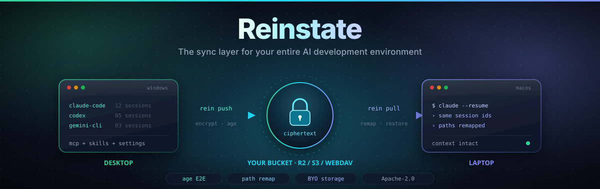
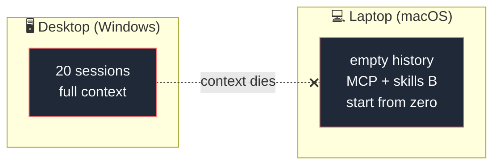
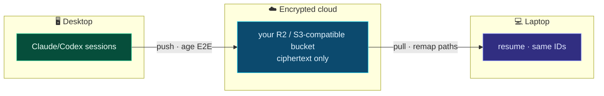
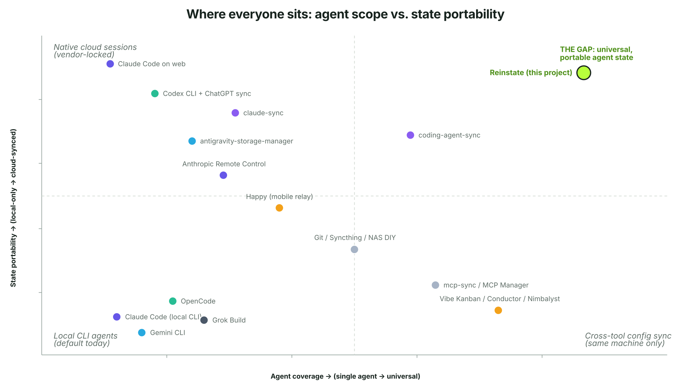
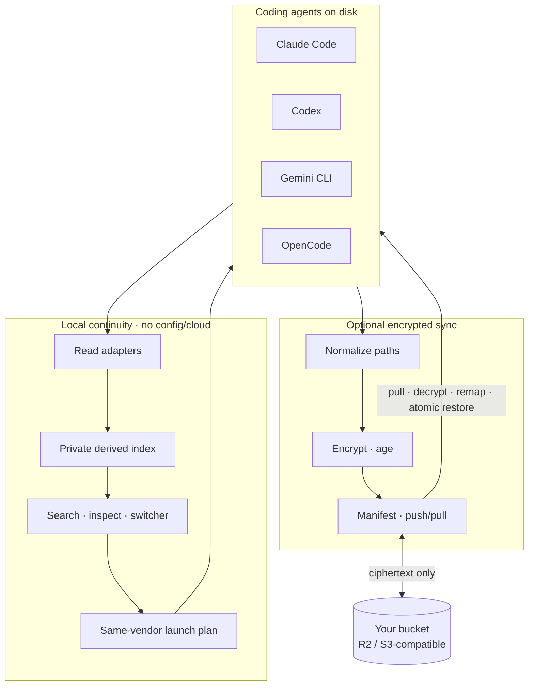
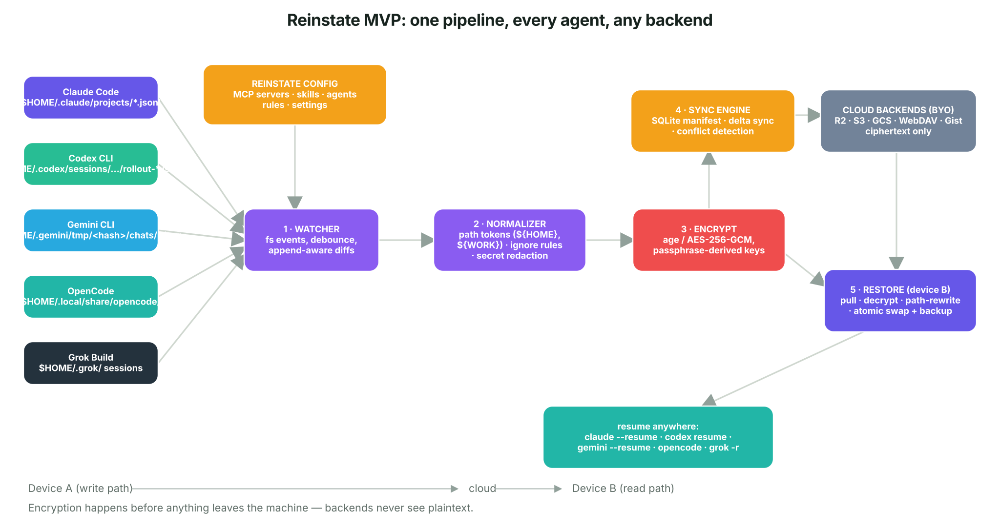
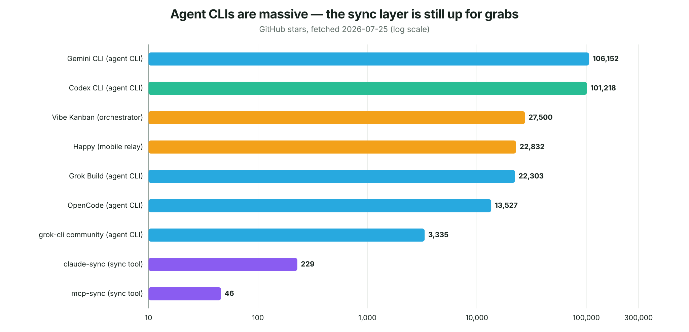

<div align="center">



# Reinstate

### Find, verify, resume, and hand off coding-agent work

**Your agents lose context every time you switch. Reinstate carries it
across.** Indexes 11 agents in stable `v0.5.1`. Full
continuity on 2 — Claude Code and Codex.

Reinstate is the open-source continuity layer for coding-agent work: search,
resume, and hand off tasks across agents, projects, environments, and devices,
with optional encrypted sync through your own S3-compatible storage.

Stable `v0.5.1` adds universal agent coverage on top of the Phase 4 structured
handoff: an agent catalog with an explicit tier per agent, `rein doctor
--agents` with a redacted storage probe, session discovery for eleven agents,
and structured handoff from five. A structured handoff continues the same task
in a *new* Claude Code or Codex session. Apple Silicon macOS and native Windows
x64 passed dual-platform tagged-artifact acceptance on candidate `v0.5.0-rc.6`
(150/150 on both
devices); the public installers pin `v0.5.1`, whose acceptance is still
pending. Intel macOS and Linux/WSL2 downloads remain preview/unverified
pending issues
[#97](https://github.com/HarjjotSinghh/reinstate/issues/97) and
[#98](https://github.com/HarjjotSinghh/reinstate/issues/98).

[](LICENSE)
[](https://goreportcard.com/report/github.com/HarjjotSinghh/reinstate)
[](https://github.com/HarjjotSinghh/reinstate/releases)
[](https://github.com/HarjjotSinghh/reinstate/actions/workflows/ci.yml)
[](go.mod)
[](CONTRIBUTING.md)
[](CODE_OF_CONDUCT.md)
[](SECURITY.md)

[](https://github.com/HarjjotSinghh/reinstate/stargazers)
[](https://github.com/HarjjotSinghh/reinstate/network/members)
[](https://github.com/HarjjotSinghh/reinstate/watchers)
[](https://github.com/HarjjotSinghh/reinstate/issues)
[](https://github.com/HarjjotSinghh/reinstate/pulls)
[](https://github.com/HarjjotSinghh/reinstate/graphs/contributors)
[](https://github.com/HarjjotSinghh/reinstate/commits/main)
[](https://github.com/HarjjotSinghh/reinstate/graphs/commit-activity)
[](https://github.com/HarjjotSinghh/reinstate)
[](https://github.com/HarjjotSinghh/reinstate/releases)

<p>
  <a href="#why-reinstate"><strong>Why</strong></a> ·
  <a href="#features"><strong>Features</strong></a> ·
  <a href="#quick-start"><strong>Quick start</strong></a> ·
  <a href="#supported-agents"><strong>Agents</strong></a> ·
  <a href="#how-it-works"><strong>How it works</strong></a> ·
  <a href="#documentation"><strong>Docs</strong></a> ·
  <a href="#roadmap"><strong>Roadmap</strong></a> ·
  <a href="#contributing"><strong>Contributing</strong></a>
</p>

<sub>Created & maintained by <a href="https://github.com/HarjjotSinghh"><strong>Harjot Singh Rana</strong></a> · <a href="https://harjot.co">harjot.co</a></sub>

</div>

---

## The problem

Even on one machine, you can have twenty sessions across Claude Code, Codex,
projects, branches, and worktrees. Finding the right thread later becomes a
memory problem. Switching agents can also mean re-explaining the task when the
source agent is closed, logged out, or rate-limited.

Then you open your **MacBook** on the couch.

Git has the code. The agent does **not** have the conversation — the rejected approaches, the files already read three times, the style constraints you established mid-thread. Vendor tools save sessions **locally**. Switching machines is context death.



**Reinstate** makes state portable:



---

## Why Reinstate?

| | What you get |
| --- | --- |
| **Local recovery** | Configless local index/search/resume for Claude Code and Codex |
| **Multi-agent** | Structured handoffs continue the same task in a new Claude Code or Codex session |
| **Verified resume** | `v0.3.0` checks the workspace, agent, capabilities, and recognized runtimes before launch |
| **Offline-capable origin** | Works when the other machine is **off** (stored sync, not a live relay) |
| **Path remapping** | Windows ↔ macOS project paths rewritten so `--resume` actually finds sessions |
| **Zero-knowledge** | Client-side encryption; bring-your-own storage |
| **Bounded previews** | Metadata and a short user-prompt preview, never a default transcript dump |
| **Privacy-safe environment truth** | Capability names and state may be indexed; contents, commands, values, credentials, and raw URLs are excluded |
| **Open source** | Apache-2.0 · auditable · patent grant · no vendor lock-in |

Native vendor sync typically serves its own ecosystem. Unreviewed
Syncthing/Drive copies can preserve source-device absolute paths or include
sensitive artifacts. Reinstate instead provides
**Claude/Codex same-vendor × cross-device × encrypted × path-aware** continuity.

<p align="center">
  
</p>

---

## Features

Phase 5 stable `v0.5.1`:

- **Directional structured handoff** — Claude Code and Codex are destinations;
  Claude Code, Codex, Gemini, OpenCode, and Grok are sources
- **No source model dependency** — parse and checkpoint locally while the
  source CLI is closed, logged out, rate-limited, or offline
- **Auditable fidelity** — each component is labeled `exact`, `normalized`,
  `summarized`, `referenced`, or `omitted`, with reasons
- **Destination capability diff** — report missing tools, MCP servers, skills,
  instructions, attachments, and context before launch
- **Private local capsules** — owner-only artifacts and append-only lineage
  under `$REINSTATE_HOME/handoffs/`, hard-excluded from sync
- **Safe destination launch** — start a new session through the vendor's
  documented CLI; never write vendor-internal session files
- **Prompt-level acknowledgement** — ask the destination to restate the task,
  workspace truth, uncertainty, and next action before mutation

Also included from stable `v0.3.0`:

- **Configless local index** — `rein sessions` works without `init` or cloud storage
- **Literal search** — prompt, file, branch, project, agent, and session identity
- **Metadata-first inspect** — bounded user-prompt preview; no full transcript mode
- **Native continuation** — `last`, `resume`, and `fork` launch the source vendor
- **Interactive switcher** — bare `rein` on a TTY; deterministic JSON for automation
- **Read-only expansion** — Gemini CLI and OpenCode discovery without mutation
- **Verified resume** — deterministic environment reports on `inspect`, native
  dry-runs, direct launches, `last`, and picker selections
- **Workspace truth** — offline repository identity, branch, HEAD, and
  privacy-safe working-tree checks without fetching or printing filenames
- **Agent and capability checks** — fail-closed Claude/Codex version and layout
  verification plus bounded, name-only instruction, skill, and MCP inventory
- **Runtime checks** — recognized Node and Go declarations inspected without
  running project scripts
- **Exact authorization** — warnings require terminal confirmation or every
  invocation-scoped `--allow-environment-warning CHECK_ID`; blockers cannot be
  overridden

Also included from stable `v0.1.0`:

- **Cross-device session sync** — continue the same Claude/Codex thread on another machine
- **Multi-agent adapters** — same-vendor Claude Code and Codex session continuity
- **End-to-end encryption** — [age](https://github.com/FiloSottile/age), passphrase-derived keys
- **Bring-your-own storage** — Cloudflare R2, AWS S3, and S3-compatible storage
- **OS-aware path remapping** — the hard problem treated as the product
- **Safe by default** — credential denylist, atomic restore, conflict forks, local backups
- **Simple sync CLI** — `rein init` · `push` · `pull` · `status` · `diff` · `conflicts`
  (`rein` is the short alias; `reinstate` is the full command — same binary)

Later, Reinstate will extend continuity beyond sessions: declare MCP servers,
skills, hooks/loops, plugins, marketplaces, instruction files, and safe settings
once, then preview and apply the correct native configuration across Claude
Code, Codex, Grok, OpenCode, Gemini CLI, and multiple devices. This is planned,
not part of the current CLI. See
[Universal agent configuration](docs/universal-configuration.md).

---

## Quick start

> **Platform boundary:** the public installers pin stable `v0.5.1`, which
> passed dual-platform tagged-artifact acceptance on Apple Silicon macOS and
> native Windows x64. Intel macOS and Linux/WSL2
> remain optional and unverified
> ([#97](https://github.com/HarjjotSinghh/reinstate/issues/97),
> [#98](https://github.com/HarjjotSinghh/reinstate/issues/98)).
>
> **CLI:** prefer short alias **`rein`**. Full name **`reinstate`** works the same.

### Local continuity from the current source

From this repository, with Go 1.25.13 or newer:

```bash
make build
export REINSTATE_HOME="$HOME/.reinstate-phase3-local"

./bin/rein sessions
./bin/rein search "stripe webhook retry" --agent claude
./bin/rein inspect claude:SESSION_ID
./bin/rein last --dry-run
./bin/rein resume codex:SESSION_ID --dry-run
./bin/rein fork claude:SESSION_ID --dry-run
./bin/rein handoff claude:SESSION_ID --to codex --dry-run
./bin/rein
```

On native Windows PowerShell, build `.\bin\rein.exe` with
`go build -o .\bin\rein.exe .\cmd\reinstate`, set `$env:REINSTATE_HOME`, and
use that executable for the same commands.

These commands refresh a private derived index at
`$REINSTATE_HOME/cache/session-index-v2.sqlite`. Its owner-only `.lock` and
`.write.lock` files protect destructive repair and serialize writers/rebuilds across concurrent
`rein`/`reinstate` processes. None is synced. These commands do not require
`init`, storage credentials, a passphrase, or a network backend.

Stable `v0.3.0` adds an `environment` report to `inspect` and native dry-runs.
A first launch truthfully warns with `baseline.unavailable`; it never
manufactures a historical match. Review the report, then either confirm on a
TTY or acknowledge every current warning explicitly in automation:

```bash
./bin/rein resume claude:SESSION_ID \
  --allow-environment-warning baseline.unavailable
```

Acknowledgements apply only to that invocation. Missing workspaces,
unrecognized agent versions/layouts, known repository replacement, stale
source metadata, and verifier failures remain non-overridable. A private
`reinstate_prelaunch_observed` baseline is stored only after the authorized
same-vendor child exits successfully. Native resume/fork remains same-vendor.

Bare `rein` opens the numbered switcher only on a TTY. For scripts use
`rein sessions --json`; a non-TTY bare invocation exits promptly with that
hint.

### Install the v0.5.1 candidate

macOS, Linux, or WSL2:

```bash
curl -fsSL https://reinstate.dev/install.sh | sh
```

Native Windows PowerShell:

```powershell
irm https://reinstate.dev/install.ps1 | iex
```

Both bootstraps pin and verify `v0.5.1`, install without elevation, and
print the next command:

```bash
rein version --json
rein init
```

Apple Silicon macOS with Homebrew:

```bash
brew install HarjjotSinghh/tap/reinstate
```

The GitHub Release and `reinstate.dev` installers pin `v0.5.1`. The Homebrew
tap may still list an earlier release until its formula is updated. Intel macOS
and Linuxbrew remain optional and unverified.

Reinstate waits at most 30 seconds for replacement approval; set
`REINSTATE_CONFIRM_TIMEOUT_SECONDS=1..300` to choose a shorter or longer bound.
Shells without timed-read support refuse immediately and preserve the installed
binary. For deliberate automation, review the version change first and set
`REINSTATE_CONFIRM_REPLACE=1`.

### Optional encrypted sync — Device A

```bash
rein init --project github.com/acme/app=/absolute/path/to/app
rein list --agent AGENT
rein push --agent AGENT --session SESSION_ID --dry-run
rein push --agent AGENT --session SESSION_ID
```

Use the S3/R2 service endpoint as the endpoint and enter the bucket separately.
Reinstate refuses to overwrite an initialized home by default. The explicit
`--force` path backs up prior config and state together before replacement.

### Optional encrypted sync — Device B

```bash
rein init --profile-id <DEVICE_A_PROFILE_ID> \
  --project github.com/acme/app=/different/local/path
rein status
rein pull --agent AGENT --session SESSION_ID --dry-run
rein pull --agent AGENT --session SESSION_ID
# Then use the same vendor's native resume UI or command.
```

Reinstate verifies the encrypted remote manifest during additional-device `init`
before saving local configuration. Require `status` to show the expected
sessions after setup.

Full walkthrough: **[docs/getting-started.md](docs/getting-started.md)**

---

## Supported agents

Support is a published [tier](docs/agent-support-tiers.md) (T0–T5), not a
yes-or-no list.

| Agent | Tier | Local index | Native resume/fork | Handoff source | Handoff target | Encrypted sync |
| ----- | :--: | :---------: | :----------------: | :------------: | :------------: | :------------: |
| [Claude Code](https://docs.anthropic.com/en/docs/claude-code) | T5 | ✅ full | ✅ same-vendor | ✅ | ✅ | ✅ |
| [OpenAI Codex CLI](https://github.com/openai/codex) | T5 | ✅ full | ✅ same-vendor | ✅ | ✅ | ✅ |
| [Gemini CLI](https://github.com/google-gemini/gemini-cli) | T2 | ✅ read-only | — | ✅ source-only | — | — |
| [OpenCode](https://opencode.ai) | T2 | ✅ read-only | — | ✅ source-only | — | — |
| [Grok Build](https://x.ai) | T2 | ✅ read-only | — | ✅ source-only | — | — |
| [Kimi Code CLI](https://www.kimi.com/code) | T2 | ✅ read-only | — | ✅ source-only | — | — |
| [Qwen Code](https://qwenlm.github.io/qwen-code-docs/) | T1 | ✅ read-only | — | — | — | — |
| [Pi](https://pi.dev/) | T1 | ✅ read-only | — | — | — | — |
| [Cursor CLI](https://cursor.com/docs/cli/overview) | T1 | ✅ read-only | — | — | — | — |
| [GitHub Copilot CLI](https://docs.github.com/en/copilot/concepts/agents/copilot-cli/about-copilot-cli) | T1 | ✅ read-only | — | — | — | — |
| [Cline](https://docs.cline.bot/) | T1 | ✅ read-only | — | — | — | — |

This table is stable `v0.5.1`, which indexes all 11 agents above.
Stable `v0.4.0` indexed 5 — Claude Code, Codex CLI, Gemini CLI, Grok Build,
and OpenCode.

Structured handoff in stable `v0.5.1` starts a new destination session.
Native resume/fork and encrypted sync remain same-vendor.

Details: **[docs/adapters.md](docs/adapters.md)**

---

## How it works



1. **Local read adapters** derive bounded metadata and user-prompt search text
2. **Index** stores owner-only SQLite session rows and private prelaunch
   baselines; it never enters sync
3. **Verified resume (stable `v0.3.0`)** observes the fresh workspace, agent,
   capabilities, and runtimes and applies exact warning/blocker policy
4. **Executors** launch a supported session through its native vendor
5. **Pathmap** rewrites known structural paths for optional cross-device sync
6. **Crypto/sync** encrypt before upload and restore atomically with backups

For a structured handoff, Reinstate freezes a read-only source boundary,
parses it locally, verifies the live workspace, builds a private continuity
capsule, and launches a new destination session through the destination
vendor's documented CLI. Imported history is inert evidence; no source model
call or vendor-internal write is part of this path.

Deep dive: **[docs/architecture.md](docs/architecture.md)** · research diagram:

<p align="center">
  
</p>

---

## Security

| Guarantee | Detail |
| --------- | ------ |
| E2E encryption | Ciphertext only on remote storage |
| Credential denylist | `auth.json` and tokens never synced by default |
| Private local index | Owner-only derived metadata; no assistant/tool-output corpus |
| No vendor API keys required | Local files only |
| Verified-resume boundary | Offline checks, exact warning consent, non-overridable blockers |
| Structured-handoff boundary | Redaction before write, inert imported history, no vendor-store mutation |
| Fail-safe restore | Backups + conflict forks |

Report vulnerabilities privately: **[SECURITY.md](SECURITY.md)** · model: **[docs/security-model.md](docs/security-model.md)**

---

## Documentation

| Doc | Description |
| --- | ----------- |
| **Website** | [reinstate.dev](https://reinstate.dev) — product, documentation, compatibility, and security |
| [Getting started](docs/getting-started.md) | Configless local index plus optional encrypted sync |
| [Features and commands](docs/features.md) | What shipped in v0.1.0 through v0.5.1 |
| [Verified resume](docs/verified-resume.md) | Phase 3 environment report, provenance, policy, and privacy contract |
| [Cross-agent handoff](docs/handoff.md) | Phase 4 scope, fidelity, security, storage, and directional support |
| [Architecture](docs/architecture.md) | Pipeline, packages, design principles |
| [Adapters](docs/adapters.md) | Per-agent layouts & support matrix |
| [Universal configuration](docs/universal-configuration.md) | Planned MCP/skills/loops/plugins/settings portability |
| [Security model](docs/security-model.md) | Threat model & defaults |
| [Comparison](docs/comparison.md) | vs native sync, claude-sync, DIY |
| [FAQ](docs/faq.md) | Common questions |
| [Troubleshooting](docs/troubleshooting.md) | Path remap, conflicts, large histories |
| [Roadmap](ROADMAP.md) | Phases & non-goals |
| [Contributing](CONTRIBUTING.md) | Dev setup & PR process |
| [Releasing](RELEASING.md) | Maintainer release checklist |
| [Package-manager publishing](docs/package-manager-publishing.md) | Maintainer registry rollout and authentication guide |
| [Support](SUPPORT.md) | How to get help |
| [Governance](GOVERNANCE.md) | Decision making |
| [Changelog](CHANGELOG.md) | Release history |

---

## Project activity

### Star history

<p align="center">
  <a href="https://www.star-history.com/#HarjjotSinghh/reinstate&Date">
    <picture>
      <source media="(prefers-color-scheme: dark)" srcset="https://api.star-history.com/svg?repos=HarjjotSinghh/reinstate&type=Date&theme=dark&legend=top-left" />
      <source media="(prefers-color-scheme: light)" srcset="https://api.star-history.com/svg?repos=HarjjotSinghh/reinstate&type=Date&legend=top-left" />
      
    </picture>
  </a>
</p>

<p align="center">
  <a href="https://www.star-history.com/#HarjjotSinghh/reinstate&Date"><strong>↗ Open interactive star history</strong></a>
  ·
  <a href="https://github.com/HarjjotSinghh/reinstate/stargazers">Stargazers</a>
</p>

### Contributors

<p align="center">
  <a href="https://github.com/HarjjotSinghh/reinstate/graphs/contributors">
    
  </a>
</p>

### Category context

<p align="center">
  
</p>

### Insights

| Metric | Link |
| ------ | ---- |
| Pulse | [pulse](https://github.com/HarjjotSinghh/reinstate/pulse) |
| Traffic | [graphs/traffic](https://github.com/HarjjotSinghh/reinstate/graphs/traffic) |
| Commits | [graphs/commit-activity](https://github.com/HarjjotSinghh/reinstate/graphs/commit-activity) |
| Code frequency | [graphs/code-frequency](https://github.com/HarjjotSinghh/reinstate/graphs/code-frequency) |
| Network | [network](https://github.com/HarjjotSinghh/reinstate/network) |
| Stars | [stargazers](https://github.com/HarjjotSinghh/reinstate/stargazers) · [star-history](https://www.star-history.com/#HarjjotSinghh/reinstate&Date) |

---

## Roadmap

| Phase | Focus | Status |
| ----- | ----- | ------ |
| **0** | Contracts, diagnostics, installers, fixtures, release trust | ✅ |
| **1** | Claude + Codex encrypted same-vendor session sync | ✅ |
| **2** | Configless local index, search, native resume/fork | ✅ |
| **3** | Verified resume (stable `v0.3.0`) | ✅ |
| **4** | Structured cross-agent handoffs (stable `v0.4.0`) | ✅ |
| **5** | Universal agent coverage (stable `v0.5.1`) | ✅ |
| **6–7** | Universal config + automatic sync, thin Console/ACP client, teams | 📋 / 💭 |

Full detail: **[ROADMAP.md](ROADMAP.md)**

---

## Stable releases

| Channel | Tag | Notes |
| ------- | --- | ----- |
| **Latest** | [](https://github.com/HarjjotSinghh/reinstate/releases/latest) | Stable builds |
| **Pre-release** | [](https://github.com/HarjjotSinghh/reinstate/releases) | Early adopters |
| **SemVer** | pre-1.0 | Breaking changes possible in minors — see CHANGELOG |

Install from [GitHub Releases](https://github.com/HarjjotSinghh/reinstate/releases).
Every published release must include checksums, SBOMs, a source archive, and an
artifact attestation.

---

## Maintainers

| | |
| --- | --- |
| **Lead** | [Harjot Singh Rana](https://github.com/HarjjotSinghh) ([@HarjjotSinghh](https://github.com/HarjjotSinghh)) |
| **Site** | [harjot.co](https://harjot.co) |
| **X** | [@HarjjotSinghh](https://x.com/HarjjotSinghh) |

See [MAINTAINERS.md](MAINTAINERS.md) · [AUTHORS](AUTHORS) · [CODEOWNERS](.github/CODEOWNERS)

---

## Contributing

Contributions are welcome — code, adapters, docs, and bug reports.

1. Read [CONTRIBUTING.md](CONTRIBUTING.md) and the [Code of Conduct](CODE_OF_CONDUCT.md)
2. Open an issue for larger changes
3. Fork → branch → PR

```bash
make deps && make test && make build
```

Good first issues: [`good first issue`](https://github.com/HarjjotSinghh/reinstate/labels/good%20first%20issue)

---

## Community & support

- **Questions** — [open a redacted question issue](https://github.com/HarjjotSinghh/reinstate/issues/new?template=question.yml)
- **Bugs / features** — [Issues](https://github.com/HarjjotSinghh/reinstate/issues)
- **Security** — [SECURITY.md](SECURITY.md) (private)
- **Support guide** — [SUPPORT.md](SUPPORT.md)

---

## Citation

If you use Reinstate in research or publications:

```bibtex
@software{rana_reinstate_2026,
  author = {Rana, Harjot Singh},
  title  = {Reinstate: Encrypted multi-agent session sync for AI coding tools},
  year   = {2026},
  url    = {https://github.com/HarjjotSinghh/reinstate},
  license = {Apache-2.0}
}
```

Also see [CITATION.cff](CITATION.cff).

---

## License

Licensed under the [Apache License, Version 2.0](LICENSE) © 2026 [Harjot Singh Rana](https://github.com/HarjjotSinghh).

```
Copyright 2026 Harjot Singh Rana

Licensed under the Apache License, Version 2.0 (the "License");
you may not use this file except in compliance with the License.
You may obtain a copy of the License at

    http://www.apache.org/licenses/LICENSE-2.0
```

See [NOTICE](NOTICE) for third-party acknowledgements. Product names of third-party agents are trademarks of their respective owners; Reinstate is an independent project and is not affiliated with or endorsed by those vendors.

---

<div align="center">

**Work on desktop. Resume on laptop. Keep the context.**

[](https://github.com/HarjjotSinghh/reinstate)

<sub>Built with ☕ in New Delhi · Open source forever</sub>

</div>
