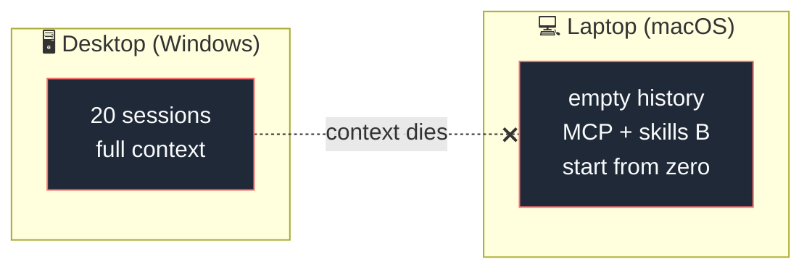
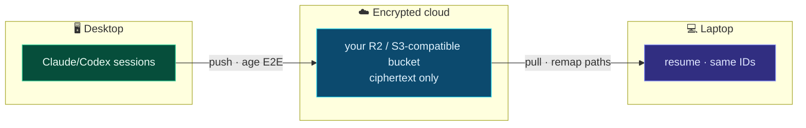
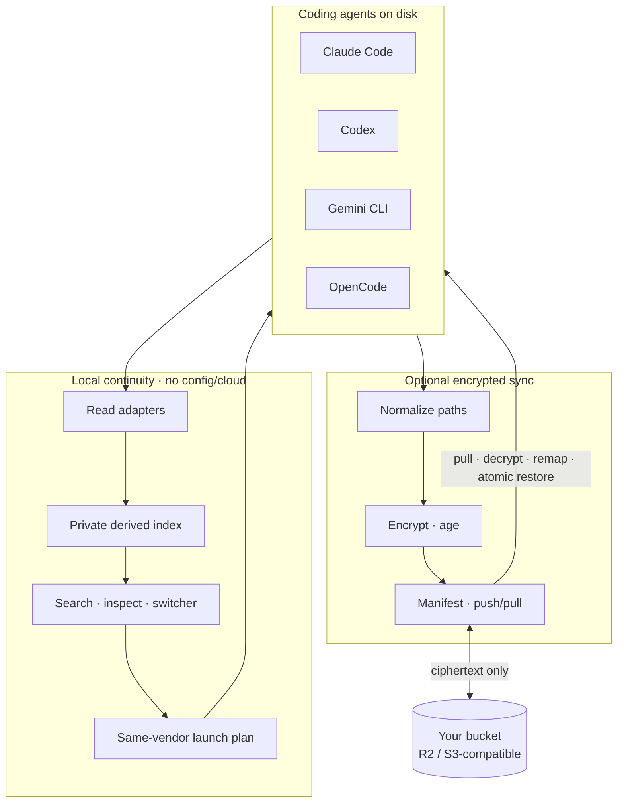

<div align="center">


# Reinstate

### Find and continue coding-agent work across sessions and devices

**Reinstate is an open-source tool that syncs encrypted Claude Code and Codex
sessions between configured devices using your own S3-compatible storage.**
Stable `v0.1.0` preserves same-vendor encrypted sync across macOS and Windows
project paths.

The `v0.2.0-rc.2` candidate adds a configless local session index, literal
search, metadata inspection, a numbered switcher, and same-vendor native
resume/fork. Phase 2 development acceptance passed all 30 required rows on
macOS and native Windows at `b952d38`; exact tagged-artifact release acceptance
is still required before stable promotion.

[](LICENSE)
[](https://goreportcard.com/report/github.com/HarjjotSinghh/reinstate)
[](https://github.com/HarjjotSinghh/reinstate/releases)
[](https://github.com/HarjjotSinghh/reinstate/actions/workflows/ci.yml)
[](go.mod)
[](CONTRIBUTING.md)
[](CODE_OF_CONDUCT.md)
[](SECURITY.md)

[](https://github.com/HarjjotSinghh/reinstate/stargazers)
[](https://github.com/HarjjotSinghh/reinstate/network/members)
[](https://github.com/HarjjotSinghh/reinstate/watchers)
[](https://github.com/HarjjotSinghh/reinstate/issues)
[](https://github.com/HarjjotSinghh/reinstate/pulls)
[](https://github.com/HarjjotSinghh/reinstate/graphs/contributors)
[](https://github.com/HarjjotSinghh/reinstate/commits/main)
[](https://github.com/HarjjotSinghh/reinstate/graphs/commit-activity)
[](https://github.com/HarjjotSinghh/reinstate)
[](https://github.com/HarjjotSinghh/reinstate/releases)

<p>
  <a href="#why-reinstate"><strong>Why</strong></a> ·
  <a href="#features"><strong>Features</strong></a> ·
  <a href="#quick-start"><strong>Quick start</strong></a> ·
  <a href="#supported-agents"><strong>Agents</strong></a> ·
  <a href="#how-it-works"><strong>How it works</strong></a> ·
  <a href="#documentation"><strong>Docs</strong></a> ·
  <a href="#roadmap"><strong>Roadmap</strong></a> ·
  <a href="#contributing"><strong>Contributing</strong></a>
</p>

<sub>Created & maintained by <a href="https://github.com/HarjjotSinghh"><strong>Harjot Singh Rana</strong></a> · <a href="https://harjot.co">harjot.co</a></sub>

</div>

---

## The problem

Even on one machine, you can have twenty sessions across Claude Code, Codex,
projects, branches, and worktrees. Finding the right thread later becomes a
memory problem.

Then you open your **MacBook** on the couch.

Git has the code. The agent does **not** have the conversation — the rejected approaches, the files already read three times, the style constraints you established mid-thread. Vendor tools save sessions **locally**. Switching machines is context death.



**Reinstate** makes state portable:



---

## Why Reinstate?

| | What you get |
| --- | --- |
| **Local recovery** | Configless local index/search/resume for Claude Code and Codex in current source |
| **Multi-agent** | One metadata index; native execution always stays with the source vendor |
| **Offline-capable origin** | Works when the other machine is **off** (stored sync, not a live relay) |
| **Path remapping** | Windows ↔ macOS project paths rewritten so `--resume` actually finds sessions |
| **Zero-knowledge** | Client-side encryption; bring-your-own storage |
| **Bounded previews** | Metadata and a short user-prompt preview, never a default transcript dump |
| **Sessions first** | Credentials, MCP, skills, and settings remain outside the session-index scope |
| **Open source** | Apache-2.0 · auditable · patent grant · no vendor lock-in |

Native vendor sync typically serves its own ecosystem. Unreviewed
Syncthing/Drive copies can preserve source-device absolute paths or include
sensitive artifacts. Reinstate instead provides
**Claude/Codex same-vendor × cross-device × encrypted × path-aware** continuity.

<p align="center">
  
</p>

---

## Features

`v0.2.0-rc.2`, development-accepted for Phase 2:

- **Configless local index** — `rein sessions` works without `init` or cloud storage
- **Literal search** — prompt, file, branch, project, agent, and session identity
- **Metadata-first inspect** — bounded user-prompt preview; no full transcript mode
- **Native continuation** — `last`, `resume`, and `fork` launch the source vendor
- **Interactive switcher** — bare `rein` on a TTY; deterministic JSON for automation
- **Read-only expansion** — Gemini CLI and OpenCode discovery without mutation

Stable `v0.1.0`:

- **Cross-device session sync** — continue the same Claude/Codex thread on another machine
- **Multi-agent adapters** — same-vendor Claude Code and Codex session continuity
- **End-to-end encryption** — [age](https://github.com/FiloSottile/age), passphrase-derived keys
- **Bring-your-own storage** — Cloudflare R2, AWS S3, and S3-compatible storage
- **OS-aware path remapping** — the hard problem treated as the product
- **Safe by default** — credential denylist, atomic restore, conflict forks, local backups
- **Simple sync CLI** — `rein init` · `push` · `pull` · `status` · `diff` · `conflicts`
  (`rein` is the short alias; `reinstate` is the full command — same binary)

Later, Reinstate will extend continuity beyond sessions: declare MCP servers,
skills, hooks/loops, plugins, marketplaces, instruction files, and safe settings
once, then preview and apply the correct native configuration across Claude
Code, Codex, Grok, OpenCode, Gemini CLI, and multiple devices. This is planned,
not part of the current CLI. See
[Universal agent configuration](docs/universal-configuration.md).

---

## Quick start

> **Release boundary:** the public installers pin prerelease
> `v0.2.0-rc.2`. Its source passed the Phase 2 development matrix, but stable
> promotion remains blocked until the exact installed candidate artifacts pass
> the release matrix on macOS and native Windows.
>
> **CLI:** prefer short alias **`rein`**. Full name **`reinstate`** works the same.

### Local continuity from the current source

From this repository, with Go 1.25.12 or newer:

```bash
make build
export REINSTATE_HOME="$HOME/.reinstate-phase2-local"

./bin/rein sessions
./bin/rein search "stripe webhook retry" --agent claude
./bin/rein inspect claude:SESSION_ID
./bin/rein last --dry-run
./bin/rein resume codex:SESSION_ID --dry-run
./bin/rein fork claude:SESSION_ID --dry-run
./bin/rein
```

On native Windows PowerShell, build `.\bin\rein.exe` with
`go build -o .\bin\rein.exe .\cmd\reinstate`, set `$env:REINSTATE_HOME`, and
use that executable for the same commands.

These commands refresh a private derived index at
`$REINSTATE_HOME/cache/session-index-v1.sqlite`. They do not require `init`,
storage credentials, a passphrase, or a network backend. Remove
`--dry-run` only after reviewing the exact executable, argument array, and
working directory. Native resume/fork remains same-vendor.

Bare `rein` opens the numbered switcher only on a TTY. For scripts use
`rein sessions --json`; a non-TTY bare invocation exits promptly with that
hint.

### Install the v0.2.0-rc.2 release candidate

macOS, Linux, or WSL2:

```bash
curl -fsSL https://reinstate.dev/install.sh | sh
```

Native Windows PowerShell:

```powershell
irm https://reinstate.dev/install.ps1 | iex
```

Both bootstraps pin and verify `v0.2.0-rc.2`, install without elevation, and
print the next command:

```bash
rein version --json
rein init
```

Reinstate waits at most 30 seconds for replacement approval; set
`REINSTATE_CONFIRM_TIMEOUT_SECONDS=1..300` to choose a shorter or longer bound.
Shells without timed-read support refuse immediately and preserve the installed
binary. For deliberate automation, review the version change first and set
`REINSTATE_CONFIRM_REPLACE=1`.

### Optional encrypted sync — Device A

```bash
rein init --project github.com/acme/app=/absolute/path/to/app
rein list --agent AGENT
rein push --agent AGENT --session SESSION_ID --dry-run
rein push --agent AGENT --session SESSION_ID
```

Use the S3/R2 service endpoint as the endpoint and enter the bucket separately.
Reinstate refuses to overwrite an initialized home by default. The explicit
`--force` path backs up prior config and state together before replacement.

### Optional encrypted sync — Device B

```bash
rein init --profile-id <DEVICE_A_PROFILE_ID> \
  --project github.com/acme/app=/different/local/path
rein status
rein pull --agent AGENT --session SESSION_ID --dry-run
rein pull --agent AGENT --session SESSION_ID
# Then use the same vendor's native resume UI or command.
```

Reinstate verifies the encrypted remote manifest during additional-device `init`
before saving local configuration. Require `status` to show the expected
sessions after setup.

Full walkthrough: **[docs/getting-started.md](docs/getting-started.md)**

---

## Supported agents

| Agent | Local index | Resume/fork | Encrypted sync | Status |
| ----- | :---------: | :---------: | :------------: | ------ |
| [Claude Code](https://docs.anthropic.com/en/docs/claude-code) | ✅ full | ✅ native | ✅ | Development acceptance passed on macOS and Windows |
| [OpenAI Codex CLI](https://github.com/openai/codex) | ✅ full | ✅ native | ✅ | Development acceptance passed on macOS and Windows |
| [Gemini CLI](https://github.com/google-gemini/gemini-cli) | ✅ read-only | — | — | Physical read-only path passed on Windows; unavailable on test Mac |
| [OpenCode](https://opencode.ai) | ✅ read-only | — | — | Physical read-only path passed on Windows; unavailable on test Mac |
| [Grok Build](https://x.ai) | 📋 | — | — | Later phase |

Details: **[docs/adapters.md](docs/adapters.md)**

---

## How it works



1. **Local read adapters** derive bounded metadata and user-prompt search text
2. **Index** stores owner-only, rebuildable SQLite state; it never enters sync
3. **Executors** launch a supported session through its native vendor
4. **Pathmap** rewrites known structural paths for optional cross-device sync
5. **Crypto/sync** encrypt before upload and restore atomically with backups

Deep dive: **[docs/architecture.md](docs/architecture.md)** · research diagram:

<p align="center">
  
</p>

---

## Security

| Guarantee | Detail |
| --------- | ------ |
| E2E encryption | Ciphertext only on remote storage |
| Credential denylist | `auth.json` and tokens never synced by default |
| Private local index | Owner-only derived metadata; no assistant/tool-output corpus |
| No vendor API keys required | Local files only |
| Fail-safe restore | Backups + conflict forks |

Report vulnerabilities privately: **[SECURITY.md](SECURITY.md)** · model: **[docs/security-model.md](docs/security-model.md)**

---

## Documentation

| Doc | Description |
| --- | ----------- |
| **Website** | [reinstate.dev](https://reinstate.dev) — product, documentation, compatibility, and security |
| [Getting started](docs/getting-started.md) | Configless local index plus optional encrypted sync |
| [Architecture](docs/architecture.md) | Pipeline, packages, design principles |
| [Adapters](docs/adapters.md) | Per-agent layouts & support matrix |
| [Universal configuration](docs/universal-configuration.md) | Planned MCP/skills/loops/plugins/settings portability |
| [Security model](docs/security-model.md) | Threat model & defaults |
| [Comparison](docs/comparison.md) | vs native sync, claude-sync, DIY |
| [FAQ](docs/faq.md) | Common questions |
| [Troubleshooting](docs/troubleshooting.md) | Path remap, conflicts, large histories |
| [Roadmap](ROADMAP.md) | Phases & non-goals |
| [Contributing](CONTRIBUTING.md) | Dev setup & PR process |
| [Releasing](RELEASING.md) | Maintainer release checklist |
| [Package-manager publishing](docs/package-manager-publishing.md) | Maintainer registry rollout and authentication guide |
| [Support](SUPPORT.md) | How to get help |
| [Governance](GOVERNANCE.md) | Decision making |
| [Changelog](CHANGELOG.md) | Release history |

---

## Project activity

### Star history

<p align="center">
  <a href="https://www.star-history.com/#HarjjotSinghh/reinstate&Date">
    <picture>
      <source media="(prefers-color-scheme: dark)" srcset="https://api.star-history.com/svg?repos=HarjjotSinghh/reinstate&type=Date&theme=dark&legend=top-left" />
      <source media="(prefers-color-scheme: light)" srcset="https://api.star-history.com/svg?repos=HarjjotSinghh/reinstate&type=Date&legend=top-left" />
      
    </picture>
  </a>
</p>

<p align="center">
  <a href="https://www.star-history.com/#HarjjotSinghh/reinstate&Date"><strong>↗ Open interactive star history</strong></a>
  ·
  <a href="https://github.com/HarjjotSinghh/reinstate/stargazers">Stargazers</a>
</p>

### Contributors

<p align="center">
  <a href="https://github.com/HarjjotSinghh/reinstate/graphs/contributors">
    
  </a>
</p>

### Category context

<p align="center">
  
</p>

### Insights

| Metric | Link |
| ------ | ---- |
| Pulse | [pulse](https://github.com/HarjjotSinghh/reinstate/pulse) |
| Traffic | [graphs/traffic](https://github.com/HarjjotSinghh/reinstate/graphs/traffic) |
| Commits | [graphs/commit-activity](https://github.com/HarjjotSinghh/reinstate/graphs/commit-activity) |
| Code frequency | [graphs/code-frequency](https://github.com/HarjjotSinghh/reinstate/graphs/code-frequency) |
| Network | [network](https://github.com/HarjjotSinghh/reinstate/network) |
| Stars | [stargazers](https://github.com/HarjjotSinghh/reinstate/stargazers) · [star-history](https://www.star-history.com/#HarjjotSinghh/reinstate&Date) |

---

## Roadmap

| Phase | Focus | Status |
| ----- | ----- | ------ |
| **0** | Contracts, diagnostics, installers, fixtures, release trust | ✅ |
| **1** | Claude + Codex encrypted same-vendor session sync | ✅ |
| **2** | Configless local index, search, native resume/fork | 🚧 |
| **3–4** | Verified resume, portable handoffs | 📋 |
| **5–7** | Universal config + automatic sync, thin Console/ACP client, teams | 📋 / 💭 |

Full detail: **[ROADMAP.md](ROADMAP.md)**

---

## Stable releases

| Channel | Tag | Notes |
| ------- | --- | ----- |
| **Latest** | [](https://github.com/HarjjotSinghh/reinstate/releases/latest) | Stable builds, once published |
| **Pre-release** | [](https://github.com/HarjjotSinghh/reinstate/releases) | Early adopters |
| **SemVer** | pre-1.0 | Breaking changes possible in minors — see CHANGELOG |

Install from [GitHub Releases](https://github.com/HarjjotSinghh/reinstate/releases).
Every published release must include checksums, SBOMs, a source archive, and an
artifact attestation.

---

## Maintainers

| | |
| --- | --- |
| **Lead** | [Harjot Singh Rana](https://github.com/HarjjotSinghh) ([@HarjjotSinghh](https://github.com/HarjjotSinghh)) |
| **Site** | [harjot.co](https://harjot.co) |
| **X** | [@HarjjotSinghh](https://x.com/HarjjotSinghh) |

See [MAINTAINERS.md](MAINTAINERS.md) · [AUTHORS](AUTHORS) · [CODEOWNERS](.github/CODEOWNERS)

---

## Contributing

Contributions are welcome — code, adapters, docs, and bug reports.

1. Read [CONTRIBUTING.md](CONTRIBUTING.md) and the [Code of Conduct](CODE_OF_CONDUCT.md)
2. Open an issue for larger changes
3. Fork → branch → PR

```bash
make deps && make test && make build
```

Good first issues: [`good first issue`](https://github.com/HarjjotSinghh/reinstate/labels/good%20first%20issue)

---

## Community & support

- **Questions** — [open a redacted question issue](https://github.com/HarjjotSinghh/reinstate/issues/new?template=question.yml)
- **Bugs / features** — [Issues](https://github.com/HarjjotSinghh/reinstate/issues)
- **Security** — [SECURITY.md](SECURITY.md) (private)
- **Support guide** — [SUPPORT.md](SUPPORT.md)

---

## Citation

If you use Reinstate in research or publications:

```bibtex
@software{rana_reinstate_2026,
  author = {Rana, Harjot Singh},
  title  = {Reinstate: Encrypted multi-agent session sync for AI coding tools},
  year   = {2026},
  url    = {https://github.com/HarjjotSinghh/reinstate},
  license = {Apache-2.0}
}
```

Also see [CITATION.cff](CITATION.cff).

---

## License

Licensed under the [Apache License, Version 2.0](LICENSE) © 2026 [Harjot Singh Rana](https://github.com/HarjjotSinghh).

```
Copyright 2026 Harjot Singh Rana

Licensed under the Apache License, Version 2.0 (the "License");
you may not use this file except in compliance with the License.
You may obtain a copy of the License at

    http://www.apache.org/licenses/LICENSE-2.0
```

See [NOTICE](NOTICE) for third-party acknowledgements. Product names of third-party agents are trademarks of their respective owners; Reinstate is an independent project and is not affiliated with or endorsed by those vendors.

---

<div align="center">

**Work on desktop. Resume on laptop. Keep the context.**

[](https://github.com/HarjjotSinghh/reinstate)

<sub>Built with ☕ in New Delhi · Open source forever</sub>

</div>
