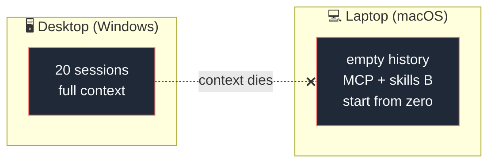
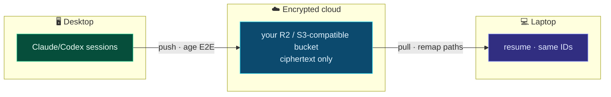
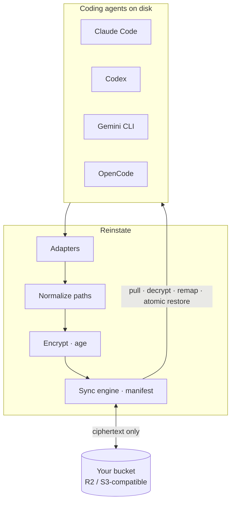
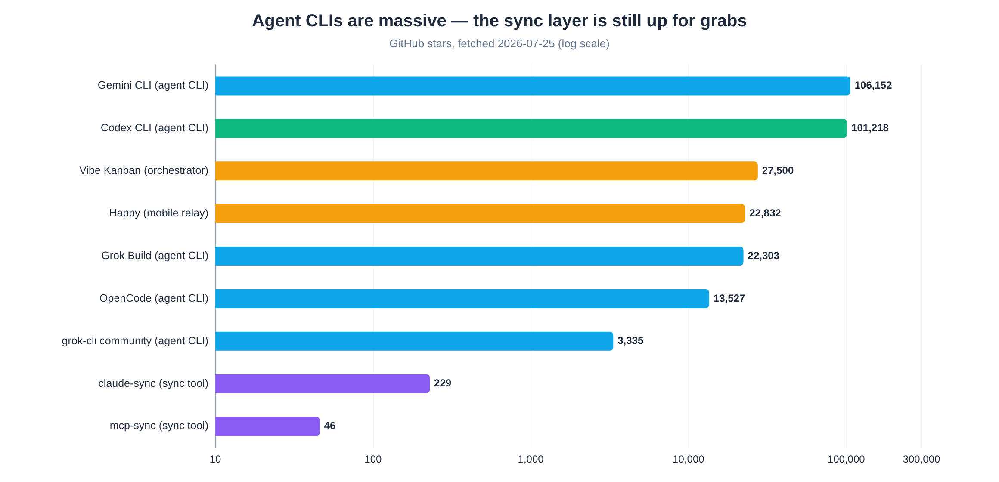

<div align="center">


# Reinstate

### Pick up any coding task exactly where you left it

**The continuity layer for coding-agent work** — search, resume, and hand off sessions across agents, projects, environments, and devices.
Phase 1 starts with encrypted same-vendor Claude Code and Codex session sync
across devices. Core cross-agent continuation follows: when one agent hits a
usage limit, hand the same task to another through an explicit, fidelity-reported
continuity capsule. Search, verified resume, and universal agent configuration
complete the later continuity stack.

[](LICENSE)
[](https://goreportcard.com/report/github.com/HarjjotSinghh/reinstate)
[](https://github.com/HarjjotSinghh/reinstate/releases)
[](https://github.com/HarjjotSinghh/reinstate/actions/workflows/ci.yml)
[](go.mod)
[](CONTRIBUTING.md)
[](CODE_OF_CONDUCT.md)
[](SECURITY.md)

[](https://github.com/HarjjotSinghh/reinstate/stargazers)
[](https://github.com/HarjjotSinghh/reinstate/network/members)
[](https://github.com/HarjjotSinghh/reinstate/watchers)
[](https://github.com/HarjjotSinghh/reinstate/issues)
[](https://github.com/HarjjotSinghh/reinstate/pulls)
[](https://github.com/HarjjotSinghh/reinstate/graphs/contributors)
[](https://github.com/HarjjotSinghh/reinstate/commits/main)
[](https://github.com/HarjjotSinghh/reinstate/graphs/commit-activity)
[](https://github.com/HarjjotSinghh/reinstate)
[](https://github.com/HarjjotSinghh/reinstate/releases)

<p>
  <a href="#why-reinstate"><strong>Why</strong></a> ·
  <a href="#features"><strong>Features</strong></a> ·
  <a href="#quick-start"><strong>Quick start</strong></a> ·
  <a href="#supported-agents"><strong>Agents</strong></a> ·
  <a href="#how-it-works"><strong>How it works</strong></a> ·
  <a href="#documentation"><strong>Docs</strong></a> ·
  <a href="#roadmap"><strong>Roadmap</strong></a> ·
  <a href="#contributing"><strong>Contributing</strong></a>
</p>

<sub>Created & maintained by <a href="https://github.com/HarjjotSinghh"><strong>Harjot Singh Rana</strong></a> · <a href="https://harjot.co">harjot.co</a></sub>

</div>

---

## The problem

You grind eight hours on your **Windows desktop** across Claude Code, Codex, with more agents planned after Phase 1… twenty sessions, four projects, full context.

Then either the device changes **or the agent's usage window closes**. You open
the laptop—or switch from Claude Code to Codex because only Codex still has
capacity.

Git has the code. The agent does **not** have the conversation — the rejected approaches, the files already read three times, the style constraints you established mid-thread. Vendor tools save sessions **locally**. Switching machines is context death.

Phase 1 solves the machine switch with same-vendor native resume. Phase 4 makes
the agent switch a core workflow: the same task continues in a new linked native
session with portable visible history, workspace truth, tool/test evidence, and
an explicit fidelity report.



**Reinstate** makes state portable:



---

## Why Reinstate?

| | What you get |
| --- | --- |
| **Universal** | Multi-agent — not Claude-only, not Codex-only |
| **Cross-agent continuity** | Core Phase 4 quota/outage handoff; same task, new linked destination session, measured fidelity |
| **Offline-capable origin** | Works when the other machine is **off** (stored sync, not a live relay) |
| **Path remapping** | Windows ↔ macOS project paths rewritten so `--resume` actually finds sessions |
| **Zero-knowledge** | Client-side encryption; bring-your-own storage |
| **Sessions first** | Phase 1 deliberately excludes credentials, MCP, skills, and settings; universal configuration is later roadmap work |
| **Open source** | Apache-2.0 · auditable · patent grant · no vendor lock-in |

Native vendor sync will always own *one* ecosystem. DIY Syncthing/Drive hacks break on absolute paths and credential sprawl. Reinstate targets the empty quadrant: **universal × cross-device × encrypted × resume-aware**.

<p align="center">
  
</p>

---

## Features

- **Cross-device session sync** — continue the same agent thread on another machine
- **Cross-agent continuation (Phase 4)** — switch from Claude Code to Codex (and back) after a quota limit without re-explaining the task; structured handoff first, reconstructed history experimental
- **Multi-agent adapters** — Claude Code, Codex, with more agents planned after Phase 1 (phased)
- **End-to-end encryption** — [age](https://github.com/FiloSottile/age), passphrase-derived keys
- **Bring-your-own storage** — Cloudflare R2, AWS S3, and S3-compatible storage
- **OS-aware path remapping** — the hard problem treated as the product
- **Safe by default** — credential denylist, atomic restore, conflict forks, local backups
- **Simple CLI** — `rein init` · `push` · `pull` · `status` · `diff` · `conflicts`
  (`rein` is the short alias; `reinstate` is the full command — same binary)

Later, Reinstate will extend continuity beyond sessions: declare MCP servers,
skills, hooks/loops, plugins, marketplaces, instruction files, and safe settings
once, then preview and apply the correct native configuration across Claude
Code, Codex, Grok, OpenCode, Gemini CLI, and multiple devices. This is planned,
not part of the current CLI. See
[Universal agent configuration](docs/universal-configuration.md).

Cross-agent continuation is planned earlier in Phase 4 and is core product
scope, not a config side effect. It preserves the immutable source and every
portable visible event, then creates a new destination-native session with a
component-level fidelity report. It does not copy credentials, approvals,
hidden reasoning, or source policy into the target. See
[Cross-agent continuation](docs/cross-agent-continuation.md).

---

## Quick start

> **Note:** the v0.1 CLI surface below is implemented, but native acceptance and
> stable release certification are still in progress. The commands below pin
> the published release candidate `v0.1.0-rc.5`.
>
> **CLI:** prefer short alias **`rein`**. Full name **`reinstate`** works the same.

### Install

macOS, Linux, or WSL2:

```bash
curl -fsSL https://reinstate.dev/install.sh | sh
```

Native Windows PowerShell:

```powershell
irm https://reinstate.dev/install.ps1 | iex
```

Both bootstraps pin and verify `v0.1.0-rc.5`, install without elevation, and
print the next command:

```bash
rein version --json
rein init
```

RC5 waits at most 30 seconds for replacement approval; set
`REINSTATE_CONFIRM_TIMEOUT_SECONDS=1..300` to choose a shorter or longer bound.
Shells without timed-read support refuse immediately and preserve the installed
binary. For deliberate automation, review the version change first and set
`REINSTATE_CONFIRM_REPLACE=1`.

### Device A

```bash
rein init --project github.com/acme/app=/absolute/path/to/app
rein push --all    # hidden passphrase prompt, encrypt, upload
```

Use the S3/R2 service endpoint as the endpoint and enter the bucket separately.
RC5 refuses to overwrite an initialized home by default. The explicit
`--force` path backs up prior config and state together before replacement.

### Device B

```bash
rein init --profile-id <DEVICE_A_PROFILE_ID> \
  --project github.com/acme/app=/different/local/path
rein pull --all --dry-run
rein pull --all
claude --resume    # or: codex resume
```

RC5 verifies the encrypted remote manifest during additional-device `init`
before saving local configuration. Require `status` to show the expected
sessions after setup.

Full walkthrough: **[docs/getting-started.md](docs/getting-started.md)**

---

## Supported agents

| Agent | Native sessions | Cross-agent handoff | Universal config | Status |
| ----- | :-------------: | :-----------------: | :--------------: | ------ |
| [Claude Code](https://docs.anthropic.com/en/docs/claude-code) | ✅ | 📋 Phase 4 source + target | 📋 | Sessions: Phase 1 |
| [OpenAI Codex CLI](https://github.com/openai/codex) | ✅ | 📋 Phase 4 source + target | 📋 | Sessions: Phase 1 |
| [Gemini CLI](https://github.com/google-gemini/gemini-cli) | 📋 | 📋 after first pair | 📋 | Later phase |
| [OpenCode](https://opencode.ai) | 📋 | 📋 after first pair | 📋 | Later phase |
| [Grok Build](https://x.ai) | 📋 | 💭 adapter evidence required | 📋 | Later phase |

Details: **[docs/adapters.md](docs/adapters.md)**

---

## How it works



1. **Adapters** read each tool’s local session layout
2. **Pathmap** rewrites absolute paths to portable tokens and back
3. **Crypto** encrypts before any upload
4. **Sync** uses a local manifest; restores are atomic with backups

For planned cross-agent continuation, source adapters additionally parse a
versioned immutable boundary into a canonical capsule; target adapters create a
new linked session from an inspectable projection. Tool calls are historical
evidence, not actions to replay, and every normalized or omitted component is
reported before launch.

Deep dive: **[docs/architecture.md](docs/architecture.md)** · research diagram:

<p align="center">
  
</p>

---

## Security

| Guarantee | Detail |
| --------- | ------ |
| E2E encryption | Ciphertext only on remote storage |
| Credential denylist | `auth.json` and tokens never synced by default |
| No vendor API keys required | Local files only |
| Fail-safe restore | Backups + conflict forks |

Report vulnerabilities privately: **[SECURITY.md](SECURITY.md)** · model: **[docs/security-model.md](docs/security-model.md)**

---

## Documentation

| Doc | Description |
| --- | ----------- |
| **Website** | [reinstate-web.vercel.app](https://reinstate-web.vercel.app) — landing + waitlist |
| [Getting started](docs/getting-started.md) | Install, init, dual-device setup |
| [Architecture](docs/architecture.md) | Pipeline, packages, design principles |
| [Adapters](docs/adapters.md) | Per-agent layouts & support matrix |
| [Cross-agent continuation](docs/cross-agent-continuation.md) | Quota-switch product spec, fidelity model, architecture, security, release gates |
| [Universal configuration](docs/universal-configuration.md) | Planned MCP/skills/loops/plugins/settings portability |
| [Security model](docs/security-model.md) | Threat model & defaults |
| [Comparison](docs/comparison.md) | vs native sync, claude-sync, DIY |
| [FAQ](docs/faq.md) | Common questions |
| [Troubleshooting](docs/troubleshooting.md) | Path remap, conflicts, large histories |
| [Roadmap](ROADMAP.md) | Phases & non-goals |
| [Contributing](CONTRIBUTING.md) | Dev setup & PR process |
| [Releasing](RELEASING.md) | Maintainer release checklist |
| [Support](SUPPORT.md) | How to get help |
| [Governance](GOVERNANCE.md) | Decision making |
| [Changelog](CHANGELOG.md) | Release history |

---

## Project activity

### Star history

<p align="center">
  <a href="https://www.star-history.com/#HarjjotSinghh/reinstate&Date">
    <picture>
      <source media="(prefers-color-scheme: dark)" srcset="https://api.star-history.com/svg?repos=HarjjotSinghh/reinstate&type=Date&theme=dark&legend=top-left" />
      <source media="(prefers-color-scheme: light)" srcset="https://api.star-history.com/svg?repos=HarjjotSinghh/reinstate&type=Date&legend=top-left" />
      
    </picture>
  </a>
</p>

<p align="center">
  <a href="https://www.star-history.com/#HarjjotSinghh/reinstate&Date"><strong>↗ Open interactive star history</strong></a>
  ·
  <a href="https://github.com/HarjjotSinghh/reinstate/stargazers">Stargazers</a>
</p>

### Contributors

<p align="center">
  <a href="https://github.com/HarjjotSinghh/reinstate/graphs/contributors">
    
  </a>
</p>

### Category context

<p align="center">
  
</p>

### Insights

| Metric | Link |
| ------ | ---- |
| Pulse | [pulse](https://github.com/HarjjotSinghh/reinstate/pulse) |
| Traffic | [graphs/traffic](https://github.com/HarjjotSinghh/reinstate/graphs/traffic) |
| Commits | [graphs/commit-activity](https://github.com/HarjjotSinghh/reinstate/graphs/commit-activity) |
| Code frequency | [graphs/code-frequency](https://github.com/HarjjotSinghh/reinstate/graphs/code-frequency) |
| Network | [network](https://github.com/HarjjotSinghh/reinstate/network) |
| Stars | [stargazers](https://github.com/HarjjotSinghh/reinstate/stargazers) · [star-history](https://www.star-history.com/#HarjjotSinghh/reinstate&Date) |

---

## Roadmap

| Phase | Focus | Status |
| ----- | ----- | ------ |
| **0** | Contracts, diagnostics, installers, fixtures, release trust | 🚧 |
| **1** | Claude + Codex encrypted same-vendor session sync | 🚧 |
| **2–4** | Local index, verified resume, core cross-agent continuation | 📋 |
| **5–7** | Universal config + automatic sync, thin Console/ACP client, teams | 📋 / 💭 |

Full detail: **[ROADMAP.md](ROADMAP.md)**

---

## Stable releases

| Channel | Tag | Notes |
| ------- | --- | ----- |
| **Latest** | [](https://github.com/HarjjotSinghh/reinstate/releases/latest) | Stable builds, once published |
| **Pre-release** | [](https://github.com/HarjjotSinghh/reinstate/releases) | Early adopters |
| **SemVer** | pre-1.0 | Breaking changes possible in minors — see CHANGELOG |

Install from [GitHub Releases](https://github.com/HarjjotSinghh/reinstate/releases).
Every published release must include checksums, SBOMs, a source archive, and an
artifact attestation.

---

## Maintainers

| | |
| --- | --- |
| **Lead** | [Harjot Singh Rana](https://github.com/HarjjotSinghh) ([@HarjjotSinghh](https://github.com/HarjjotSinghh)) |
| **Site** | [harjot.co](https://harjot.co) |
| **X** | [@HarjjotSinghh](https://x.com/HarjjotSinghh) |

See [MAINTAINERS.md](MAINTAINERS.md) · [AUTHORS](AUTHORS) · [CODEOWNERS](.github/CODEOWNERS)

---

## Contributing

Contributions are welcome — code, adapters, docs, and bug reports.

1. Read [CONTRIBUTING.md](CONTRIBUTING.md) and the [Code of Conduct](CODE_OF_CONDUCT.md)
2. Open an issue for larger changes
3. Fork → branch → PR

```bash
make deps && make test && make build
```

Good first issues: [`good first issue`](https://github.com/HarjjotSinghh/reinstate/labels/good%20first%20issue)

---

## Community & support

- **Discussions** — [GitHub Discussions](https://github.com/HarjjotSinghh/reinstate/discussions)
- **Bugs / features** — [Issues](https://github.com/HarjjotSinghh/reinstate/issues)
- **Security** — [SECURITY.md](SECURITY.md) (private)
- **Support guide** — [SUPPORT.md](SUPPORT.md)

---

## Citation

If you use Reinstate in research or publications:

```bibtex
@software{rana_reinstate_2026,
  author = {Rana, Harjot Singh},
  title  = {Reinstate: Encrypted multi-agent session sync for AI coding tools},
  year   = {2026},
  url    = {https://github.com/HarjjotSinghh/reinstate},
  license = {Apache-2.0}
}
```

Also see [CITATION.cff](CITATION.cff).

---

## License

Licensed under the [Apache License, Version 2.0](LICENSE) © 2026 [Harjot Singh Rana](https://github.com/HarjjotSinghh).

```
Copyright 2026 Harjot Singh Rana

Licensed under the Apache License, Version 2.0 (the "License");
you may not use this file except in compliance with the License.
You may obtain a copy of the License at

    http://www.apache.org/licenses/LICENSE-2.0
```

See [NOTICE](NOTICE) for third-party acknowledgements. Product names of third-party agents are trademarks of their respective owners; Reinstate is an independent project and is not affiliated with or endorsed by those vendors.

---

<div align="center">

**Work on desktop. Resume on laptop. Keep the context.**

[](https://github.com/HarjjotSinghh/reinstate)

<sub>Built with ☕ in New Delhi · Open source forever</sub>

</div>
