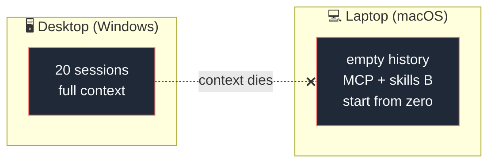
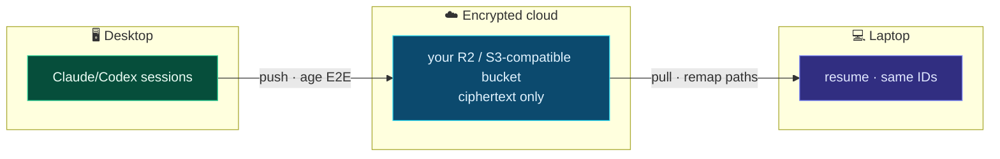
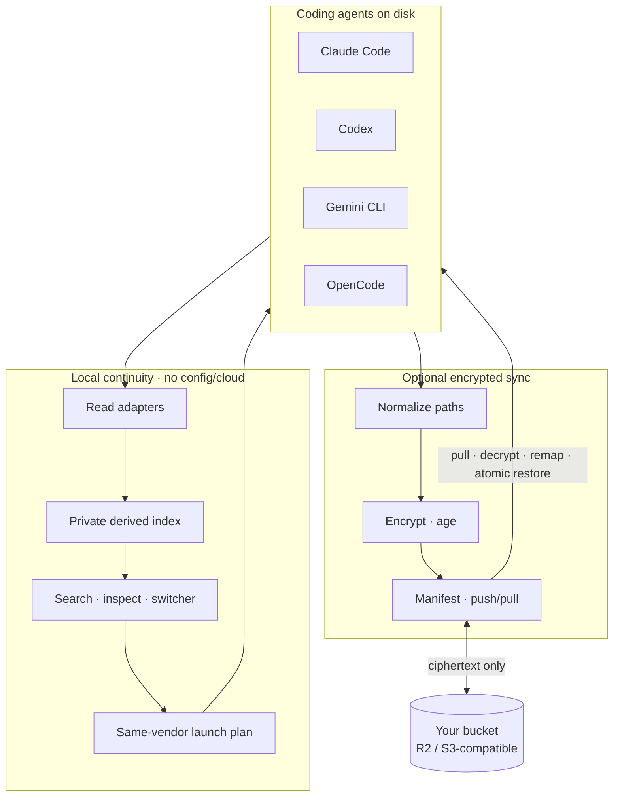

<div align="center">


# Reinstate

### Find, verify, resume, and hand off coding-agent work

**Reinstate is the open-source continuity layer for coding-agent work: search,
resume, and hand off tasks across agents, projects, and devices, with optional
encrypted sync through your own S3-compatible storage.**

[](LICENSE)
[](https://github.com/HarjjotSinghh/reinstate/releases)
[](https://github.com/HarjjotSinghh/reinstate/actions/workflows/ci.yml)
[](go.mod)
[](CONTRIBUTING.md)

```bash
brew install HarjjotSinghh/tap/reinstate
rein sessions
```

No config, no cloud, no API keys. Point it at a machine that already runs
Claude Code or Codex and it indexes what's there.

```text
claude:7f3a2c1e-9b44-4d21-8c0a-11a0e4b8d201	acme/billing	main	Retry Stripe webhook signature
codex:rollout-2026-08-14T18-22-03-00000000-0000-4000-8000-00000000a001	acme/billing	main	Windows path remap for resume
```

Verified on Apple Silicon macOS and native Windows x64. Linux/WSL2 and Intel
macOS are preview. [Full release status ↓](#release-status)

<p>
  <a href="#why-reinstate"><strong>Why</strong></a> ·
  <a href="#features"><strong>Features</strong></a> ·
  <a href="#quick-start"><strong>Quick start</strong></a> ·
  <a href="#release-status"><strong>Release status</strong></a> ·
  <a href="#supported-agents"><strong>Agents</strong></a> ·
  <a href="#documentation"><strong>Docs</strong></a>
</p>

<sub>Created & maintained by <a href="https://github.com/HarjjotSinghh"><strong>Harjot Singh Rana</strong></a> · <a href="https://harjot.co">harjot.co</a></sub>

</div>

---

## The problem

Even on one machine, you can have twenty sessions across Claude Code, Codex,
projects, branches, and worktrees. Finding the right thread later becomes a
memory problem. Switching agents can also mean re-explaining the task when the
source agent is closed, logged out, or rate-limited.

You've been deep in a session on your desktop all afternoon. Then you open
your **MacBook** on the couch.

Git has the code. The agent does **not** have the conversation — the rejected
approaches, the files already read three times, the style constraints you
established mid-thread. Vendor tools save sessions **locally**. Switching
machines is context death.



**Reinstate** makes state portable:



---

## Why Reinstate?

| | What you get |
| --- | --- |
| **Local recovery** | Configless local index/search/resume for Claude Code and Codex |
| **Multi-agent** | Structured handoffs continue the same task in a new Claude Code or Codex session |
| **Verified resume** | Checks the workspace, agent, capabilities, and recognized runtimes before launch |
| **Offline-capable origin** | Works when the other machine is **off** (stored sync, not a live relay) |
| **Path remapping** | Windows ↔ macOS project paths rewritten so `--resume` actually finds sessions |
| **Zero-knowledge** | Client-side encryption; bring-your-own storage |
| **Bounded previews** | Metadata and a short user-prompt preview, never a default transcript dump |
| **Open source** | Apache-2.0 · auditable · patent grant · no vendor lock-in |

Native vendor sync typically serves its own ecosystem. Unreviewed
Syncthing/Drive copies can preserve source-device absolute paths or include
sensitive artifacts. Reinstate instead provides
**Claude/Codex same-vendor × cross-device × encrypted × path-aware** continuity.

<p align="center">
  
</p>

---

## Features

- **Find the thread** — `rein sessions` and literal search by prompt, file,
  branch, project, or agent, with no `init` or cloud
- **Inspect without dumping** — metadata and a short user-prompt preview; no
  full-transcript mode
- **Resume the same vendor** — `last`, `resume`, and `fork` launch Claude Code
  or Codex after a verified environment report
- **Hand off across agents** — continue the same task in a *new* Claude Code
  or Codex session from Claude, Codex, Gemini CLI, OpenCode, or Grok
- **Sync across devices** — encrypted push/pull through your own R2 or
  S3-compatible bucket, with Windows ↔ macOS path remapping
- **Stay safe by default** — credentials stay local, history is inert
  evidence, and destination sessions start through the vendor CLI
- **Use it on a TTY or in scripts** — bare `rein` opens the numbered
  switcher; `rein sessions --json` is deterministic

Handoff contract: **[docs/handoff.md](docs/handoff.md)**. Verified resume:
**[docs/verified-resume.md](docs/verified-resume.md)**. Planned universal
agent configuration:
**[docs/universal-configuration.md](docs/universal-configuration.md)**.

---

## Quick start

Prefer the short alias **`rein`**. Full name **`reinstate`** is the same binary.

### Install

Apple Silicon macOS (stable `v0.3.0`):

```bash
brew install HarjjotSinghh/tap/reinstate
rein sessions
```

Windows Package Manager (stable releases; can lag a fresh tag):

```powershell
winget install HarjotSinghRana.Reinstate
```

Candidate `v0.4.0-rc.10` (adds structured handoffs):

```bash
curl -fsSL https://reinstate.dev/install.sh | sh
```

```powershell
irm https://reinstate.dev/install.ps1 | iex
```

Replacement prompts, confirm timeouts, lock files, and
`--allow-environment-warning` live in
**[docs/getting-started.md](docs/getting-started.md)**.

### Optional encrypted sync

```bash
rein init --project github.com/acme/app=/absolute/path/to/app
rein push --agent AGENT --session SESSION_ID --dry-run
rein push --agent AGENT --session SESSION_ID
```

On the second device, reuse the first profile UUID, map the same project ID to
that machine's path, then `rein pull`. Full walkthrough:
**[docs/getting-started.md](docs/getting-started.md)**.

---

## Release status

| Channel | What it is | Platforms |
| ------- | ---------- | --------- |
| **Stable `v0.3.0`** | Local index, search, verified same-vendor resume, encrypted sync | Apple Silicon macOS and native Windows x64 passed tagged-artifact acceptance |
| **Candidate `v0.4.0-rc.10`** | Adds Phase 4 structured handoffs into a new Claude Code or Codex session | Dual-platform tagged-artifact acceptance is **pending**; not stable `v0.4.0` |
| **Preview** | Intel macOS and Linux/WSL2 | Unverified ([#97](https://github.com/HarjjotSinghh/reinstate/issues/97), [#98](https://github.com/HarjjotSinghh/reinstate/issues/98)) |

`v0.4.0-rc.1` through `v0.4.0-rc.9` were published and failed physical
acceptance. `v0.4.0-rc.10` is the current candidate. Maintainer tagging
checklist: **[RELEASING.md](RELEASING.md)**.

---

## Supported agents

| Agent | Local index | Native resume/fork | Handoff source | Handoff target | Encrypted sync |
| ----- | :---------: | :----------------: | :------------: | :------------: | :------------: |
| [Claude Code](https://docs.anthropic.com/en/docs/claude-code) | ✅ full | ✅ same-vendor | ✅ | ✅ | ✅ |
| [OpenAI Codex CLI](https://github.com/openai/codex) | ✅ full | ✅ same-vendor | ✅ | ✅ | ✅ |
| [Gemini CLI](https://github.com/google-gemini/gemini-cli) | ✅ read-only | — | ✅ source-only | — | — |
| [OpenCode](https://opencode.ai) | ✅ read-only | — | ✅ source-only | — | — |
| [Grok Build](https://x.ai) | ✅ read-only | — | ✅ source-only | — | — |

Handoff columns describe candidate `v0.4.0-rc.10` and remain subject to tagged
macOS arm64 and Windows amd64 acceptance. Native resume/fork and encrypted
sync remain same-vendor capabilities.

Details: **[docs/adapters.md](docs/adapters.md)**

---

## How it works



1. **Local read adapters** derive bounded metadata and user-prompt search text
2. **Index** stores owner-only SQLite session rows and private prelaunch
   baselines; it never enters sync
3. **Verified resume** observes the fresh workspace, agent, capabilities, and
   runtimes and applies exact warning/blocker policy
4. **Executors** launch a supported session through its native vendor
5. **Pathmap** rewrites known structural paths for optional cross-device sync
6. **Crypto/sync** encrypt before upload and restore atomically with backups

For a structured handoff, Reinstate freezes a read-only source boundary,
parses it locally, verifies the live workspace, builds a private continuity
capsule, and launches a new destination session through the destination
vendor's documented CLI. Imported history is inert evidence; no source model
call or vendor-internal write is part of this path.

Deep dive: **[docs/architecture.md](docs/architecture.md)**

<p align="center">
  
</p>

---

## Security

| Guarantee | Detail |
| --------- | ------ |
| E2E encryption | Ciphertext only on remote storage |
| Credential denylist | `auth.json` and tokens never synced by default |
| Private local index | Owner-only derived metadata; no assistant/tool-output corpus |
| No vendor API keys required | Local files only |
| Verified-resume boundary | Offline checks, exact warning consent, non-overridable blockers |
| Structured-handoff boundary | Redaction before write, inert imported history, no vendor-store mutation |
| Fail-safe restore | Backups + conflict forks |

Report vulnerabilities privately: **[SECURITY.md](SECURITY.md)** · model: **[docs/security-model.md](docs/security-model.md)**

---

## Documentation

| Doc | Description |
| --- | ----------- |
| **Website** | [reinstate.dev](https://reinstate.dev) — product, documentation, compatibility, and security |
| [Getting started](docs/getting-started.md) | Install, local index, optional encrypted sync |
| [Verified resume](docs/verified-resume.md) | Environment report, provenance, policy, and privacy contract |
| [Cross-agent handoff](docs/handoff.md) | Phase 4 scope, fidelity, security, and directional support |
| [Architecture](docs/architecture.md) | Pipeline, packages, design principles |
| [Adapters](docs/adapters.md) | Per-agent layouts & support matrix |
| [Universal configuration](docs/universal-configuration.md) | Planned MCP/skills/loops/plugins/settings portability |
| [Security model](docs/security-model.md) | Threat model & defaults |
| [Comparison](docs/comparison.md) | vs native sync, claude-sync, DIY |
| [FAQ](docs/faq.md) | Common questions |
| [Troubleshooting](docs/troubleshooting.md) | Path remap, conflicts, large histories |
| [Roadmap](ROADMAP.md) | Phases & non-goals |
| [Contributing](CONTRIBUTING.md) | Dev setup & PR process |
| [Releasing](RELEASING.md) | Maintainer release checklist |
| [Package-manager publishing](docs/package-manager-publishing.md) | Maintainer registry rollout |
| [Support](SUPPORT.md) | How to get help |
| [Governance](GOVERNANCE.md) | Decision making |
| [Changelog](CHANGELOG.md) | Release history |

---

## Roadmap

| Phase | Focus | Status |
| ----- | ----- | ------ |
| **0** | Contracts, diagnostics, installers, fixtures, release trust | ✅ |
| **1** | Claude + Codex encrypted same-vendor session sync | ✅ |
| **2** | Configless local index, search, native resume/fork | ✅ |
| **3** | Verified resume (stable `v0.3.0`) | ✅ |
| **4** | Structured cross-agent handoffs (`v0.4.0-rc.10` candidate) | 🚧 |
| **5–7** | Universal config + automatic sync, thin Console/ACP client, teams | 📋 / 💭 |

Full detail: **[ROADMAP.md](ROADMAP.md)**

---

## Stable releases

| Channel | Tag | Notes |
| ------- | --- | ----- |
| **Latest** | [](https://github.com/HarjjotSinghh/reinstate/releases/latest) | Stable builds |
| **Pre-release** | [](https://github.com/HarjjotSinghh/reinstate/releases) | Early adopters |
| **SemVer** | pre-1.0 | Breaking changes possible in minors — see CHANGELOG |

Install from [GitHub Releases](https://github.com/HarjjotSinghh/reinstate/releases).
Every published release must include checksums, SBOMs, a source archive, and an
artifact attestation.

---

## Maintainers

| | |
| --- | --- |
| **Lead** | [Harjot Singh Rana](https://github.com/HarjjotSinghh) ([@HarjjotSinghh](https://github.com/HarjjotSinghh)) |
| **Site** | [harjot.co](https://harjot.co) |
| **X** | [@HarjjotSinghh](https://x.com/HarjjotSinghh) |

See [MAINTAINERS.md](MAINTAINERS.md) · [AUTHORS](AUTHORS) · [CODEOWNERS](.github/CODEOWNERS)

---

## Contributing

Contributions are welcome — code, adapters, docs, and bug reports.

1. Read [CONTRIBUTING.md](CONTRIBUTING.md) and the [Code of Conduct](CODE_OF_CONDUCT.md)
2. Open an issue for larger changes
3. Fork → branch → PR

```bash
make deps && make test && make build
```

Good first issues: [`good first issue`](https://github.com/HarjjotSinghh/reinstate/labels/good%20first%20issue)

---

## Community & support

- **Questions** — [open a redacted question issue](https://github.com/HarjjotSinghh/reinstate/issues/new?template=question.yml)
- **Bugs / features** — [Issues](https://github.com/HarjjotSinghh/reinstate/issues)
- **Security** — [SECURITY.md](SECURITY.md) (private)
- **Support guide** — [SUPPORT.md](SUPPORT.md)

---

## Citation

If you use Reinstate in research or publications:

```bibtex
@software{rana_reinstate_2026,
  author = {Rana, Harjot Singh},
  title  = {Reinstate: Encrypted multi-agent session sync for AI coding tools},
  year   = {2026},
  url    = {https://github.com/HarjjotSinghh/reinstate},
  license = {Apache-2.0}
}
```

Also see [CITATION.cff](CITATION.cff).

---

## License

Licensed under the [Apache License, Version 2.0](LICENSE) © 2026 [Harjot Singh Rana](https://github.com/HarjjotSinghh).

```
Copyright 2026 Harjot Singh Rana

Licensed under the Apache License, Version 2.0 (the "License");
you may not use this file except in compliance with the License.
You may obtain a copy of the License at

    http://www.apache.org/licenses/LICENSE-2.0
```

See [NOTICE](NOTICE) for third-party acknowledgements. Product names of third-party agents are trademarks of their respective owners; Reinstate is an independent project and is not affiliated with or endorsed by those vendors.

---

<div align="center">

**Work on desktop. Resume on laptop. Keep the context.**

<sub>Built with ☕ in New Delhi · Open source forever</sub>

</div>
