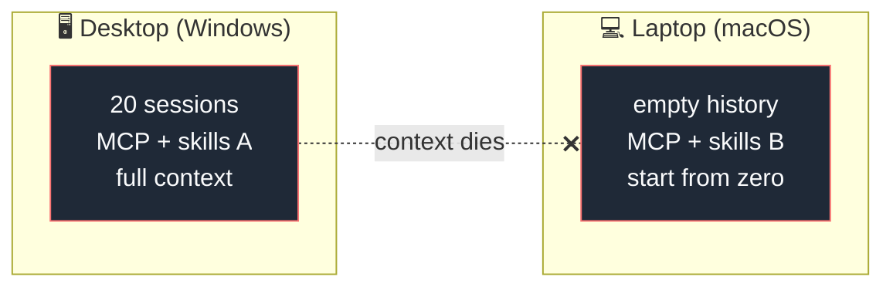
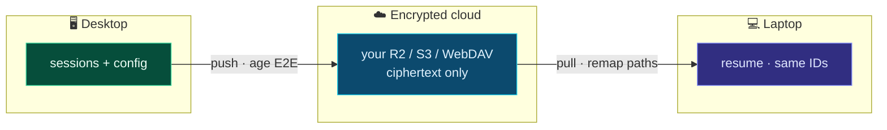
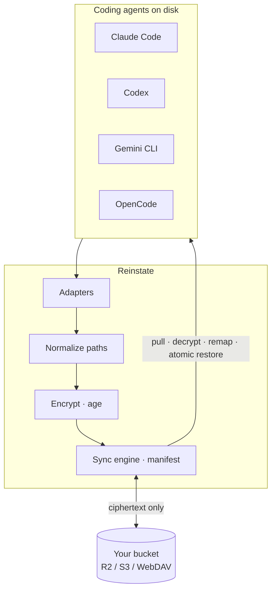

<div align="center">


# Reinstate

### Pick up any coding task exactly where you left it

**The continuity layer for coding-agent work** — search, resume, and hand off sessions across agents, projects, environments, and devices.
Multi-device sync is encrypted (BYO storage) so only you can read it.

[](LICENSE)
[](https://goreportcard.com/report/github.com/HarjjotSinghh/reinstate)
[](https://github.com/HarjjotSinghh/reinstate/releases)
[](https://github.com/HarjjotSinghh/reinstate/actions/workflows/ci.yml)
[](go.mod)
[](CONTRIBUTING.md)
[](CODE_OF_CONDUCT.md)
[](SECURITY.md)

[](https://github.com/HarjjotSinghh/reinstate/stargazers)
[](https://github.com/HarjjotSinghh/reinstate/network/members)
[](https://github.com/HarjjotSinghh/reinstate/watchers)
[](https://github.com/HarjjotSinghh/reinstate/issues)
[](https://github.com/HarjjotSinghh/reinstate/pulls)
[](https://github.com/HarjjotSinghh/reinstate/graphs/contributors)
[](https://github.com/HarjjotSinghh/reinstate/commits/main)
[](https://github.com/HarjjotSinghh/reinstate/graphs/commit-activity)
[](https://github.com/HarjjotSinghh/reinstate)
[](https://github.com/HarjjotSinghh/reinstate/releases)

<p>
  <a href="#why-reinstate"><strong>Why</strong></a> ·
  <a href="#features"><strong>Features</strong></a> ·
  <a href="#quick-start"><strong>Quick start</strong></a> ·
  <a href="#supported-agents"><strong>Agents</strong></a> ·
  <a href="#how-it-works"><strong>How it works</strong></a> ·
  <a href="#documentation"><strong>Docs</strong></a> ·
  <a href="#roadmap"><strong>Roadmap</strong></a> ·
  <a href="#contributing"><strong>Contributing</strong></a>
</p>

<sub>Created & maintained by <a href="https://github.com/HarjjotSinghh"><strong>Harjot Singh Rana</strong></a> · <a href="https://harjot.co">harjot.co</a></sub>

</div>

---

## The problem

You grind eight hours on your **Windows desktop** across Claude Code, Codex, Gemini CLI, OpenCode, Grok Build… twenty sessions, four projects, full context.

You open your **MacBook** on the couch.

Git has the code. The agent does **not** have the conversation — the rejected approaches, the files already read three times, the style constraints you established mid-thread. Vendor tools save sessions **locally**. Switching machines is context death.



**Reinstate** makes state portable:



---

## Why Reinstate?

| | What you get |
| --- | --- |
| **Universal** | Multi-agent — not Claude-only, not Codex-only |
| **Offline-capable origin** | Works when the other machine is **off** (stored sync, not a live relay) |
| **Path remapping** | Windows ↔ macOS project paths rewritten so `--resume` actually finds sessions |
| **Zero-knowledge** | Client-side encryption; bring-your-own storage |
| **Config + sessions** | MCP servers, skills, agents, settings — one environment everywhere |
| **Open source** | Apache-2.0 · auditable · patent grant · no vendor lock-in |

Native vendor sync will always own *one* ecosystem. DIY Syncthing/Drive hacks break on absolute paths and credential sprawl. Reinstate targets the empty quadrant: **universal × cross-device × encrypted × resume-aware**.

<p align="center">
  
</p>

---

## Features

- **Cross-device session sync** — continue the same agent thread on another machine
- **Multi-agent adapters** — Claude Code, Codex, Gemini CLI, OpenCode, Grok Build (phased)
- **End-to-end encryption** — [age](https://github.com/FiloSottile/age), passphrase-derived keys
- **Bring-your-own storage** — Cloudflare R2, AWS S3, GCS, S3-compatible, WebDAV
- **OS-aware path remapping** — the hard problem treated as the product
- **Selective scopes** — `sessions` | `config` | `all`
- **Safe by default** — credential denylist, atomic restore, conflict forks, local backups
- **Simple CLI** — `rein init` · `push` · `pull` · `status` · `diff` · `conflicts`  
  (`rein` is the short alias; `reinstate` is the full command — same binary)

---

## Quick start

> **Note:** v0.1 CLI is under active development. The UX below is the target
> interface. Star & watch the repo for the first stable release.
>
> **CLI:** prefer short alias **`rein`**. Full name **`reinstate`** works the same.

### Install

```bash
# From source
git clone https://github.com/HarjjotSinghh/reinstate.git
cd reinstate
make build
./bin/rein version        # short alias
./bin/reinstate version   # full name (same tool)

# Go install (when module is published)
go install github.com/HarjjotSinghh/reinstate/cmd/reinstate@latest
# optional: ln -s "$(go env GOPATH)/bin/reinstate" "$(go env GOPATH)/bin/rein"
```

### Device A

```bash
rein init          # backend + passphrase + path map
rein push          # encrypt & upload
```

### Device B

```bash
rein init          # SAME backend + SAME passphrase
rein pull --dry-run
rein pull
claude --resume    # or: codex resume
```

Full walkthrough: **[docs/getting-started.md](docs/getting-started.md)**

---

## Supported agents

| Agent | Sessions | Config / MCP | Status |
| ----- | :------: | :----------: | ------ |
| [Claude Code](https://docs.anthropic.com/en/docs/claude-code) | ✅ | ✅ | Priority (v0.1) |
| [OpenAI Codex CLI](https://github.com/openai/codex) | ✅ | ✅ | Priority (v0.1) |
| [Gemini CLI](https://github.com/google-gemini/gemini-cli) | 📋 | 📋 | Phase 1 |
| [OpenCode](https://opencode.ai) | 📋 | 📋 | Phase 1 |
| [Grok Build](https://x.ai) | 📋 | 📋 | Phase 2 |

Details: **[docs/adapters.md](docs/adapters.md)**

---

## How it works



1. **Adapters** read each tool’s local session layout  
2. **Pathmap** rewrites absolute paths to portable tokens and back  
3. **Crypto** encrypts before any upload  
4. **Sync** uses a local manifest; restores are atomic with backups  

Deep dive: **[docs/architecture.md](docs/architecture.md)** · research diagram:

<p align="center">
  
</p>

---

## Security

| Guarantee | Detail |
| --------- | ------ |
| E2E encryption | Ciphertext only on remote storage |
| Credential denylist | `auth.json` and tokens never synced by default |
| No vendor API keys required | Local files only |
| Fail-safe restore | Backups + conflict forks |

Report vulnerabilities privately: **[SECURITY.md](SECURITY.md)** · model: **[docs/security-model.md](docs/security-model.md)**

---

## Documentation

| Doc | Description |
| --- | ----------- |
| **Website** | [reinstate-web.vercel.app](https://reinstate-web.vercel.app) — landing + waitlist + docs (`website/`) |
| [Getting started](docs/getting-started.md) | Install, init, dual-device setup |
| [Architecture](docs/architecture.md) | Pipeline, packages, design principles |
| [Adapters](docs/adapters.md) | Per-agent layouts & support matrix |
| [Security model](docs/security-model.md) | Threat model & defaults |
| [Comparison](docs/comparison.md) | vs native sync, claude-sync, DIY |
| [FAQ](docs/faq.md) | Common questions |
| [Troubleshooting](docs/troubleshooting.md) | Path remap, conflicts, large histories |
| [Roadmap](ROADMAP.md) | Phases & non-goals |
| [Contributing](CONTRIBUTING.md) | Dev setup & PR process |
| [Releasing](RELEASING.md) | Maintainer release checklist |
| [Support](SUPPORT.md) | How to get help |
| [Governance](GOVERNANCE.md) | Decision making |
| [Changelog](CHANGELOG.md) | Release history |

---

## Project activity

### Star history

<p align="center">
  <a href="https://www.star-history.com/#HarjjotSinghh/reinstate&Date">
    <picture>
      <source media="(prefers-color-scheme: dark)" srcset="https://api.star-history.com/svg?repos=HarjjotSinghh/reinstate&type=Date&theme=dark&legend=top-left" />
      <source media="(prefers-color-scheme: light)" srcset="https://api.star-history.com/svg?repos=HarjjotSinghh/reinstate&type=Date&legend=top-left" />
      
    </picture>
  </a>
</p>

<p align="center">
  <a href="https://www.star-history.com/#HarjjotSinghh/reinstate&Date"><strong>↗ Open interactive star history</strong></a>
  ·
  <a href="https://github.com/HarjjotSinghh/reinstate/stargazers">Stargazers</a>
</p>

### Contributors

<p align="center">
  <a href="https://github.com/HarjjotSinghh/reinstate/graphs/contributors">
    
  </a>
</p>

### Category context

<p align="center">
  
</p>

### Insights

| Metric | Link |
| ------ | ---- |
| Pulse | [pulse](https://github.com/HarjjotSinghh/reinstate/pulse) |
| Traffic | [graphs/traffic](https://github.com/HarjjotSinghh/reinstate/graphs/traffic) |
| Commits | [graphs/commit-activity](https://github.com/HarjjotSinghh/reinstate/graphs/commit-activity) |
| Code frequency | [graphs/code-frequency](https://github.com/HarjjotSinghh/reinstate/graphs/code-frequency) |
| Network | [network](https://github.com/HarjjotSinghh/reinstate/network) |
| Stars | [stargazers](https://github.com/HarjjotSinghh/reinstate/stargazers) · [star-history](https://www.star-history.com/#HarjjotSinghh/reinstate&Date) |

---

## Roadmap

| Phase | Focus | Status |
| ----- | ----- | ------ |
| **0** | Claude + Codex, push/pull, path remap, encryption | 🚧 |
| **1** | Gemini + OpenCode, config/MCP scope | 📋 |
| **2** | Shell hooks, Grok, delta sync, redaction | 📋 |
| **3** | Hosted ZK convenience, session browser, teams | 💭 |

Full detail: **[ROADMAP.md](ROADMAP.md)**

---

## Stable releases

| Channel | Tag | Notes |
| ------- | --- | ----- |
| **Latest** | [](https://github.com/HarjjotSinghh/reinstate/releases/latest) | Production-minded builds |
| **Pre-release** | [](https://github.com/HarjjotSinghh/reinstate/releases) | Early adopters |
| **SemVer** | pre-1.0 | Breaking changes possible in minors — see CHANGELOG |

Install from [GitHub Releases](https://github.com/HarjjotSinghh/reinstate/releases) (checksums attached when CI release workflow is enabled).

---

## Maintainers

| | |
| --- | --- |
| **Lead** | [Harjot Singh Rana](https://github.com/HarjjotSinghh) ([@HarjjotSinghh](https://github.com/HarjjotSinghh)) |
| **Site** | [harjot.co](https://harjot.co) |
| **X** | [@HarjjotSinghh](https://x.com/HarjjotSinghh) |

See [MAINTAINERS.md](MAINTAINERS.md) · [AUTHORS](AUTHORS) · [CODEOWNERS](.github/CODEOWNERS)

---

## Contributing

Contributions are welcome — code, adapters, docs, and bug reports.

1. Read [CONTRIBUTING.md](CONTRIBUTING.md) and the [Code of Conduct](CODE_OF_CONDUCT.md)
2. Open an issue for larger changes
3. Fork → branch → PR

```bash
make deps && make test && make build
```

Good first issues: [`good first issue`](https://github.com/HarjjotSinghh/reinstate/labels/good%20first%20issue)

---

## Community & support

- **Discussions** — [GitHub Discussions](https://github.com/HarjjotSinghh/reinstate/discussions)
- **Bugs / features** — [Issues](https://github.com/HarjjotSinghh/reinstate/issues)
- **Security** — [SECURITY.md](SECURITY.md) (private)
- **Support guide** — [SUPPORT.md](SUPPORT.md)

---

## Citation

If you use Reinstate in research or publications:

```bibtex
@software{rana_reinstate_2026,
  author = {Rana, Harjot Singh},
  title  = {Reinstate: Encrypted multi-agent session sync for AI coding tools},
  year   = {2026},
  url    = {https://github.com/HarjjotSinghh/reinstate},
  license = {Apache-2.0}
}
```

Also see [CITATION.cff](CITATION.cff).

---

## License

Licensed under the [Apache License, Version 2.0](LICENSE) © 2026 [Harjot Singh Rana](https://github.com/HarjjotSinghh).

```
Copyright 2026 Harjot Singh Rana

Licensed under the Apache License, Version 2.0 (the "License");
you may not use this file except in compliance with the License.
You may obtain a copy of the License at

    http://www.apache.org/licenses/LICENSE-2.0
```

See [NOTICE](NOTICE) for third-party acknowledgements. Product names of third-party agents are trademarks of their respective owners; Reinstate is an independent project and is not affiliated with or endorsed by those vendors.

---

<div align="center">

**Work on desktop. Resume on laptop. Keep the context.**

[](https://github.com/HarjjotSinghh/reinstate)

<sub>Built with ☕ in New Delhi · Open source forever</sub>

</div>
