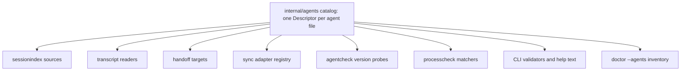

# Agent catalog SDK

**Status:** Phase 5 implementation contract · **Decided by:**
[ADR 0004](../adr/0004-universal-agent-coverage.md) · **Tier vocabulary:**
[agent-support-tiers.md](../agent-support-tiers.md)

This specifies `internal/agents`: the single place an agent is described, and
the mechanism that turns one description into registrations across the index,
transcript, handoff, sync, version-probe, and process subsystems.

It extends [contributing-an-adapter.md](contributing-an-adapter.md), which
remains the checklist for the T5 sync tier. This page covers T0 through T5.

---

## Why a catalog

Today an agent is registered in five unrelated places, each a file every other
agent also edits:

| Concern | Current registration site |
| ------- | ------------------------- |
| Encrypted sync | `defaultRegistry()` in `internal/cli/commands_impl.go` |
| Local index | `defaultLocalSources()` in `internal/cli/sessions.go` |
| Handoff source | `init()` in `internal/transcript/<agent>.go` |
| Handoff destination | `RegisterTarget()` in `internal/handoff/target_*.go` |
| Version probe | `definitions` map in `internal/agentcheck/agent.go` |

Plus agent constants, the `processcheck` switch, two CLI validators, and the
default enablement list in `internal/schema/config.go`.

After this change there is exactly one file per agent, and those nine sites
become derived consumers that iterate the catalog.



---

## The descriptor

One agent is one `Descriptor` value, constructed in
`internal/agents/catalog/<key>.go` and registered from that file's `init()`.

```go
package agents

// Descriptor is the complete, self-contained description of one coding agent.
// Exactly one Descriptor exists per agent, in internal/agents/catalog/<key>.go.
type Descriptor struct {
    Key         string // stable lowercase key, e.g. "kimi"; used in agent:session refs
    DisplayName string // "Kimi Code CLI"
    Vendor      string // "Moonshot AI"
    DocsURL     string // vendor documentation root

    Tier     Tier          // highest tier this agent has evidence for
    Family   StorageFamily // F1..F5
    T0Reason T0Reason      // required when Tier == TierKnown, empty otherwise

    Storage StorageSpec
    Native  *NativeSpec  // required at T3 and above
    Version *VersionSpec // required at T3 and above
    Process ProcessSpec

    Evidence Evidence

    // Capability constructors. A nil constructor means the agent does not
    // provide that capability. The conformance suite asserts these agree
    // exactly with Tier: no capability above the declared tier, and no
    // missing capability below it.
    NewIndexSource func(Env) (sessionindex.Source, error)      // T1+
    NewReader      func(Env) (transcript.Reader, error)        // T2+
    NewTarget      func(Env) (handoff.HandoffTarget, error)    // T4+
    NewSyncAdapter func(Env) (adapter.Adapter, error)          // T5
}
```

`Env` carries the resolved home directory, environment lookups, and fixture
root overrides, so every constructor is testable against `testdata/` without
touching a real machine.

### Tier and family

```go
type Tier int

const (
    TierKnown       Tier = iota // T0
    TierDiscover                // T1
    TierHandoffFrom             // T2
    TierResume                  // T3
    TierHandoffTo               // T4
    TierSync                    // T5
)

type StorageFamily string

const (
    FamilyHomeTree    StorageFamily = "F1" // JSON/JSONL tree under a home root
    FamilyCLIQuery    StorageFamily = "F2" // vendor CLI is the read API
    FamilyEmbeddedDB  StorageFamily = "F3" // SQLite or editor extension storage
    FamilyProjectFile StorageFamily = "F4" // per-repository files
    FamilyRemote      StorageFamily = "F5" // server-backed or desktop-only
)
```

`T0Reason` is a closed enumeration so `rein doctor` output stays machine
readable: `no_local_history`, `server_backed`, `desktop_only`,
`unidentified_product`, `unofficial_distribution_only`, `layout_unverified`.

### Storage

```go
type StorageSpec struct {
    RootEnv     string                    // "KIMI_CODE_HOME"; empty when none
    Roots       func(home HomeDir) []Root // ordered candidates, first match wins
    Marker      string                    // relative path that must exist for the root to count
    Layout      string                    // stable layout id, e.g. "sessions-workdir-wire-jsonl"
    SessionGlob string                    // relative glob below the root
    ProjectKey  ProjectKeyKind            // how the vendor derives its project bucket
    Excluded    []string                  // subtrees never read (credentials, caches, subagents)
}
```

`Roots` returns per-OS candidates. Native Windows and WSL2 are separate devices
with separate trees; a descriptor never assumes one is the other.

`ProjectKeyKind` records the vendor's bucketing scheme — path slug, path hash,
URL encoding, opaque ID, or none — so `internal/pathmap` recomputes the
destination key rather than reusing the source device's.

### Native launch, required at T3

```go
type NativeSpec struct {
    Executable    string   // "kimi"
    Resume        []string // argv template, {{.SessionID}} substituted
    Fork          []string // nil when the vendor has no fork
    Continue      []string // nil when the vendor has no continue
    NewSession    []string // T4 only
    InitialPrompt PromptMode
    MaxArgvBytes  int // 0 uses DefaultMaxArgvBytes
}
```

Every argv template must be quotable from vendor documentation in the agent's
storage page. An undocumented flag is not a template.

### Version probe, required at T3

```go
type VersionSpec struct {
    Args      []string                       // {"--version"}
    Parse     func(VersionOutput) (string, bool)
    Min, Max  string                         // inclusive, fail-closed range
}
```

This is the existing `internal/agentcheck` `definition` shape, moved into the
descriptor. Unknown or unparseable version at T3 produces `UNTESTED` and exit
code `5`, per [adapters.md](../adapters.md). Transcript readers keep the
existing softer rule: fail open on unknown version, fail closed on unknown
layout.

### Evidence, checked by the conformance suite

```go
type Evidence struct {
    StoragePage   string   // docs/session-storage/<key>.md — always required
    ProbeReports  []string // docs/testing/results/agent-probes/… — required at T1+
    Fixtures      []string // testdata/… roots — required at T1+
    DeviceReports []string // docs/testing/results/… — required at T3+
}
```

Every path must exist in the repository. A descriptor that claims a tier
without the artifacts that tier requires fails
`internal/agents/conformance` — the tier claim is enforced by tests, not by
review.

---

## Registration

```go
// internal/agents/catalog/kimi.go
package catalog

func init() { agents.MustRegister(kimiDescriptor()) }

func kimiDescriptor() agents.Descriptor { /* ... */ }
```

`MustRegister` panics on an empty key, a duplicate key, or a descriptor that
fails structural validation, so a bad descriptor fails at process start rather
than at first use.

The catalog exposes read accessors only:

```go
func All() []Descriptor              // deterministic order, sorted by Key
func Get(key string) (Descriptor, bool)
func Keys() []string
func AtLeast(t Tier) []Descriptor
func Capable(c Capability) []Descriptor
```

Consumers build their registries from these. For example
`defaultLocalSources()` becomes an iteration over `Capable(CapabilityIndex)`
instead of a hand-maintained slice.

---

## Shared scanners

An F1 agent should be roughly 150 lines of descriptor plus record mapping. The
scanning, bounding, and corruption handling are shared.

| Package | Family | Provides |
| ------- | ------ | -------- |
| `internal/agents/scan/hometree` | F1 | Root resolution, bounded glob walk, JSONL line reader with last-complete-record boundary, mod-time and size change detection |
| `internal/agents/scan/cliquery` | F2 | Bounded subprocess with timeout and output ceiling, JSON decode, non-zero-exit handling |
| `internal/agents/scan/embeddeddb` | F3 | Read-only SQLite open with immutable pragma, schema-version gate, row ceiling |
| `internal/agents/scan/projectfiles` | F4 | Project-scoped discovery from the workspace rather than a home root |

Each scanner enforces the existing ceilings — `MaxJSONLineBytes`,
`MaxSearchTextBytes`, `MaxFileReferences` — so a new agent cannot introduce an
unbounded read by accident. An agent supplies a mapping function from a raw
record to a `sessionindex.Record`, and nothing else.

F3 opens the database read-only and never takes a write lock, because the
editor may have the file open. An unrecognized schema version is a closed
failure, not a best-effort query.

---

## Conformance suite

`internal/agents/conformance` is a single exported entry point that every
agent's test file calls:

```go
func TestKimiConformance(t *testing.T) {
    conformance.Run(t, catalog.Kimi(), conformance.Fixtures{
        Root: "testdata/sessionindex/kimi",
        OS:   []string{"macos", "windows"},
    })
}
```

`Run` asserts, for the declared tier:

1. **Structure** — key shape, non-empty identity, family set, `T0Reason`
   present if and only if the tier is T0.
2. **Capability agreement** — constructors present exactly for the declared
   tier, no more and no less.
3. **Evidence presence** — every path in `Evidence` exists.
4. **Determinism** — two scans of one fixture produce identical records in
   identical order.
5. **Isolation** — the scan opens no file outside the fixture root, and opens
   nothing for writing. Enforced with a wrapped filesystem, not by convention.
6. **Corruption** — truncated final record, invalid UTF-8, empty file, empty
   directory, absent root, and unknown layout each produce the specified
   outcome rather than a panic or a partial record.
7. **Privacy** — no record field contains transcript body text beyond the
   bounded preview ceiling.
8. **Fail-closed version** — at T3, a version outside the range yields
   `UNTESTED`, and an unparseable version does not yield `SUPPORTED`.
9. **Read-only reason** — below T3, every record sets `ReadOnlyReason`.

A new agent that passes conformance and has its evidence committed is
mergeable. One that does not is not, regardless of how well the parser works.

---

## Adding an agent

The whole point of the catalog is that this list is short and the files are
disjoint.

1. `docs/session-storage/<key>.md` — start it with every row `Unverified` and
   the vendor sources cited. This is written **before** any code.
2. Run the probe on macOS and native Windows:
   `rein doctor --agents --json > probe.json`. Commit the redacted output to
   `docs/testing/results/agent-probes/<date>-<os>-<key>.json`.
3. Promote the storage page rows the probe confirms, and delete or mark the
   rows it contradicts.
4. `testdata/sessionindex/<key>/{macos,windows}/` — synthetic fixtures only,
   modeled on the probe's shape, never copied from a real tree.
5. `internal/agents/catalog/<key>.go` — the descriptor.
6. `internal/agents/sources/<key>/` — the record mapping, using the shared
   scanner for its family.
7. `internal/agents/catalog/<key>_test.go` — the conformance call plus any
   agent-specific record tests.
8. Add the row to the matrix in [../compatibility.md](../compatibility.md) and
   the tier table in [../agent-support-tiers.md](../agent-support-tiers.md).
9. `CHANGELOG.md` under `[Unreleased]`.

Steps 5 through 7 are files no other agent touches. Steps 1 through 4 are
per-agent paths. Steps 8 and 9 are the only shared files, they are append-only
table rows, and the work-breakdown assigns them a serialization rule.

---

## Files an agent task must never touch

Enforced by review and by the file-ownership map in
[../planning/v0.5.0-universal-agents/file-ownership.md](../planning/v0.5.0-universal-agents/file-ownership.md):

- `internal/agents/*.go` — the catalog core belongs to the platform task
- another agent's `catalog/` or `sources/` files
- `internal/capsule/`, `internal/crypto/`, `internal/sync/` — no agent needs
  them at T1 or T2
- `docs/session-storage-map.md` beyond its index row
- any website file — website work is a separate, later workstream

---

## Relationship to the sync checklist

[contributing-an-adapter.md](contributing-an-adapter.md) is unchanged and
remains authoritative for T5. Its nine items map onto the ladder as follows:

| Checklist item | Tier that enforces it |
| -------------- | --------------------- |
| Detect exact vendor version and layout | T3 |
| Fail closed for unknown versions | T3 |
| Discover metadata without printing transcript content | T1 |
| Define credential and cache exclusions before export | T5 |
| Stream bounded records | T1 |
| Preserve native resume identity and path layout | T3 |
| Back up and atomically replace | T5 |
| Deterministic macOS, Windows, WSL2 fixtures | T1 |
| Update adapters, compatibility, README, CHANGELOG | every tier |

Configuration adapters remain a separate contract; see
[../universal-configuration.md](../universal-configuration.md). Never infer
configuration support from session support.
