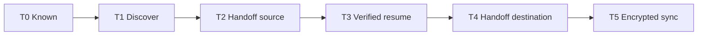

# Agent support tiers

**Status:** Phase 5 contract · **Decided by:**
[ADR 0004](adr/0004-universal-agent-coverage.md)

"Reinstate supports agent X" is not a yes-or-no fact. Support is a ladder of
six tiers, each with its own evidence gate. This page is the vocabulary every
other surface must use: docs, `rein doctor`, the compatibility matrix, the
website, and release notes.

Nothing here is a roadmap promise. An agent's **target** tier is what the
release is aiming at; its **current** tier is what shipped.

---

## The ladder

| Tier | Name | User-visible capability |
| ---- | ---- | ----------------------- |
| **T0** | Known | Named in `rein doctor` with a reason it is not usable |
| **T1** | Discover | `rein sessions`, `rein search`, `rein inspect` |
| **T2** | Handoff source | `rein handoff --from <agent>` builds a portable capsule |
| **T3** | Verified resume | `rein resume` / `rein fork` launch the vendor's own session |
| **T4** | Handoff destination | `rein handoff --to <agent>` starts a new session there |
| **T5** | Encrypted sync | `rein push` / `rein pull` carry that agent's sessions |

Tiers are cumulative: T3 implies T1, and T5 implies everything below it. An
agent cannot skip a rung, because each rung's evidence is a prerequisite for
the next one's.



Risk rises monotonically along the ladder. T1 and T2 only ever open files
read-only. T3 launches a vendor binary. T4 creates state in another vendor's
product. T5 writes files back into a vendor's private store from a remote
source. That is why breadth is delivered at the bottom of the ladder and depth
is delivered one agent at a time at the top.

---

## What each tier requires

### T0 — Known

**Capability:** the agent appears in `rein doctor --agents` with an explicit
reason it cannot be used: no local session artifacts, server-backed history,
desktop-only distribution, or unidentified product.

**Evidence required:**

1. A catalog descriptor with identity, vendor, and a machine-readable
   `t0_reason`.
2. A `docs/session-storage/<agent>.md` page, even if every row is `Unverified`.

**Explicitly not required:** any storage path, any probe, any fixture.

T0 exists so that "we have never heard of your agent" and "your agent keeps its
history on a server we cannot read" are distinguishable to a user.

### T1 — Discover

**Capability:** the agent's sessions appear in the local index, are searchable
by prompt, file, branch, and project, and can be inspected for bounded
metadata. Read-only. No launch.

**Evidence required:**

1. A **redacted device probe** from a real machine on macOS and on native
   Windows, committed under `docs/testing/results/agent-probes/`.
2. Storage rows promoted from `Unverified` to at least `Documented`, with the
   probe cited.
3. Synthetic fixtures under `testdata/sessionindex/<agent>/{macos,windows}/`,
   with `wsl/` when the agent runs there.
4. A `sessionindex` source that fails closed on an unrecognized layout.
5. Corruption tests: truncated final record, invalid UTF-8, empty directory,
   absent root, and a root that exists but is empty.
6. `ReadOnlyReason` set on every record, naming why resume is refused.

**Explicitly not required:** a version probe, an executable on `PATH`, or the
agent being installed at all. T1 reads files that already exist.

### T2 — Handoff source

**Capability:** `rein handoff --from <agent>` reads the thread and produces a
continuity capsule with a fidelity report.

**Evidence required:** everything in T1, plus:

1. A `transcript.Reader` with `Probe`, `Snapshot`, and `Parse`.
2. Boundary discipline: parse to the last complete record only, and record the
   byte offset plus the SHA-256 of the prefix.
3. Every unknown record classified `portability: referenced` or `omitted` with
   a machine-readable reason. Never guessed, never translated.
4. Golden capsule fixtures under `testdata/handoff/<agent>/`, including at
   least one truncation case and one unknown-record case.
5. Redaction verified on the agent's own record shapes.
6. Determinism: two runs over one fixture produce byte-identical capsules.

**Explicitly not required:** a version probe. A transcript reader fails open on
an unknown version and fails closed on an unknown **layout**, matching the
existing rule in [adapters.md](adapters.md).

### T3 — Verified resume

**Capability:** `rein resume <agent>:<id>` and `rein fork` launch the vendor's
own CLI against the vendor's own session, after environment verification.

**Evidence required:** everything in T2, plus:

1. A documented native resume argv, from vendor documentation, quoted in the
   agent's storage page.
2. A bounded version probe in the catalog descriptor, and a fail-closed
   supported version range with exact minimum and maximum.
3. Executable trust resolution and workspace identity guards on the launch
   path, reusing the Phase 3 contract.
4. Process detection so an active session is not resumed underneath the user.
5. A physical device journey on macOS **and** native Windows: real agent, real
   session, resumed, and the continuation observed. Recorded in a journey
   report — see "How a device journey is recognised" below.
6. Unknown version produces exit code `5` with the range in the message.

**This is the first tier that runs a binary.** A parser test is not evidence;
[adapters/contributing-an-adapter.md](adapters/contributing-an-adapter.md)
already says so, and T3 is where that rule bites.

### T4 — Handoff destination

**Capability:** `rein handoff --to <agent>` starts a **new** session in that
agent, seeded with a bootstrap prompt pointing at an inspectable capsule.

**Evidence required:** everything in T3, plus:

1. A `handoff.HandoffTarget` with `Plan`, `Materialize`, `Launch`, `Verify`.
2. A documented way to start a new session with an initial prompt, and a
   documented or conservatively budgeted argv ceiling.
3. A capability diff describing what the destination cannot do.
4. Lineage reconciliation, including honest `unresolved` and `ambiguous`
   outcomes when the destination's session ID is not knowable at launch.
5. Bidirectional device journeys against every existing destination.
6. No vendor-internal writes, per [ADR 0003](adr/0003-phase-4-rc1-scope-and-launch-route.md).

**Not expanding in `v0.5.1`.** Claude Code and Codex CLI remain the only
destinations.

### T5 — Encrypted sync

**Capability:** the agent's sessions push to and pull from BYO storage,
encrypted, with path remapping across devices.

**Evidence required:** everything in T4, plus the full nine-item adapter
checklist in
[adapters/contributing-an-adapter.md](adapters/contributing-an-adapter.md),
plus:

1. A complete `adapter.Adapter`: `Detect`, `Discover`, `PlanExport`, `Export`,
   `PlanRestore`, `Restore`, `Exclusions`.
2. Credential and cache exclusions defined **before** the first export.
3. Atomic restore with backup and rollback.
4. Cross-OS path remapping through `internal/pathmap`, with fixtures for
   macOS to Windows and back.
5. Live-session safety, conflict handling, and keep-both recovery.
6. A cross-device physical journey: push on one OS, pull on the other, resume
   natively, in a Phase 5 device report.

**Not expanding in `v0.5.1`.** Claude Code and Codex CLI remain the only synced
agents.

---

## Current and target tiers

Current tier is what candidate `v0.5.1` ships, sourced to the agent
catalog in code (`internal/agents/catalog`), not to this table. Stable
`v0.4.0` predates that package and indexes 5 agents: Claude Code, Codex CLI,
Gemini CLI, Grok Build, OpenCode. Target is the `v0.5.1` aim, which is an aim
and not a commitment: an agent whose probe finds no readable local history
stays where it is, and that outcome is a successful result, not a failed task.

| Agent | Vendor | Storage family | Current | `v0.5.1` target |
| ----- | ------ | -------------- | ------- | --------------- |
| Claude Code | Anthropic | F1 | **T5** | T5 |
| Codex CLI | OpenAI | F1 | **T5** | T5 |
| Gemini CLI | Google | F1 | **T2** | T3 |
| Antigravity CLI | Google | F1 (expected) | — | T0 (`layout_unverified`) |
| OpenCode | anomalyco | F3 | **T4** | T4 |
| Grok Build | xAI | F1 | **T2** | T2 |
| Kimi Code CLI | Moonshot AI | F1 | **T2** | T3 |
| Pi | earendil-works | F1 | **T1** | T3 |
| Qwen Code | Alibaba | F1 | **T4** | T4 |
| Cursor CLI | Anysphere | F3 (expected) | **T1** | T1 |
| GitHub Copilot CLI | GitHub | unknown | **T1** | T1 |
| Aider | Aider community | F4 | — | T1 |
| Cline | Cline | F3 | **T1** | T1 |
| Roo Code | Roo | F3 | — | T1 |
| Amp | Sourcegraph | unknown | — | T1 or T0 |
| OpenHands | All Hands AI | F5 (expected) | — | T0 |
| ZCode | Z.ai | F5 (expected) | — | T0 |
| MiniMax | MiniMax | unidentified | — | T0 |

Per-agent detail, including binaries, environment overrides, evidence status,
and blockers, is in
[planning/v0.5.0-universal-agents/agent-roster.md](planning/v0.5.0-universal-agents/agent-roster.md).

---

## Storage families

The family determines how much code an agent needs, which is why it is part of
the descriptor.

| Family | Shape | Agents | Cost |
| ------ | ----- | ------ | ---- |
| **F1** | JSON/JSONL tree under a home root | Claude, Codex, Gemini, Grok, Kimi, Pi, Qwen | Small: declare roots and record shapes against the shared scanner |
| **F2** | Vendor CLI query | none currently | Medium: bounded subprocess, plus a separate reader for bodies |
| **F3** | SQLite or editor extension storage | OpenCode, Cursor, Cline, Roo | Medium: read-only, schema-versioned, fails closed on unknown schema |
| **F4** | Per-repository files in the project | Aider | Medium: project-scoped discovery instead of a home-root walk |
| **F5** | Server-backed or desktop-only | OpenHands, ZCode, possibly Amp | T0 unless a probe finds a local artifact |

F5 is not a failure state. Recording that an agent keeps its history on a
server is a real answer to a real user question.

---

## How a device journey is recognised

From T3 upward the conformance suite checks not only that a claim cites reports
from macOS **and** native Windows, but that those reports are *about that agent
reaching that rung*. It reads the first markdown heading of each cited report,
which is why a journey names its agent and its rung there:

```
# Qwen Code T4 journey — native Windows x64, 2026-08-22
```

A claim at T4 must cite a journey for **every** rung from T3 upward, on both
platforms. A release-acceptance report is not a substitute. It may name an agent
in index or handoff-source rows without evidencing a resume at all, and two such
reports once satisfied the platform check for a tier they never demonstrated.

The four Phase 3 and Phase 4 device reports that Claude Code and Codex CLI cite
predate this convention and carry no tier vocabulary — no `T3`, no `T5`, no
per-agent row identifiers — so nothing could read a rung out of them. They are
accepted as a closed list in `internal/agents/conformance`, and nothing is added
to it.

## Rules that do not change with breadth

1. **Native resume is same-vendor.** T3 launches the agent's own CLI against
   its own session. Cross-agent continuation is T4 handoff, which creates a new
   destination session. There is no transcript translation at any tier.
2. **No vendor-internal writes below T5.** T1 through T4 never write into a
   vendor's session store.
3. **Fail closed on unknown layout, at every tier.** Exit code `5`.
4. **Never read a contributor's real agent tree.** Fixtures are synthetic;
   probes are redacted.
5. **A tier claim needs its evidence committed.** A descriptor claiming a tier
   without the artifacts that tier requires fails the conformance suite.

---

## How to state support publicly

Correct:

> Reinstate indexes Kimi Code CLI sessions and can hand off from them. Native
> resume for Kimi is not yet verified.

> Encrypted sync covers Claude Code and Codex CLI.

Incorrect, and blocked by the website contract tests in
`website/src/lib/comparison-pages.test.ts`:

> Works with all coding agents.

> Seamless cross-agent session sync.

> Sync your sessions across every agent.

When in doubt, state the tier and link the matrix.
