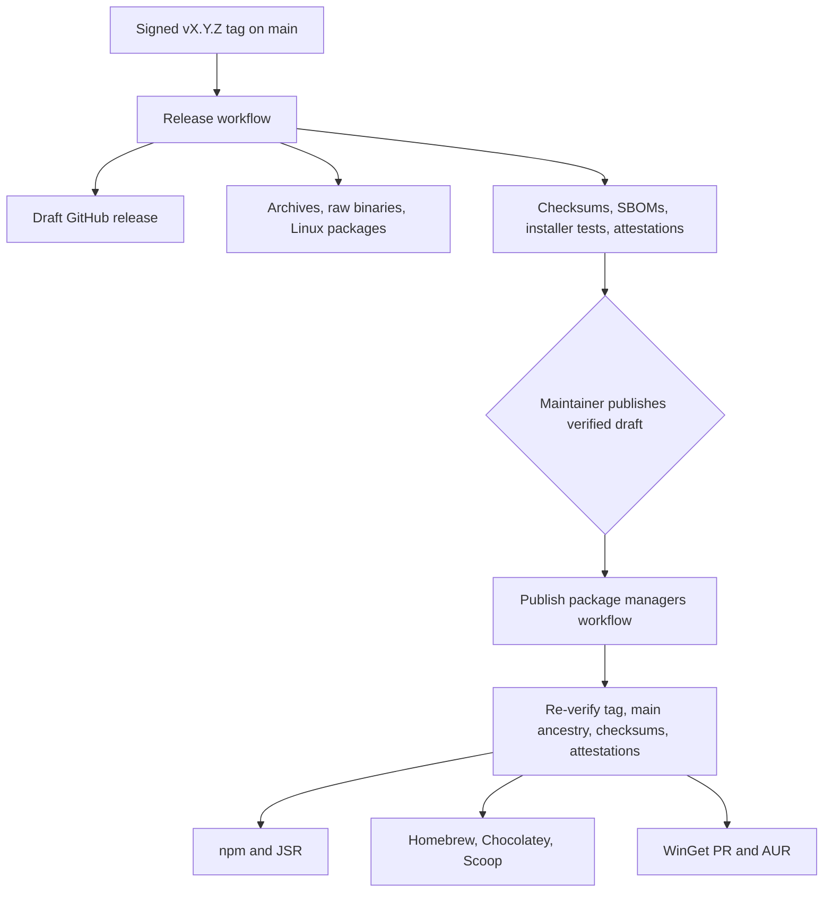

# Package-manager publishing

Maintainer plan and onboarding guide for distributing the `rein` / `reinstate`
CLI beyond the canonical GitHub release and checksum-verifying bootstraps.

This document describes prepared automation. A channel is **not a supported
install route** until its first package has been published, installed on the
native platform, and added to the user-facing install documentation. Until
then, `https://reinstate.dev/install.sh` and `install.ps1` remain canonical.
The Homebrew tap is additionally supported on Apple Silicon macOS after its
stable `v0.2.0` native smoke test.

## Outcome and channel matrix

| Channel | User command after onboarding | Automation | Credentials / external review |
| --- | --- | --- | --- |
| GitHub release | download an archive or raw binary | existing signed-tag workflow | repository `GITHUB_TOKEN`; maintainer publishes the verified draft |
| POSIX bootstrap | `curl -fsSL https://reinstate.dev/install.sh \| sh` | existing guarded website deployment | existing website release process |
| PowerShell bootstrap | `irm https://reinstate.dev/install.ps1 \| iex` | existing guarded website deployment | existing website release process |
| npm | `npm install -g @reinstate/cli` | tokenless OIDC after bootstrap | npm `reinstate` scope; one-time initial publish, then trusted-publisher links |
| JSR / Deno | `deno install --global ... jsr:@reinstate/cli/cli` | tokenless OIDC | JSR `@reinstate/cli` package linked to this GitHub repository |
| Homebrew / Linuxbrew | `brew install HarjjotSinghh/tap/reinstate` | formula committed to `homebrew-tap` | separate tap repository and fine-grained GitHub token |
| Chocolatey | `choco install reinstate` | `.nupkg` push | Chocolatey account/API key; community moderation |
| Scoop | `scoop install reinstate` after adding the bucket | manifest committed to `scoop-bucket` | separate bucket repository and fine-grained GitHub token |
| WinGet | `winget install HarjotSinghRana.Reinstate` | manifest PR through pinned WinGetCreate | GitHub token, Microsoft CLA, and community-repository review |
| AUR | `yay -S reinstate-bin` | `PKGBUILD` and `.SRCINFO` push | AUR account and dedicated SSH key |
| Debian | `apt install ./reinstate_VERSION_linux_ARCH.deb` | built into every GitHub release | none beyond GitHub release |
| RPM | `dnf install ./reinstate_VERSION_linux_ARCH.rpm` | built into every GitHub release | none beyond GitHub release |
| Alpine | `apk add --allow-untrusted ./reinstate_VERSION_linux_ARCH.apk` | built into every GitHub release | none beyond GitHub release |
| Arch package file | `pacman -U ./reinstate_VERSION_linux_ARCH.pkg.tar.zst` | built into every GitHub release | none beyond GitHub release |
| Go toolchain | `go install github.com/HarjjotSinghh/reinstate/cmd/reinstate@vX.Y.Z` | Go module proxy follows tags | no registry credential |

The unscoped npm name `reinstate` is already owned by an unrelated project, so
the prepared package intentionally uses `@reinstate/cli`.

## Rollout status

Status recorded on 2026-08-12 after promoting stable `v0.3.0`. This section is
operational state, not a claim that every prepared channel is already a
supported install route.

| Channel | Current state | Next gate |
| --- | --- | --- |
| GitHub release and native Linux files | Stable `v0.3.0` is public with a signed tag and 25 checksum- and attestation-verified assets. The public bootstraps now pin candidate `v0.4.0-rc.8`, whose tagged-artifact acceptance is pending (`v0.4.0-rc.1` was published and failed its acceptance) | Keep Intel macOS and Linux/WSL2 artifacts labeled preview until their deferred physical acceptance closes; package channels stay on stable `0.3.0` until a stable `v0.4.0` promotion |
| npm | `@reinstate/cli@0.2.0-rc.3` remains the latest published npm line; stable `0.3.0` payloads were generated but not published (no npm auth / `PUBLISH_NPM` off) | Configure trusted publishers, enable `PUBLISH_NPM`, and publish `@reinstate/cli@0.3.0` plus platform packages with the `latest` tag |
| JSR | Intentionally deferred because the maintainer's current account cannot create another scope; `PUBLISH_JSR` remains disabled | Obtain scope capacity or make an explicit namespace decision before enabling |
| Homebrew | Stable `0.3.0` formula is live in `HarjjotSinghh/homebrew-tap`; Apple Silicon install and formula test passed for `v0.3.0` | Supported on Apple Silicon; keep Intel macOS and Linuxbrew unverified |
| Scoop | Stable `0.3.0` `reinstate.json` is live in `HarjjotSinghh/scoop-bucket` with the verified Windows ZIP hash | Test install, both aliases, update, and uninstall on native Windows before advertising it in user-facing install docs |
| Chocolatey | Still pending community moderation from the earlier stable submission; not bumped for `v0.3.0` | Wait for approval or submit a `0.3.0` package, then verify on clean native Windows before advertising it |
| WinGet | Earlier stable PR remains the open review path; not re-submitted for `v0.3.0` in this bump | Complete CLA/automated review and verify after merge before advertising it |
| AUR | Dedicated CI key and independently verified host key are stored; AUR account public-key registration was blocked by an upstream 503 | Add the public key to the AUR account, verify SSH authentication, then set `PUBLISH_AUR=true` |

All repository `PUBLISH_*` switches are `false` after the one-time stable
rollout. Each future publication requires an explicit channel enablement and
protected-environment approval.

The `package-publish` environment has a required reviewer. Publishing a
verified GitHub Release starts the workflow automatically, but enabled registry
jobs do not cross that environment gate until a maintainer approves the run.
Stable-only conditions then prevent Homebrew, Scoop, Chocolatey, WinGet, and
AUR from receiving a prerelease.

## Release architecture

The registry workflow never rebuilds the CLI. It consumes the exact assets
from the published GitHub release, verifies every checksum and GitHub artifact
attestation, then generates registry metadata from those immutable files. This
keeps GitHub Release assets as the canonical binary identity.

Stable releases go to every enabled channel. Prereleases use npm's `next` tag
and JSR prerelease semantics; Homebrew, Chocolatey, Scoop, WinGet, and AUR are
deliberately skipped for prereleases. Manual re-runs are allowed only for an
already-published signed release tag.

## Files to review

- `.github/workflows/release.yml` builds and validates canonical assets.
- `.github/workflows/package-publish.yml` promotes a published release.
- `.goreleaser.yml` emits archives, raw binaries, SBOM inputs, and native Linux
  packages.
- `scripts/stage-release-assets.sh` gives local verification the same raw-file
  layout users receive from GitHub Releases.
- `scripts/prepare-package-manager-assets.mjs` generates all registry payloads
  from `checksums.txt` and the exact release binaries.
- `.github/workflows/ci.yml` exercises a complete snapshot, npm launcher, JSR
  dry run, formula syntax, package manifests, and PowerShell parsing.

## GitHub setup

1. Create a protected GitHub environment named `package-publish`.
2. Add required reviewers for the environment. A registry promotion should be
   a conscious step even though the release event starts the workflow.
3. Add only the secrets needed by enabled channels to that environment.
4. Add repository variables with a string value of `true` to enable each
   channel. Omitted or non-`true` variables safely skip the corresponding job.

| Repository variable | Required secret(s) |
| --- | --- |
| `PUBLISH_NPM` | `NPM_TOKEN` only for the initial bootstrap; remove it after OIDC is configured |
| `PUBLISH_JSR` | none after the JSR package is linked |
| `PUBLISH_HOMEBREW` | `PACKAGE_REPOSITORIES_TOKEN` |
| `PUBLISH_SCOOP` | `PACKAGE_REPOSITORIES_TOKEN` |
| `PUBLISH_CHOCOLATEY` | `CHOCOLATEY_API_KEY` |
| `PUBLISH_WINGET` | `WINGET_GITHUB_TOKEN` |
| `PUBLISH_AUR` | `AUR_SSH_PRIVATE_KEY`, `AUR_KNOWN_HOSTS` |

Use one fine-grained `PACKAGE_REPOSITORIES_TOKEN` restricted to **contents:
read/write** on only `HarjjotSinghh/homebrew-tap` and
`HarjjotSinghh/scoop-bucket`. Do not use a broad personal token.

## npm onboarding

The workflow publishes six public packages: `@reinstate/cli` plus five
platform packages for macOS amd64/arm64, Linux amd64/arm64, and Windows amd64.
The root launcher selects an embedded optional dependency. It has no install
lifecycle script and does not download executable code during installation.

1. Create or claim the npm organization/scope `reinstate`.
2. Create a short-lived granular automation token that can publish public
   packages in that scope. Store it as environment secret `NPM_TOKEN`.
3. Set `PUBLISH_NPM=true` and manually run **Publish package managers** for an
   already-published release. The workflow publishes platform packages first.
4. For every resulting package, configure an npm trusted publisher:
   organization/user `HarjjotSinghh`, repository `reinstate`, workflow
   `package-publish.yml`, environment `package-publish`, allowed action
   `npm publish`.
5. Re-run the workflow once to confirm idempotent OIDC access, then delete the
   `NPM_TOKEN` secret and revoke the bootstrap token.
6. Test both commands on macOS, Linux, and native Windows:
   `npm install -g @reinstate/cli`, `rein version --json`, and
   `reinstate version --json`.

npm trusted publishing requires GitHub-hosted runners, `id-token: write`, and a
new enough npm CLI. The workflow pins npm 11.5.1 for publication and generates
registry provenance. See the official
[npm trusted publishing guide](https://docs.npmjs.com/trusted-publishers/).

If the `reinstate` npm scope cannot be obtained, stop and choose one replacement
scope once. Update the generator, workflow queries, docs, and all six package
records together; do not publish a split namespace.

## JSR onboarding

1. Create the `@reinstate` scope and `@reinstate/cli` package on JSR.
2. Link the package to `HarjjotSinghh/reinstate` in JSR package settings.
3. Set `PUBLISH_JSR=true`. No long-lived token is required; JSR uses GitHub
   Actions OIDC and records provenance.
4. Dispatch the package workflow for a published tag.
5. Install and run it with the exact permission set shown on the published JSR
   package, then verify `rein version --json` on each supported OS.

The generated TypeScript launcher embeds the release asset name and SHA-256 for
all five targets. It downloads from the immutable versioned GitHub release,
checks the hash before an atomic cache write, rechecks cached bytes, and then
executes the binary. See JSR's official
[publishing](https://jsr.io/docs/publishing-packages) and
[provenance](https://jsr.io/docs/trust) documentation.

## Homebrew and Scoop onboarding

1. Create public repositories `HarjjotSinghh/homebrew-tap` and
   `HarjjotSinghh/scoop-bucket`, each with `main` as the default branch.
2. Add a short README and the Apache-2.0 license to each repository.
3. Create the restricted `PACKAGE_REPOSITORIES_TOKEN` described above.
4. Store it in the protected environment and enable `PUBLISH_HOMEBREW` and/or
   `PUBLISH_SCOOP`.
5. Dispatch the workflow. It changes only `Formula/reinstate.rb` or
   `reinstate.json`, commits only when content differs, and pushes to `main`.
6. Test on Intel and Apple Silicon macOS, Linuxbrew, and native Windows.

Homebrew recommends the `homebrew-` repository prefix for tap shorthand; see
[Homebrew's tap documentation](https://docs.brew.sh/How-to-Create-and-Maintain-a-Tap).
Scoop's manifest shape follows its official
[app manifest reference](https://github.com/ScoopInstaller/Scoop/wiki/App-Manifests).

## Chocolatey onboarding

1. Create a Chocolatey Community Repository account and confirm that the
   lowercase package ID `reinstate` is available.
2. Generate an API key and store it as `CHOCOLATEY_API_KEY` in the protected
   environment.
3. Set `PUBLISH_CHOCOLATEY=true` and dispatch the workflow for a stable release.
4. Follow the package moderation thread until the first version is approved.
5. On a clean Windows VM run `choco install reinstate`, then verify both command
   names and uninstall/reinstall behavior.

The Chocolatey package downloads the exact versioned GitHub ZIP with the
generated SHA-256. The package itself does not embed a second untracked binary.
See Chocolatey's official [package creation and push
guide](https://docs.chocolatey.org/en-us/create/create-packages/).

## WinGet onboarding

1. Ensure `HarjjotSinghh` has accepted Microsoft's CLA for contributions to
   `microsoft/winget-pkgs`.
2. Create the GitHub token recommended by WinGetCreate for public-repository
   submissions and store it as `WINGET_GITHUB_TOKEN`.
3. Set `PUBLISH_WINGET=true` and dispatch a stable release.
4. The workflow checksum-verifies a pinned official WinGetCreate executable and
   submits the generated three-file manifest as a PR.
5. Respond to automated validation or reviewer feedback; merging is controlled
   by Microsoft. After merge, test
   `winget install --id HarjotSinghRana.Reinstate --exact` in Windows Sandbox.

Microsoft's process requires a PR and may include manual review; a successful
workflow means **submitted**, not necessarily listed. See the official
[manifest submission guide](https://learn.microsoft.com/en-us/windows/package-manager/package/repository)
and [WinGetCreate repository](https://github.com/microsoft/winget-create).

## AUR onboarding

1. Create an AUR account and confirm `reinstate-bin` is available. The `-bin`
   suffix is required because this package consumes prebuilt upstream assets.
2. Generate a dedicated, revocable Ed25519 key pair for AUR CI. The CI key must
   not be reused for GitHub, release signing, or personal SSH access.
3. Add the public key to the AUR account. Store the private key as
   `AUR_SSH_PRIVATE_KEY`.
4. Independently verify the current `aur.archlinux.org` SSH host key and store
   the complete pinned known-hosts line as `AUR_KNOWN_HOSTS`. The workflow uses
   strict host-key checking and never runs `ssh-keyscan` on the release path.
5. Set `PUBLISH_AUR=true` and dispatch a stable release.
6. Build in a clean Arch environment with `makepkg --syncdeps --cleanbuild`,
   inspect the package, then install and test both aliases.

The official [AUR submission
guidelines](https://wiki.archlinux.org/title/AUR_submission_guidelines) require
`PKGBUILD` plus regenerated `.SRCINFO` and allow pushes only to `master`.

## First publication order

Enable channels gradually so failures stay attributable:

1. Merge the workflow change and let normal CI pass.
2. Use the next reviewed patch release; do not republish or move `v0.1.0`.
3. Confirm the GitHub draft contains 5 archives, 5 raw binaries, 8 Linux
   packages, 5 SBOMs, source, and checksums, and that attestations verify.
4. Publish the GitHub draft.
5. Enable and verify npm and JSR.
6. Enable Homebrew and Scoop repositories.
7. Submit Chocolatey, WinGet, and AUR, accounting for their reviews.
8. Only after native installs pass, add each live command to `README.md`,
   `docs/getting-started.md`, the website, and release notes.

## Stable v0.2.0 publication reminder

Do not close or remove this checklist merely because the automation is enabled.
It is complete only when the stable packages are public, externally reviewed
where required, and verified from clean native environments.

- [x] Merge the Apple Silicon macOS and native-Windows RC4 reports and their
      explicit `v0.2.0` limited-platform reconciliation. Keep Intel macOS and
      WSL2/Linux physical acceptance `NOT TESTED`, waived for this release only,
      and label those artifacts preview rather than certified.
- [x] Cut the signed stable `v0.2.0` tag from reviewed `main`, let the Release
      workflow produce the draft, and independently verify its checksums,
      attestations, binary identity, installer contracts, and package payloads.
- [x] Publish the verified GitHub draft and approve the protected
      `package-publish` environment deployment.
- [ ] Verify stable npm publication for `@reinstate/cli` and all five platform
      packages, including `latest`, provenance, clean install, both command
      aliases, update, and uninstall on every supported OS.
- [x] Decide whether JSR remains deferred; if enabled, complete its linked
      package/OIDC setup and native launcher verification.
- [x] Verify the Homebrew formula on Apple Silicon. Keep Intel macOS and
      Linuxbrew preview until their deferred physical acceptance completes.
- [ ] Verify the Scoop manifest on native Windows.
- [ ] Track Chocolatey until its first package passes moderation, then verify it
      on a clean native-Windows VM.
- [ ] Track [WinGet PR #412426](https://github.com/microsoft/winget-pkgs/pull/412426)
      through CLA, automated validation, review,
      and merge, then verify it in Windows Sandbox.
- [ ] Finish AUR account public-key registration, verify the dedicated key,
      enable `PUBLISH_AUR`, publish `reinstate-bin`, and clean-build/install it
      in an Arch environment.
- [ ] Verify supported stable routes against the stable commit. Checksum and
      attest the versioned `.deb`, `.rpm`, `.apk`, `.pkg.tar.zst`, and Linux
      archive assets, but retain their preview label until physical Linux/WSL2
      acceptance completes.

## Post-publication documentation reminder

Only advertise a route after the corresponding item above passes. Once stable
`v0.2.0` is live across the selected channels:

- [x] Update the install section and examples in `README.md`.
- [x] Update `docs/getting-started.md` and this channel matrix with every
      verified install, upgrade, and uninstall command.
- [x] Update `website/src/content/docs/installation.md` and any homepage or
      download callouts that should expose the new routes.
- [x] Update the stable release notes and `CHANGELOG.md` with links to the live
      npm/JSR/package-manager records and external review PRs.
- [x] Record native smoke-test evidence and distinguish directly downloadable
      package files from repository-backed package-manager installs.
- [x] Remove prerelease-only wording and TODOs only after the live stable routes
      have been rechecked from clean environments.

## Failure and rollback rules

- Never replace assets, move tags, or overwrite a published package version.
- If registry metadata is wrong before acceptance, yank/deprecate where the
  registry supports it and issue a new patch release.
- A failure in one downstream job does not invalidate already-published
  immutable packages. Fix credentials or metadata and manually dispatch the
  same published tag; jobs are designed to skip versions already present where
  registry APIs make that reliable.
- If a registry is compromised, set its `PUBLISH_*` variable to `false`, revoke
  its credential, document the incident, and keep the canonical GitHub release
  available only if its own tag, checksums, and attestations remain valid.
- Registry packages are distribution metadata, not a new source of truth.

## Deferred channels

- **Homebrew Core, Debian/Ubuntu archives, Fedora/COPR, Alpine community,
  nixpkgs, and MacPorts** require upstream-repository review and ongoing
  ecosystem-specific maintenance. Start with the prepared tap and release
  packages, then submit centrally after demand and maintainer capacity exist.
- **Snap** usually needs classic confinement for a CLI that must inspect coding
  agent state across arbitrary home/project paths and use native keyrings.
  Seek Snap Store approval before adding a workflow; strict confinement would
  misrepresent Reinstate's supported behavior.
- **Flatpak** targets sandboxed desktop apps and conflicts with Reinstate's host
  filesystem/keyring integration. It is not planned.
- **Containers** are useful for CI but are not a valid primary install route for
  a host continuity CLI.

## Wake-up review checklist

- [ ] Review every new workflow permission, immutable action pin, environment,
      secret, and opt-in variable.
- [ ] Review npm/JSR namespace ownership before enabling either channel.
- [ ] Review the generated Homebrew, Chocolatey, Scoop, WinGet, and AUR payloads
      from a CI snapshot artifact.
- [ ] Confirm the raw-binary and Linux-package expansion is acceptable for the
      GitHub release asset contract.
- [ ] Decide which external repositories/accounts to create now versus later.
- [ ] Require native install/uninstall evidence before changing user-facing
      install commands.
