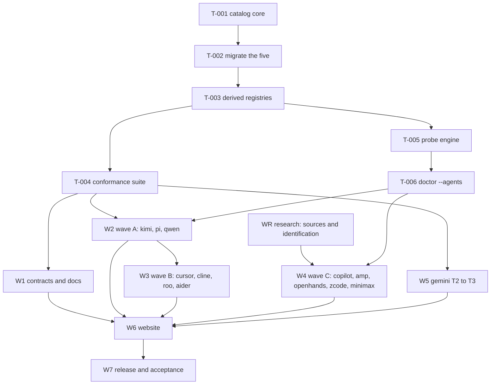

# Phase 5 work breakdown

**Roster:** [agent-roster.md](agent-roster.md) ·
**Ownership:** [file-ownership.md](file-ownership.md) ·
**Gates:** [review-gates.md](review-gates.md) ·
**Cards:** [task-cards/](task-cards/)

Eight workstreams. W0 is serialized and blocks almost everything; W2 through W4
are the parallel body of the work; W6 and W7 close it.

---

## Dependency graph

`WR` has no code dependency and starts on day one, in parallel with W0. It is
the cheapest way to keep executors busy while the catalog is being built, and
its output determines whether several W4 tasks exist at all.

---

## W0 — Platform (serialized, one executor)

**Cards:** [task-cards/W0-platform.md](task-cards/W0-platform.md)

| Task | Title |
| ---- | ----- |
| T-001 | `internal/agents` catalog core: descriptor, tiers, families, registry |
| T-002 | Migrate claude, codex, gemini, opencode, grok onto descriptors |
| T-003 | Convert the five registration sites into derived consumers |
| T-004 | `internal/agents/conformance` suite |
| T-005 | Probe engine and `AGENT-PROBE-V1` emitter with redaction tests |
| T-006 | `rein doctor --agents`, `--json`, `--acceptance-matrix`, wrapper scripts |

**One executor, start to finish.** Splitting W0 across people costs more in
coordination than it saves, because every task touches the same new package.

**The hard rule for T-002 and T-003:** no observable behavior changes. The
existing test suite must pass with **no assertion edited**. If a test has to
change, the refactor is wrong; stop and escalate rather than adjusting the
test.

### Why this must land first

Adding an agent today means editing at least five shared files, each of which
every other agent also edits:

| Concern | Registration site today |
| ------- | ----------------------- |
| Encrypted sync | `defaultRegistry()` in `internal/cli/commands_impl.go` |
| Local index | `defaultLocalSources()` in `internal/cli/sessions.go` |
| Handoff source | `init()` in `internal/transcript/<agent>.go` |
| Handoff destination | `RegisterTarget()` in `internal/handoff/target_*.go` |
| Version probe | `definitions` map in `internal/agentcheck/agent.go` |

Plus these, which also carry hard-coded agent lists:

- `internal/sessionindex/model.go` — agent constants
- `internal/sessionindex/launch.go` — native launch executables
- `internal/cli/sessions.go` — `validateLocalAgent`, `validateNativeAgent`, filters
- `internal/cli/commands_impl.go` — `list --agent` choices
- `internal/cli/handoff.go` — `--to` and `--with` help strings
- `internal/processcheck/process.go` — the process-matching switch
- `internal/capability/types.go` and `discover.go`
- `internal/preflight/verify.go` — per-agent home defaults
- `internal/schema/config.go` — default enabled agents

Fifteen agents times fifteen shared files is not a parallelizable shape. After
W0, each of those reads the catalog, and an agent is one new file.

---

## WR — Research (parallel, no dependencies, starts immediately)

**Cards:** [task-cards/W4-wave-c-research.md](task-cards/W4-wave-c-research.md)

Establish official sources, product identity, binary names, and documented
session surfaces for every candidate, and fill in the corresponding page under
[../../session-storage/](../../session-storage/).

Two candidates may resolve to "there is nothing to add" and that closes them:

- **MiniMax** — if the coding experience is a MiniMax model running inside
  another vendor's harness, the harness is the catalog entry and MiniMax is
  not. Reinstate indexes harnesses, not models.
- **ZCode** — [ADR 0004](../../adr/0004-universal-agent-coverage.md) decision 8
  excludes unofficial re-packagings. Probe the Z.ai-distributed application,
  not the npm client.

Research output is a documentation change only. No Go code is written in WR.

---

## W1 — Contracts and documentation (one executor, after T-004)

**Cards:** [task-cards/W1-contracts.md](task-cards/W1-contracts.md)

| Task | Title |
| ---- | ----- |
| T-010 | Tier column and Phase 5 rows in `docs/compatibility.md` |
| T-011 | `internal/doctest` contracts binding the catalog to the docs |
| T-012 | Migrate the five shipped agents' sections into `docs/session-storage/` |
| T-013 | `docs/cli-reference.md`, `docs/adapters.md`, `docs/README.md`, README updates |

T-011 is the load-bearing task: it makes the tier claim mechanically checked in
documentation the same way conformance checks it in code. Without it, the
matrix drifts from the catalog within one release.

---

## W2 — Wave A agents (parallel, one executor per agent)

**Cards:** [task-cards/W2-wave-a-agents.md](task-cards/W2-wave-a-agents.md)

| Task | Agent | Target |
| ---- | ----- | ------ |
| T-020 | Kimi Code CLI | T3 |
| T-021 | Pi | T3 |
| T-022 | Qwen Code | T2 |

All three are F1 and use the shared `hometree` scanner, so they are genuinely
independent once W0 lands. Kimi is the flagship and should be assigned to the
strongest executor: it has the richest documented layout, the global session
index, and the documentation conflict that proves the probe requirement.

---

## W3 — Wave B agents (after W2 starts landing)

**Cards:** [task-cards/W3-wave-b-agents.md](task-cards/W3-wave-b-agents.md)

| Task | Agent | Family | Target |
| ---- | ----- | ------ | ------ |
| T-030 | Cursor CLI | F3 | T1 |
| T-031 | Cline | F3 | T1 |
| T-032 | Roo Code | F3 | T1 |
| T-033 | Aider | F4 | T1 |

**T-031 before T-032.** Cline establishes multi-host root resolution and host
attribution for the F3 family; Roo reuses it. Running them concurrently means
two people inventing the same scanner.

T-033 owns the `projectfiles` scanner and is independent of the F3 tasks.

---

## W4 — Wave C, honest T0 (parallel, after WR and T-006)

**Cards:** [task-cards/W4-wave-c-research.md](task-cards/W4-wave-c-research.md)

| Task | Agent | Expected outcome |
| ---- | ----- | ---------------- |
| T-040 | GitHub Copilot CLI | T1 or T0 `server_backed` |
| T-041 | Amp | T1 or T0 `server_backed` |
| T-042 | OpenHands | T0 `server_backed` |
| T-043 | ZCode | T0 `desktop_only` or `server_backed` |
| T-044 | MiniMax | T0 `unidentified_product`, or closed as not-an-agent |

**The cache trap.** A local cache of server-held state is indistinguishable
from a local authoritative store to a naive scanner. T-040 and T-041 must
observe the tree across a cache clear or a re-login before claiming T1.
Indexing a cache produces records that later vanish under the user, which is
worse than not indexing the agent at all.

---

## W5 — Promotion (one executor, after T-004)

**Cards:** [task-cards/W5-promotions.md](task-cards/W5-promotions.md)

| Task | Title |
| ---- | ----- |
| T-050 | Promote Gemini CLI from T2 to T3 |

Gemini has a verified read path and a documented resume flag; what it lacks is
the version probe that T3 requires. It is the cheapest demonstration that the
ladder works upward as well as outward.

---

## W6 — Website (one executor, after code merges)

**Cards:** [task-cards/W6-website.md](task-cards/W6-website.md)

| Task | Title |
| ---- | ----- |
| T-060 | `website/src/data/compatibility.json` and tier data |
| T-061 | Integrations pages and the agent matrix component |
| T-062 | Roadmap page renumbering to match `ROADMAP.md` |
| T-063 | Vitest contract updates and copy review |

W6 runs **after** the code, never beside it. The website asserts product truth,
and product truth is not settled until the tiers are.

The copy constraint is enforced by `website/src/lib/comparison-pages.test.ts`,
which rejects "all coding agents" and "seamless cross-agent". Those tests are
correct and must not be weakened to accommodate marketing language. Breadth
is stated as a matrix, not as an absolute.

---

## W7 — Release and acceptance (maintainer plus coordinator)

**Cards:** [task-cards/W7-release.md](task-cards/W7-release.md)

| Task | Title |
| ---- | ----- |
| T-070 | CHANGELOG, version bump, release commit |
| T-071 | Candidate tag and dispatch |
| T-072 | macOS Phase 5 device report |
| T-073 | Windows Phase 5 device report |
| T-074 | Reconciliation, tier reductions, stable promotion |

Follows [../../../RELEASING.md](../../../RELEASING.md) unchanged. The Phase 5
matrix is
[../../testing/phase-5-universal-agent-coverage-acceptance.md](../../testing/phase-5-universal-agent-coverage-acceptance.md).

Device reports are physical work on real machines. An executor cannot produce
one; the maintainer runs them.

---

## Documentation contracts that will bite

`internal/doctest` binds documentation to code. A change in one without the
other fails CI. The tests most likely to be hit by this phase:

| Test file | What it locks |
| --------- | ------------- |
| `phase4_cli_contract_test.go` | CLI reference flags; the directional handoff matrix rows; and a classifier that rejects any paragraph in the main docs implying cross-agent native identity |
| `version_test.go` | Released-version claims across README, compatibility, adapters, and the presence of Phase 0 and Phase 1 in `ROADMAP.md` |
| `prompts_test.go` | Setup prompt documents |
| `seo_product_truth_test.go` | Website release truth |

The classifier in `phase4_cli_contract_test.go` operates per paragraph. Do not
write a paragraph that combines "native resume" with "same session" or
"cross-agent", even to deny it. Keep the two subjects in separate paragraphs.

---

## Merge protocol

1. One task, one branch, one PR. Branch from the integration branch
   `feat/universal-agent-coverage`, never from `main`.
2. PRs target the integration branch. Only the coordinator opens the final PR
   into `main`.
3. Rebase on the integration branch before requesting review. Never merge the
   integration branch into a task branch.
4. A PR that touches a file outside its ownership entry is rejected on sight,
   not reviewed. See [file-ownership.md](file-ownership.md).
5. Small and reviewable beats complete. `AGENTS.md` non-negotiable 6 applies.

---

## Escalate instead of guessing

Stop and report to the coordinator when:

- a probe contradicts a documented layout, and the correct row is unclear;
- an agent's evidence supports a **lower** tier than the roster targets;
- a task appears to require editing a file it does not own;
- a test must be changed to make a refactor pass;
- an agent has no local history and the task looks like it has "failed";
- a vendor's product identity cannot be established from official sources.

Every one of these has a correct answer that is not "make it work". The last
two are frequently correct outcomes that close a task successfully.
