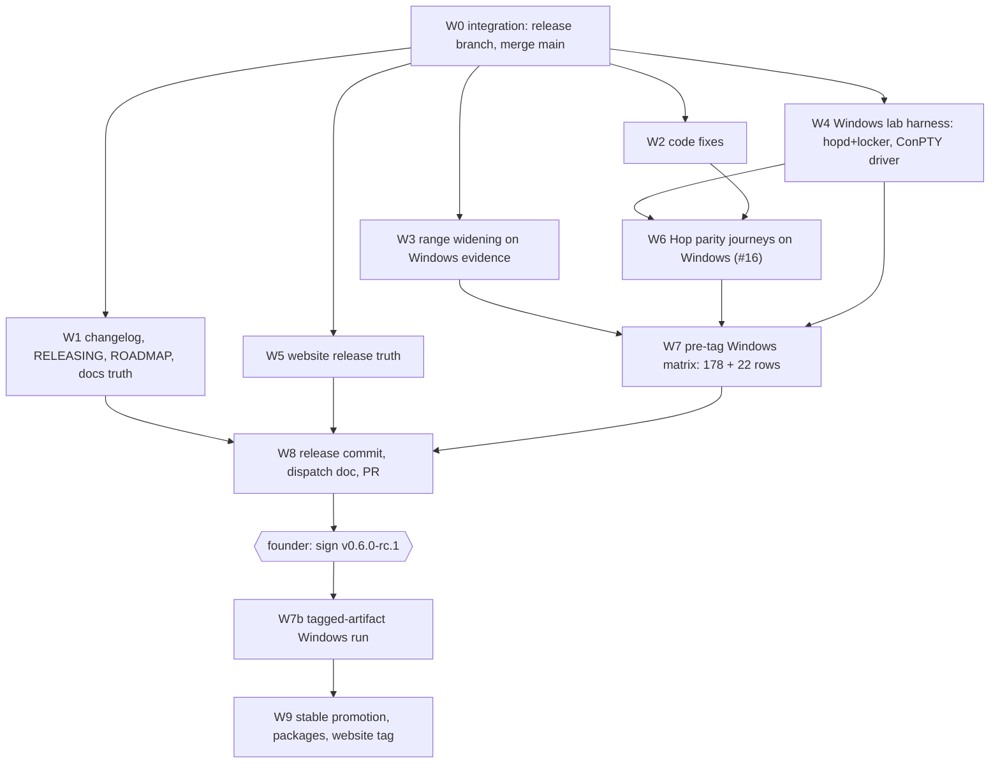

# v0.6.0 work breakdown

**Plan:** [README.md](README.md) · **Ownership:** [file-ownership.md](file-ownership.md) ·
**Gates:** [review-gates.md](review-gates.md) · **Cards:** [task-cards/](task-cards/) ·
**Contract:** [Windows acceptance](../../testing/v0.6.0-windows-acceptance.md)

Nine workstreams. W0 is serialized and blocks everything. W1–W5 are the
parallel body. W6 and W7 are evidence. W8 closes the candidate; W9 closes the
stable and is mostly founder steps.

Every executor and every verifier is a Sonnet agent. The coordinator plans,
reviews at the gates, merges, and fixes what the gates reject when a fix is
faster than a round trip.

---

## Dependency graph

---

## W0 — Integration (serialized, one executor) — **running**

**Card:** [task-cards/W0-integration.md](task-cards/W0-integration.md)

| Task | Title |
| ---- | ----- |
| T-000 | Create `release/v0.6.0-rc.1` from `hop/main`; merge `main`; resolve CHANGELOG; full suite; reconcile semantic collisions |

Blocks every other workstream. Nothing branches until its report says the
suite is green (modulo the known preflight flake, which W2 owns).

---

## W1 — Changelog, release docs, roadmap, product truth (one executor + one verifier)

**Card:** [task-cards/W1-docs.md](task-cards/W1-docs.md)

| Task | Title |
| ---- | ----- |
| T-101 | Reshape `[Unreleased]` into `## [0.6.0-rc.1] - DATE` with a highlights paragraph; merge duplicate headings; every bullet survives; the changelog guard passes |
| T-102 | `RELEASING.md`: Windows-first waiver under the platform boundary; `v0.6.0-rc.1` candidate gate; founder steps for signing |
| T-103 | `ROADMAP.md`: Phase 6 split (6C ✅ in `v0.6.0`, Windows evidence; 6A/6B → `v0.7.0`); "last updated"; stable release policy line |
| T-104 | `docs/hop.md`, `README.md`, `docs/getting-started.md`, `docs/cli-reference.md`, `docs/security-model.md`: truth pass for D1 (service not open), stale "daemon follows" sentences, command list completeness; doc gate green |
| T-105 | `docs/compatibility.md` platform table and Hop rows worded per D2/D3 (W3 supplies the numbers) |

---

## W2 — Code fixes (one executor + one verifier)

**Card:** [task-cards/W2-fixes.md](task-cards/W2-fixes.md)

| Task | Title |
| ---- | ----- |
| T-201 | Preflight shared-deadline test: load-tolerant bound, same shape as the `TestHugeTreeFinishes` widening |
| T-202 | `rein login` / `rein whoami` against an unreachable default control plane: one-sentence message naming the URL and pointing at `docs/hop.md`; exit code unchanged; test with a refused connection |
| T-203 | `GOOS=windows`/`darwin`/`linux` `go build ./...` and `go vet` all clean; `go mod tidy -diff` empty |
| T-204 | Sweep: any `TODO(v0.6.0)`/`FIXME` that names this release, any test skipped on Windows without a recorded reason |

---

## W3 — Verified-range widening on Windows evidence (one executor + one verifier)

**Card:** [task-cards/W3-ranges.md](task-cards/W3-ranges.md)

| Task | Title |
| ---- | ----- |
| T-301 | Claude Code ceiling `2.1.238` → `2.1.261` in `internal/adapter/claude`, `internal/agentcheck`, `internal/agents/catalog/claude.go`, docs, website JSON — after a real native-Windows create → index → resume round trip proves it |
| T-302 | OpenCode `1.18.21` → `1.18.27` likewise (T3 resume, T4 destination, T5 push/pull round trip within one host) |
| T-303 | Confirm Codex `0.149.0`, Qwen `0.21.13`, Grok `1.0.5` are the installed versions and in range; record all five in a results doc with the evidence policy's redaction |
| T-304 | `docs/compatibility.md` and `website/src/data/compatibility.json` notes: "widened on native Windows evidence; macOS pending" |

Evidence goes to `docs/testing/results/2026-09-DD-windows-range-widening-v060.md`.

---

## W4 — Windows lab harness (one executor + one verifier)

**Card:** [task-cards/W4-harness.md](task-cards/W4-harness.md)

| Task | Title |
| ---- | ----- |
| T-401 | `scripts/testing/hoplab/`: start `hopd` (built from the private repo path given by env) with `HOPD_STORAGE=fake`, `HOPD_EMAIL_SENDER=log`, a fresh DB, and `scripts/testing/fakelocker`; print the env block a client shell needs; stop cleanly. PowerShell and Bash entrypoints |
| T-402 | Two-home recipe: two isolated Reinstate homes plus isolated agent roots on one host so pairing, revocation, and the lagging device can be exercised without a second machine |
| T-403 | ConPTY: probe whether the host allocates pseudo-consoles again (#367). If not, a Go driver under `scripts/testing/conptydriver` that runs a command under `CreatePseudoConsole`, answers the Bubble Tea startup queries, injects keystrokes from a script, and captures the stream — the Windows twin of `vendor-tty-driver.py` |
| T-404 | Document the bench in `docs/testing/windows-acceptance-host.md` (Hop lab section, ConPTY driver section) |

---

## W5 — Website release truth (one executor + one verifier)

**Card:** [task-cards/W5-website.md](task-cards/W5-website.md)

| Task | Title |
| ---- | ----- |
| T-501 | `releases.ts`, `product.ts`, `compatibility.json`, `released-tiers.json`, `agent-version-history.ts` for `v0.6.0-rc.1`; installers keep pinning `v0.5.1` until stable |
| T-502 | Product-truth tests (`product-truth.test.ts`, `seo.test.ts`, `linkable-assets.test.ts`) updated to the new truth, not weakened |
| T-503 | Website docs mirror: `hop.md` page from `docs/hop.md` with the D1 wording; `contact.astro` and `storage.md` sentences that deny a hosted tier exists become "not yet open" |
| T-504 | `npm run build` and `vitest run` green; the SEO/link/freshness checks that run offline green |

---

## W6 — Hop parity journeys on Windows, hosted #16 (two executors + one verifier)

**Card:** [task-cards/W6-hop-parity.md](task-cards/W6-hop-parity.md)

| Task | Title |
| ---- | ----- |
| T-601 | H1–H5: sign-in, `init --hop`, `account init`, first push (Claude, Codex, OpenCode), wipe → recover → pull → verified resume |
| T-602 | H6–H8: pairing across two homes, daemon Task Scheduler round trip and loop, revocation with the lagging-device attack (`-tags hopacceptance` crossplane test against the local `hopd`) |
| T-603 | H9–H11: `sync verify` report, `sync migrate --to byo` and `--forget-hop`, path remap across the two homes' project mappings |
| T-604 | Every Windows-only defect fixed with a regression test, or listed as a release blocker in the results doc |

Results: `docs/testing/results/2026-09-DD-windows-hop-parity-v060.md`.

---

## W7 — Pre-tag Windows matrix (three executors + one verifier)

**Card:** [task-cards/W7-matrix.md](task-cards/W7-matrix.md)

| Task | Title |
| ---- | ----- |
| T-701 | Snapshot build of the candidate commit (`scripts/snapshot.ps1`, `stage-release-assets.ps1`, `check-release-artifacts.ps1`, `test-install.ps1`); install the staged Windows archive into a fresh directory |
| T-702 | Phase 5 generated matrix, Windows column: core A/B/G/H (33 rows) plus per-agent C/D/E/F rows (178 total at this catalog) |
| T-703 | CLI experience matrix, Windows column: the 22 rows, through the W4 ConPTY driver |
| T-704 | Results doc per the Phase 5 template plus the CLI and Hop sections; `PARTIAL`/`NOT TESTED` fail required rows |

After the founder signs the tag, **W7b** repeats T-701–T-704 against the
published artifacts installed from the live bootstrap, per the dispatch doc W8
writes. That report, not this one, authorizes stable.

---

## W8 — Release commit and candidate PR (one executor; coordinator verifies)

**Card:** [task-cards/W8-release.md](task-cards/W8-release.md)

| Task | Title |
| ---- | ----- |
| T-801 | Release commit: changelog date, `CITATION.cff`, bootstrap contract test, website data from W5, `docs/testing/v0.6.0-rc.1-agent-verification-prompts.md` (Windows dispatch with the deferred-macOS table), `RELEASING.md` candidate section |
| T-802 | `make verify`, `go mod tidy -diff`, snapshot and artifact gates on the exact commit; clean tree |
| T-803 | Push `release/v0.6.0-rc.1`; open the PR to `main`; CI green; re-point #366, comment on #367/#368 with the W4 outcome |
| T-804 | Open the deferred-macOS issue listing every row owed (D2) |

---

## W9 — Stable promotion (founder-gated)

**Card:** [task-cards/W9-stable.md](task-cards/W9-stable.md)

| Task | Title |
| ---- | ----- |
| T-901 | After W7b PASS: stable release commit (installers pin `v0.6.0`, website `currentRelease`, `RELEASING.md` stable evidence under the waiver) |
| T-902 | Founder signs `v0.6.0`; publish; package promotion; signed `website-v` tag and guarded deploy |
| T-903 | Fast-forward `hop/main`, retire the ticket branches and worktrees, close hosted #16 with the report link |
