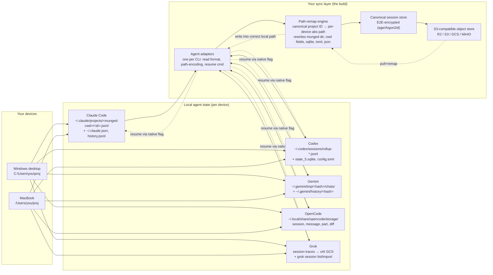

Worth building — yes. The pain is real, well-documented, and felt broadly enough that there's a real audience. But the framing of "essentially just storing sessions on S3" undersells the actual hard part by a lot. The storage layer is trivial; the moat (and the minefield) is **path portability across operating systems and the seven-place sprawl of where each CLI hides project paths**. That's also where every existing tool — including the ones already shipping — has a gap you can exploit.

## The landscape you're walking into

## What each CLI actually stores (and why "just sync the file" breaks)

The honest engineering reality: every one of these agents keys sessions to the **absolute working-directory path**, encoded differently per tool, and none of them follow the project when it moves — let alone when it moves between `C:\Users\you\code\app` on Windows and `/Users/you/code/app` on macOS.

| Agent | Session location | Format | Resume mechanism | Native cross-device? |
|---|---|---|---|---|
| Claude Code | `~/.claude/projects/<munged-cwd>/<id>.jsonl` + sibling `<id>/subagents/` | JSONL, linked list via `parentUuid`, `cwd`/`gitBranch` per entry | `claude --resume <id>` (must run from same dir) | Partial — `--teleport`/`--cloud` via Anthropic cloud, GitHub-only 【turn1search5】【turn0fetch2】 |
| Codex CLI | `~/.codex/sessions/*/rollup-*.jsonl` + `state_5.sqlite` + `config.toml` + `.codex-global-state.json` | JSONL transcript + SQLite + TOML | `codex continue <id>`, `codex exec --resume-session-id` | No 【turn2fetch0】【turn1fetch1】 |
| Gemini CLI | `~/.gemini/tmp/<project_hash>/chats/checkpoint-*.json` + `~/.gemini/history/<hash>` (shadow git) | JSON + git snapshots | `gemini --resume` / `-r` | No 【turn0search17】【turn1search10】 |
| OpenCode | `~/.local/share/opencode/storage/{session,message,part,session_diff}/` | Custom (can grow to GBs) | `opencode --session <id>` / `--continue` | Partial — `/share` → `opncd.ai/s/<id>` (OpenCode's servers) 【turn0search23】【turn1search22】 |
| Grok Code/Build | Local + auto-uploaded to xAI GCS bucket `grok-code-session-traces` | Traces | `grok --session latest`, `grok session list/search/delete` | Yes but controversial — auto-uploads repo+history to xAI 【turn0search19】【turn2search10】 |

The single most important technical finding for your project: Claude Code and Codex together store the project path in **seven different places** — munged directory name, `.claude.json` projects dict, `githubRepoPaths`, Codex `state_5.sqlite`, `config.toml` `[projects."path"]` sections, `.codex-global-state.json`, and per-session `cwd` fields inside the JSONL. When the directory moves (or exists at a different path on another OS), "session history vanishes. Thread-to-directory associations break." 【turn2fetch0】 GitHub issue #35226 confirms `--resume` silently fails when a session ID is valid but belongs to a different directory, and Claude Code currently has **no built-in directory migration**. 【turn1search14】【turn2fetch1】

On Windows specifically the situation is worse: the same folder produces different encoded entries depending on whether you launched from CMD, PowerShell, or Git Bash (`C:\\Users\\...` vs `C:/Users/...` vs `c:`), creating duplicate project entries. 【turn2search2】 Cross-OS, the munged paths don't even resemble each other — `-Users-you-code-app` (mac) vs `-C--Users-you-code-app`-ish (windows). A naive "sync `~/.claude/projects/`" approach drops the file into a directory name that `--resume` will never look in on the other machine.

## Competitive landscape — the space is already warm

| Tool | Scope | Approach | Gap you can exploit |
|---|---|---|---|
| **claude-sync** (tawanorg) | Claude Code only | Go CLI, age E2E encryption, R2/S3/GCS, syncs raw `~/.claude/projects/` + skills/settings | No cross-OS path remap; Claude-only 【turn0fetch0】 |
| **perfectra1n/claude-code-sync** | Claude Code only | Rust, git-backed history sync | Single-agent, git-based 【turn0search15】 |
| **AgentsView** (kenn-io) | Claude + Codex + Gemini (read) | Local-first viewer, `s3://` roots, analytics | Viewer, not a resume-enabler 【turn2search5】【turn2search6】 |
| **skills-sync** (ryanreh99) | Config only (no sessions) | Profile-driven skills+MCP across Codex/Cursor/Gemini/Copilot/Claude | Direct competitor to your *current* Dev Sync 【turn0search10】 |
| **amtiYo/.agents** | Config only | `.agents` source of truth for MCP/skills/instructions across 6 agents | Direct competitor to Dev Sync config scope 【turn0search12】 |
| **Anthropic `--teleport`/Sessions API (beta)** | Claude only | Official cloud, moves web↔terminal | GitHub-repo-only, Anthropic-cloud-locked 【turn1search5】【turn2search12】 |
| **OpenCode `/share`** | OpenCode only | Native share-to-cloud | Single-agent, OpenCode-hosted 【turn0search23】 |
| **Grok `session import-from-claude-code`** | Grok only | Native cross-agent import | One-directional, Grok-only 【turn2search10】 |

Two takeaways from this table. First, your existing Dev Sync (centralized MCP config) is already going up against skills-sync and `.agents` — that niche is filling fast. Second, the **session-sync** niche is occupied per-agent (claude-sync owns Claude) but **nobody owns unified cross-agent session sync with path remapping**. That's your white space.

## The hard problems you'll actually need to solve

**1. Path portability is the product, not a footnote.** This is where claude-sync is thinest and where you can clearly win. The design that works: maintain a **canonical project ID** (e.g. a hash of the git remote + repo name, or a user-assigned alias) mapped to per-device absolute paths. On `pull`, run a remap pass that rewrites the munged directory name, every `cwd` field inside the JSONL, the Codex SQLite rows, `config.toml` sections, and `.claude.json` project entries. The `migrate-project.sh` script from harnez already does the single-machine rename version of exactly this across all seven stores — generalize it to cross-OS and you have your core differentiator. 【turn2fetch0】

**2. Each adapter needs to know the resume incantation, not just the file location.** Claude: `claude --resume <id>` from the correct dir. Codex: `codex continue <id>` or `codex exec --resume-session-id <id>`, with `--all` to escape the directory filter. Gemini: `--resume`/`-r`. OpenCode: `opencode --session <id>`. Grok: `grok --session latest|<id>`. 【turn1fetch1】【turn0search20】【turn0search15】 The adapter's job is: drop the synced transcript into the locally-correct path, then invoke the right resume command.

**3. Conflict handling on append-only transcripts.** JSONL is append-only, so for a single session last-writer-wins per line is mostly fine — but if you edit the same session from two devices concurrently, you'll get divergent `parentUuid` chains. Claude Code's native `/branch` and `--fork-session` give you a clean answer: detect divergence and auto-fork rather than merge. 【turn0search5】 Vector clocks or even just "session locked to device X until pushed" will do for an MVP.

**4. Format drift is a permanent tax.** These formats are barely documented — the JSONL deep-dive explicitly notes "Anthropic barely documents the format" and was reverse-engineered from reading thousands of lines. 【turn0fetch2】 Codex, Gemini, and OpenCode are no better, and all five CLIs ship breaking changes monthly. Budget for version detection per adapter and graceful degradation (if you can't parse a field, pass the raw line through untouched).

**5. Security is table stakes, not a feature.** After the Grok Build scandal (uploading full git history + `.env` to xAI's GCS), users are hyper-aware of session data leaving their machine. 【turn0search19】 claude-sync already sets the bar: age encryption (X25519 + ChaCha20-Poly1305) with Argon2id passphrase-derived keys, so the cloud store sees only ciphertext. 【turn0fetch0】 Match that or users won't trust you with their transcripts.

## Recommended MVP scope — resist the "universal" temptation

The fastest path to something that actually works and that you'll use daily:

1. **One agent first: Claude Code.** Best-documented format, largest user base, clearest resume semantics. Ship cross-OS path remap for Claude before touching a second agent.
2. **Two-device, S3-compatible, E2E-encrypted.** R2 free tier is plenty (sessions are typically <50MB). 【turn0fetch0】 Reuse the age + Argon2id pattern.
3. **Path-remap engine as the headline feature.** This is the thing claude-sync doesn't do well and the thing that makes your tool actually work between Windows and macOS — which is literally your own use case.
4. **Then add Codex** (its seven-store sprawl is well-mapped by the harnez work 【turn2fetch0】), then Gemini, then OpenCode, then Grok last (its native cloud + import features make it lowest priority).

## Where the real moat could be (beyond "sync the file")

Three angles that no current competitor does, any one of which would justify the project beyond scratching your own itch:

- **Cross-agent context injection.** Store a canonical session model derived from the raw transcripts, and let me resume a Claude Code session's *context* inside Codex or Gemini on the laptop. Nobody does this. Grok's `import-from-claude-code` is one-directional and Grok-only. 【turn2search10】
- **Unified Dev Sync = config + skills + MCP + sessions.** If you're already pivoting Dev Sync from MCP-only to universal, bundling sessions into the same control plane is a genuinely differentiated position — skills-sync and `.agents` do config but not sessions; claude-sync does sessions but only Claude and not config. The intersection is empty.
- **Team/shared sessions.** claude-sync and perfectra1n are both single-user. A hosted control plane for team session sharing, audit, and cross-agent injection is a plausible paid tier on top of an OSS CLI.

## The risk worth naming honestly

The biggest existential risk isn't claude-sync — it's **vendor native solutions gradually eating the space**. Anthropic's `--teleport` + beta Sessions API already moves Claude sessions across devices via their cloud; OpenCode has `/share`; Grok has native import + cloud traces. 【turn1search5】【turn2search12】【turn0search23】【turn2search10】 Each vendor has incentive to make their own sessions portable *within their own ecosystem*. Your defensibility lives in the **cross-agent + cross-OS + self-hosted/E2E-encrypted** intersection — the part no single vendor will build because it benefits their competitors. That's a real and durable niche, but it means the value proposition has to be explicitly "works across all of them, on your own storage, with path remapping" rather than "syncs Claude Code," because the latter is already a solved problem with a free OSS solution.

Build it. Start with Claude Code + cross-OS path remap as the wedge, treat the adapter-per-agent layer as the architecture from day one (even if only one adapter ships initially), and the multi-agent + cross-agent-injection expansion becomes the thing that separates Dev Sync from the single-agent sync tools already out there.
