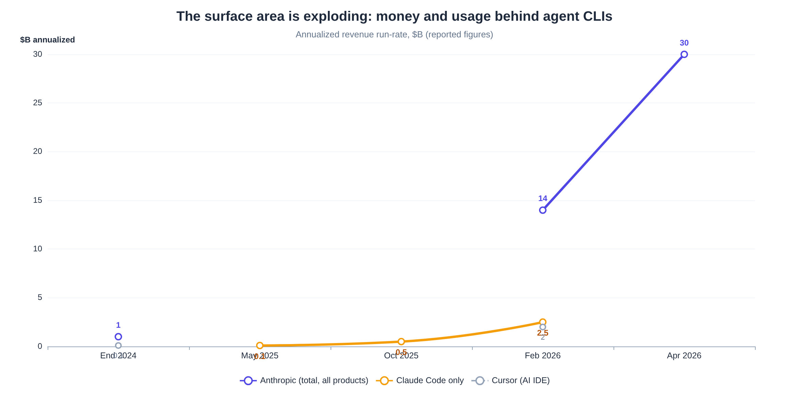

# Devsync: Cloud Session Sync for AI Coding Agents — Deep Research & Build Verdict

*Research date: 2026-07-25 · Scope: Claude Code, OpenAI Codex, Gemini CLI, OpenCode, Grok Build (plus adjacent IDEs/orchestrators) · Question: is universal cloud sync of coding-agent sessions and configs across devices worth building, and if so, how?*

---

## TL;DR

**Yes — build it. The idea is good, the timing is right, and the specific niche you carved out (universal, cross-device sync of *sessions + MCP configs + skills* for *all* terminal coding agents) is genuinely unoccupied.** The pain is documented on the official issue trackers of Anthropic, OpenAI, and Google, where users have filed feature request after feature request asking for exactly what you described [^11^][^14^]. OpenAI's tracker carries the same request, nearly word for word [^3^]. Three direct-but-partial competitors exist and none has broken out. **claude-sync** is Claude-only with ~229 GitHub stars [^2^]. **coding-agent-sync** is config-first with sessions bolted on, covering Claude + OpenCode only [^4^]. And MCP-only tools like **mcp-sync** (~46 stars) propagate configs across tools on a *single* machine but never across devices [^39^]. The uncomfortable truth you must design around: **OpenAI already ships account-level sync for Codex across CLI, desktop, and mobile** [^21^][^18^]. Anthropic is clearly marching the same direction — web sessions persist across devices and can be "teleported" back to the CLI [^10^][^28^]. Each vendor will eventually sync *its own* agent; none will ever sync its competitors' agents. Your moat is therefore not "sync" — it is **universality, vendor-neutrality, end-to-end encryption with bring-your-own storage, and the unification of sessions with the config layer (MCP servers, skills, agents) you already built Devsync for.** The pivot from "MCP config sync" to "full agent-state sync" is exactly the right expansion: MCP-sync alone is too thin to sustain a tool (the 46-star evidence says so), while sessions are the emotionally resonant killer feature that gets people to install it.

---

## 1. What you are actually building

### 1.1 The problem, restated precisely

Your own framing is already the correct product framing: a coding-agent session is a *thread of messages, tool calls, tool outputs, decisions, and reasoning* — and right now that thread is trapped on the machine where it was created. After an 8-hour day producing ~20 sessions across 4 projects on your Windows desktop, the context that matters at night on the MacBook is not in `git log`; it is in the transcripts. The standard workaround — pull latest commits and have a fresh agent re-derive what changed — throws away the reasoning layer (why approach B was rejected, which files the agent already read three times, what the user said about style preferences mid-thread) and re-spends tokens rediscovering it. Users filing the equivalent request on Anthropic's tracker put it the same way: "`--continue` / `--resume` only work within the same machine… being able to pick up exactly where you left off on a different machine would significantly improve the workflow" [^15^], and "JSONL files embed absolute `cwd` paths… manual sync via Syncthing/rsync is fragile" [^14^]. One user resorted to Windows directory junctions pointing `~/.claude` into OneDrive and noted it "took the better part of a session to get right. A non-technical user should not have to do this" [^11^]. The gap is not hypothetical or niche — multi-device development (desktop + laptop, work + home, Mac + Windows + Linux) is the default shape of the exact power-user cohort that runs agent CLIs all day [^13^][^35^].

It is worth being precise about *why* the transcript is the asset, because it determines what Devsync must preserve. A session file is not a chat log in the consumer sense; it is the full execution record — every prompt, every tool call with its inputs, every tool result, the model's reasoning blocks, token accounting, the git branch and working directory at each step [^55^][^59^]. Two sessions that touched the same code can have wildly different future value: the one where the agent already mapped the auth module and was told "never touch the legacy migration path" carries constraints that took real time to establish. Re-deriving that from a diff is impossible; re-establishing it in a fresh session costs tokens and, worse, user attention — the user has to *remember what they remember*. That is why "just have a new agent read the changes" feels so unsatisfying in practice, and why the requests consistently ask for continuation of the *same* session rather than a summary of it [^15^][^3^].

### 1.2 Why the timing is unusually good

Three curves are crossing right now. First, the agent-CLI user base exploded: Claude Code went from launch to a reported **$2.5B annualized run-rate inside nine months**, authors roughly **4% of all public GitHub commits**, and took a **46% "most loved" rating** in a 15,000-developer survey in February 2026 [^58^][^54^]. As early as October 2025 it was already past a $500M annualized run-rate with 10× user growth since its May 2025 general launch [^29^]. OpenAI says Codex has **over 4 million weekly users** [^18^]. Gemini CLI and Codex CLI sit at ~106K and ~101K GitHub stars respectively (fetched 2026-07-25) [^25^][^3^]. Second, multi-*agent* fragmentation is real: power users routinely run two to five different agents depending on task and subscription, and orchestration tools now advertise support for "10+ agents (Claude Code, Codex, Gemini, Copilot, Amp, Cursor, OpenCode, Droid, CCR, Qwen Code)" as a selling point [^51^] — meaning any sync tool that only speaks one vendor's format leaves most of this cohort unserved. Third, the vendors themselves just validated the cross-device thesis by shipping partial versions of it — Claude Code on the web keeps sessions that "persist across devices, so a task you start on your laptop is ready to review from your phone later" [^10^], and OpenAI's ChatGPT app now connects to your desktop Codex so "the app is always in sync with what you did on your desktop" [^18^]. When incumbents start marketing the behavior, the market for the universal, vendor-neutral version of that behavior stops needing education.

A subtler timing point: the cohort in question self-selects into your target demographic. People who run two machines *and* multiple agent CLIs *and* care enough to customize MCP servers and skills are, definitionally, the most tool-forward developers in the industry — the ones who star repos, write blog posts, and pull their teams into new workflows. The Anthropic issue tracker frames the affected population as "likely a significant portion of the user base" [^11^]. Reddit threads about two-computer Claude Code setups recur across r/ClaudeAI and r/ClaudeCode [^35^][^36^]. Google's own forum has users telling Antigravity to "give the Google experience" of everything-follows-your-account [^49^]. Meanwhile the surface count keeps growing — Claude Code alone now spans terminal, VS Code and JetBrains extensions, a desktop app with local and remote session types, web, and mobile [^69^] — and every new surface a vendor adds is another place users expect their state to be waiting. A neutral layer that already handles five agents inherits each new agent's audience the day an adapter ships.

---

## 2. Demand evidence: people are asking for this everywhere, out loud

### 2.1 On the vendors' own trackers

The strongest possible demand signal is users filing the feature request with the incumbent — it means the pain survived the friction of writing it up. What makes the signal stronger still is its persistence and shape: not one thread gathering dust, but a stream of separately filed requests across March through May 2026, each written by a different user with a different workflow — Mac-and-MacBook pairs, Mac+Windows+Linux triples, VS Code Remote clients — and nearly all still open, none closed by a shipped fix. That last detail is the tell: when vendor roadmaps are moving as fast as these are, an unresolved request usually means the fix doesn't fit the vendor's own architecture, not that nobody noticed. On **anthropics/claude-code**, at least six distinct open requests cover this territory:

- session portability across machines (Mar 2026) [^17^];
- cross-machine session sync/sharing (Mar 2026) [^15^];
- cross-device session sync/resume with portable path resolution (Apr 2026) [^14^];
- connecting instances across Mac/Windows/Linux with shared context (Apr 2026) [^13^];
- CLI-to-desktop-app history sync explicitly modeled on OpenAI's implementation (May 2026) [^66^];
- memory/settings sync across devices (May 2026) [^11^].

On **openai/codex**, the same pattern repeats across three separate filings within a single quarter. The OpenAI-side requests skew toward surface unification — desktop app, mobile app, and CLI as windows onto one thread list — which foreshadows exactly what OpenAI shipped later that quarter, and which a third party cannot replicate at the account level. What a third party *can* replicate, and what these users asked for before the native version existed, is the portable thread itself. That sequence — users ask for portable state, vendor ships hosted surfaces — is the pattern to watch on the Anthropic side too, and it is why a file-level sync tool retains value even where native sync arrives:

- a mobile companion showing "active and recent Codex desktop/cloud threads under the same ChatGPT account" (May 2026) [^20^];
- making local CLI sessions first-class in Codex desktop history (May 2026) [^67^];
- and a July 2026 discussion titled — almost verbatim your pitch — "Synchronization of Codex Threads and Session Context Across Devices," whose author writes that switching devices forces them to "recreate the context manually, re-explain the architecture of the project, or restart tasks that were already underway" [^3^].

Google is not exempt from the pattern either. Gemini CLI's resume machinery only landed in December 2025 after sustained community pressure [^23^][^25^]. Antigravity users are already asking Google to "push conversation to cloud" so a new device login retains history [^49^]. The cross-vendor consistency is itself the finding: within the same span of months, users of three rival ecosystems independently asked for the same capability, in nearly the same words — which is about as close as product research gets to a control experiment confirming the need is ecosystem-agnostic rather than a quirk of one tool's UX. It also means demand does not depend on any single vendor's fortunes; whichever agent wins a given user's loyalty next year, the multi-device continuity problem travels with them.

Read the proposed solutions inside those requests and you get a ready-made product spec, written by the users themselves. Two things stand out when you tabulate the asks. The first is their consistency — the same primitives, vocabulary, and acceptance criteria recur across three rival vendors' trackers. The second is their modesty: nobody requests real-time collaboration or shared agent brains; they request storage, export, and a setting. Both observations should calm scope anxiety — the market is asking for plumbing, not magic, and plumbing is buildable by one determined developer on weekend time. It is worth screenshotting these threads, incidentally: they double as your landing-page copy, since no sentence you write will ever describe the pain better than its sufferers already have. Concretely, users ask for:

- cloud-based session storage tied to the account, with opt-in semantics [^15^];
- explicit `export`/`import` commands with portable path resolution [^17^][^14^];
- sessions stored on the server side rather than per client [^16^];
- a single setting that redirects state into any synced folder [^11^].

They are also strikingly realistic about the hard parts: one requester explicitly concedes "even if local file paths or environments differ between machines, retaining the conversational context and high-level task history would significantly improve usability" [^3^] — meaning your path-mapping layer is understood by the market to be the crux, not an implementation detail. Notice what that requester did: they pre-emptively descoped the hardest sub-problem to make the feature more buildable, which is exactly the scope discipline §7 asks of Devsync itself. Notably, these threads remain open; the vendors' shipped answers (cloud VMs, relays) address adjacent needs while leaving the local-CLI continuity request itself unresolved [^10^][^1^], which is exactly the seam a third-party tool can occupy.

### 2.2 In the wild: grassroots tools and DIY plumbing

When users can't wait for the vendor, they build the sync themselves — the second-strongest demand signal. **claude-sync** is a purpose-built Go CLI that encrypts `~/.claude` with age and pushes it to Cloudflare R2/S3/GCS/WebDAV, with passphrase-derived keys, selective "sessions-only" scope, and a genuinely thoughtful cross-device path-mapping system (more on that in §5) [^2^]. **coding-agent-sync** distributes Claude Code and OpenCode configs — including MCP servers from `~/.claude.json`, custom agents, rules, and OpenCode session contexts — through AES-256-GCM-encrypted private GitHub Gists [^4^]. A VS Code extension called **antigravity-storage-manager** syncs Google Antigravity conversation history across computers via the user's own Google Drive behind a master password [^52^]. Around the edges sit the quality-of-life helpers: `codex-tabs` for named/resumable Codex sessions [^64^], and a Codex Session Picker built because resume UX lagged [^70^]. A macOS "Agent Sessions" app reads both Codex and Claude Code logs locally [^61^]. And beneath all of it, the fully manual layer: developers running Syncthing on `~/claudecode/projects`, symlinking `~/.claude` subtrees onto a Synology NAS, and splitting changelogs into machine-local vs. project-synced — one practitioner's writeup syncs ~253,000 files across 30 project directories this way [^5^]. Adoption is still early (npm: @tawandotorg/claude-sync ~822 downloads/month; happy-coder ~4K/month, fetched 2026-07-25) [^2^][^6^], but the shape of the solution space is already proven; what is missing is the *universal, polished, trusted* version.

Two meta-observations about this grassroots layer matter for your design. First, every one of these tools is single-ecosystem: claude-sync speaks only Claude Code, and the Antigravity extension speaks only Antigravity's storage [^2^][^52^]. The Codex helpers likewise speak only rollout files [^64^]. The same pattern repeats per vendor because each storage layout is just different enough that generalizing is real work. That is the moat-by-plumbing opportunity: nobody has yet paid the cost of five adapters plus a shared path-normalization engine. Second, the DIY stacks reveal what users tolerate when desperate: SMB mounts with symlink farms, Syncthing's ~10-second propagation and `.sync-conflict` files, plaintext API keys on a network share, and setup scripts that must be re-run per machine [^5^]. Each tolerated rough edge is a feature requirement in disguise — conflict safety, secret handling, one-command bootstrap — and a polished tool that removes them converts that entire DIY population on day one.

---

## 3. Competitive landscape: four categories, one empty quadrant

### 3.1 The four categories everyone falls into

Everything shipping today clusters into one of four buckets. **(a) Native vendor cloud** — the agent vendor's own cloud sessions: Claude Code on the web/desktop-remote runs on Anthropic-managed VMs, with sessions persisting across devices and a "teleport" that copies transcript plus edited files down to your local CLI [^10^][^28^]. Codex cloud/desktop/mobile threads sync under one ChatGPT account via an authenticated relay [^18^][^21^]. Anthropic's Remote Control exposes a *running local* session to claude.ai or the mobile app [^1^]. These are excellent but vendor-locked by design, and — crucially for your positioning — Remote Control is a **live relay, not stored sync**: "Local process must keep running… if you close the terminal… the session ends" [^1^]. **(b) Remote-access relays** — Happy (mobile/web client for Claude Code and Codex, end-to-end encrypted relay, ~22.8K stars) [^6^], and even Grok Build community tooling with a Telegram remote-control bridge [^40^]. These answer "drive my home machine from my phone," not "my state exists independent of any one machine." **(c) Same-machine cross-tool config sync** — mcp-sync propagates MCP server definitions across Claude Desktop, Claude Code, Cline, Roo, VS Code, Cursor, and Continue *on one computer* [^39^]. The MCP Manager app does similar across 9+ clients [^41^], and MCPHub.nvim centralizes servers for Neovim [^44^]. This category is literally your original Devsync concept, and its ceiling (46 stars for mcp-sync) tells you config-sync alone is a feature, not a product. **(d) Cross-device state sync** — claude-sync and coding-agent-sync cover agents [^2^][^4^]. antigravity-storage-manager covers Google's IDE [^52^]. Small, single-vendor or two-vendor, and early. The empty quadrant — visible in the positioning map — is **universal × cross-device × works-when-the-other-machine-is-off**.

The boundaries between these buckets are porous in instructive ways. Anthropic's redesigned desktop app straddles (a) and (b): it offers Local, Remote (Anthropic-hosted), SSH, and WSL session environments, and can "continue a session on the web or in your IDE," with Routines syncing across CLI, web, and desktop through the cloud account [^69^]. That shows a vendor converging on "every surface sees your work" — but only inside Anthropic's walls, and only for session types born on their infrastructure; the local CLI transcript store remains outside the sync perimeter [^66^]. It also shows the relay/cloud split clearly: anything that requires your machine to be awake (Remote Control, SSH modes) fails the exact scenario you described — desktop off, laptop in bed — while cloud-VM sessions answer it by moving the *work*, not the *state* [^1^][^10^]. Devsync's category (d) is the only one whose premise is that state itself should be portable.

### 3.2 Traction: the sync layer has no winner yet

The star counts tell the story cleanly: the agent CLIs themselves are enormous (Gemini CLI 106,152; Codex 101,218; Grok Build 22,303 within days of open-sourcing; OpenCode 13,527), the orchestration/relay layer has proven breakout potential (Vibe Kanban 27,500; Happy 22,832), and the sync-specific tools are rounding errors by comparison — claude-sync 229, mcp-sync 46 (all fetched from GitHub on 2026-07-25) [^2^][^39^][^6^][^34^][^51^]. Two readings are possible, and both matter. The bullish reading: **the category is pre-consolidation** — nobody has shipped the definitive tool, and the audience (millions of agent-CLI users) dwarfs the current adoption of every sync tool combined. The bearish reading: sync is plumbing that users expect the vendor to provide for free, and third-party tools get absorbed — OpenAI's native sync is the live demonstration of that risk. Both are true simultaneously, which is why the differentiation analysis in §4 and §6 matters more than the raw gap.

One caution against over-reading low star counts: they measure discovery and positioning as much as demand. claude-sync launched in February 2026, is Claude-only, and its README is its entire marketing [^2^]; mcp-sync solves a same-machine problem most people solve by hand once and forget [^39^]. Meanwhile the two adjacent projects that nailed a compelling demo — Happy's "control Claude Code from your phone" and Vibe Kanban's "kanban board for your agents" — rocketed past 20K stars [^6^][^51^], proving this exact audience adopts meta-layer tooling aggressively when the value is visible in a screenshot. Cross-device resume is an unusually demo-able value proposition (a two-minute video of `claude --resume` reviving a Windows session on a Mac tells the whole story), which suggests the ceiling for a well-positioned sync tool is far above what the current crop's numbers imply.

### 3.3 The orchestration neighborhood (why it is *not* your competition)

A crowded category of tools — Vibe Kanban, Conductor, Claude Squad, Nimbalyst (née Crystal), Superset, Paneflow, opcode, Mux — manages *parallel* sessions: worktree-per-agent isolation, kanban boards of running tasks, diff review [^45^][^51^]. They are worth studying but not fearing. Their unit of value is *supervision of many concurrent agents on one machine*; yours is *continuity of one developer's state across machines*. The two compose rather than compete — indeed Nimbalyst's pricing page lists "optional paid sync" as a monetizable add-on, which both validates sync-as-paid-feature and hints that orchestrators may bundle naive sync later [^46^]. Note also the churn in this neighborhood: Vibe Kanban's original company (bloop) shut down on April 10, 2026 and the project is now community-maintained [^45^], a reminder that building adjacent-to-platforms is risky when the platform can bundle the feature. Your hedge against that same fate is being *multi-platform by construction* — no single vendor can bundle you away.

There is also useful design DNA to steal from this neighborhood. The worktree-per-session isolation model these tools normalized matters for Devsync's conflict semantics: if your two devices ever work the same repo concurrently, the honest answer is separate branches or worktrees, not transcript merging — orchestrators already trained users to think this way [^45^]. Their boards and sidebars also preview what a Devsync "session library" UI could become later: a cross-device, cross-agent inventory of resumable threads with status and diffs attached [^46^]. Keeping that as a Phase-3 option rather than a v1 scope is the discipline that keeps the project shippable; the orchestrators' crowded example shows how quickly the UI layer becomes a tarpit of features, while the sync layer underneath remains unbuilt.

---

## 4. The incumbent risk, assessed honestly

### 4.1 What the vendors already ship

OpenAI is furthest along and is the canonical warning: ChatGPT "Cloud Work chats sync across web, mobile, and desktop," and the mobile app reaches into desktop Codex through a relay layer "that keeps trusted machines reachable across devices without exposing them to the public internet" [^21^][^18^]. A Claude Code user explicitly filed "Sync CLI conversation history with Claude desktop app" arguing for "account-based sync… similar to how OpenAI's Codex CLI syncs conversations with the ChatGPT desktop app" [^66^] — users now *expect* this per-vendor. Anthropic's answer so far is asymmetric: cloud sessions (web/desktop-remote) persist and teleport, and Routines created in the CLI show up at claude.ai/code immediately [^10^][^69^]. But **local CLI sessions remain local-only** — the open feature requests in §2.1 are the proof [^66^]. Google's Gemini CLI has rich *local* session management (auto-save, session browser, checkpoints, retention policies) with no cloud story [^9^][^23^]. Antigravity's cloud-sync request sits unanswered in Google's forum [^49^]. xAI's Grok Build is a days-old open-source CLI with local session flags (`-s`, `-r`, `-c`, `/resume`, `/sessions`, `/fork`) and no sync story [^33^][^34^]. OpenCode stores sessions locally under `~/.local/share/opencode/` with no first-party sync [^43^].

The pattern across the laggards is consistent: everyone invested in *local* session ergonomics first (browsers, checkpoints, retention policies), because that is what same-machine users needed — Gemini CLI's December 2025 session-management release reads almost exactly like the feature set Claude Code already had, down to `/resume` browsing and `--resume <uuid>` flags [^23^][^12^]. Cross-device is universally the *next* item, visible in each ecosystem's open requests rather than its changelogs [^49^][^3^]. For a third party this is a gift: by the time Devsync ships, every target agent will have mature local resume semantics for the restore side to hook into, and none will have universal sync. The adapter's job is therefore stable and well-defined — put the right bytes in the right layout, and the vendor's own `--resume` does the rest.

### 4.2 What the vendors will and will not do

The strategic forecast that should shape Devsync: **every vendor will eventually offer account-synced sessions for its own agent**, because the demand is overwhelming and the architecture (they already run relay infrastructure) is near at hand. That kills any *single-vendor* third-party sync tool on a long enough timeline — claude-sync's Claude-only scope is an absorption target, and its 229 stars won't protect it. But three structural facts keep the universal layer defensible. First, **no vendor will ever sync a competitor's sessions**, and the power-user cohort is irreducibly multi-agent — the orchestration tools' "10+ agents supported" marketing exists precisely because users mix Claude Code, Codex, Gemini, OpenCode, and more [^51^]. Second, the **config layer** (MCP servers, skills, agents, rules, settings) is inherently cross-vendor — Anthropic has no incentive to write your `opencode.json`, Google has no incentive to manage your `~/.claude/skills/`, and yet users want one coherent environment across all of them [^4^][^39^]. Third, **bring-your-own-storage with end-to-end encryption is a trust posture vendors can't match** — their sync necessarily means your transcripts (which contain source code and sometimes secrets) live on *their* infrastructure, whereas Devsync can offer ciphertext-only storage on infrastructure the user already controls (R2, S3, Gists, a home NAS via WebDAV) [^2^][^52^]. The remaining real risks — format churn, secret hygiene, DIY substitution — are engineering and positioning problems, covered in §5 and §8.

A second-order point completes the moat analysis: vendor sync deepens vendor lock-in, which creates its own counter-pressure. If your Codex threads live in ChatGPT's cloud and your Claude sessions live in Anthropic's, your environment is fragmented *by design* — and the moment you want to leave a vendor, your history is the hostage. A neutral, encrypted, user-controlled store is the only architecture where the user owns the accumulated context layer independent of which model currently wins their preference [^21^][^65^]. There is precedent for this neutrality premium in the ecosystem itself: Grok Build deliberately auto-reads `CLAUDE.md` and `.claude/` (skills, agents, MCPs, hooks, rules) so "existing project context just works" [^33^] — vendors already interoperate with the *file* layer when it suits adoption. Devsync simply turns that de-facto file-level standard into maintained infrastructure with a sync engine attached.

---

## 5. Technical feasibility: the formats are friendly, the edge cases are the product

### 5.1 Session anatomy, per tool

Every target agent persists sessions as plain JSON or JSONL on disk — there is no opaque database to reverse-engineer, no API to negotiate, and resume is always a local-file operation. That makes the core of Devsync a file-sync problem with a normalization layer, which is very buildable. It also means the trust story is clean: the tool reads only files the user already owns, writes only to the same directories, and the vendor CLIs remain the sole executors of the transcripts — Devsync never interprets or replays a session, it relocates one. This last property matters more than it first appears, because it keeps the tool firmly in "user-owned files on user-owned machines" territory rather than "third-party client of a vendor API," which is both a simpler legal posture and a more robust engineering one. The per-tool facts that your adapters must encode:

| Tool | Session storage | Format | Resume mechanism | Portability blockers |
|---|---|---|---|---|
| **Claude Code** | `~/.claude/projects/<munged-path>/<session-uuid>.jsonl` (+ sibling subagent dir) | Append-only JSONL; lines carry `type`, `uuid`, `parentUuid`, `timestamp`, `sessionId`, `cwd`, `gitBranch`, `version` [^59^] | `claude --resume`; keeps appending to same file [^55^] | Project dir name is a **lossy** munging of the absolute path (non-alphanumerics → `-`), and absolute `cwd` is embedded in every line [^57^][^14^] |
| **Codex CLI** | `~/.codex/sessions/YYYY/MM/DD/rollout-<ts>-<uuid>.jsonl` + `~/.codex/state_5.sqlite` index | JSONL rollout log; `session_meta` head + event stream [^63^][^60^] | `codex resume [id]`; picker backed by SQLite state DB [^60^] | Auto-generated IDs/filenames (no custom naming) [^61^]; resume behavior varies by CLI version (scan limits, regressions) [^63^][^62^] |
| **Gemini CLI** | `~/.gemini/tmp/<project_hash>/chats/session-*.json` (+ `logs.json`, checkpoints) | Single JSON per session: prompts, responses, tool I/O, token stats [^9^] | `gemini --resume [idx\|uuid]`, `/resume` browser [^12^] | `<project_hash>` derives from the project's absolute root path; `tmp/` location signals "disposable" semantics to some users [^9^][^30^] |
| **OpenCode** | `~/.local/share/opencode/project/<slug>/storage/` (git projects) or `global/storage/` | JSON session/message/part records [^43^] | In-app session list | Project slug mapping; `auth.json` with API keys sits in the same tree and must **never** sync [^43^] |
| **Grok Build** | `~/.grok/` (config `config.toml`, auth `auth.json`; session store per CLI internals) | Local session files; named sessions supported [^32^][^33^] | `grok -s <name>` / `-r <name>` / `-c`; `/resume`, `/sessions` in TUI [^33^] | Newest and fastest-moving codebase of the set — expect format drift [^34^] |

Two cross-cutting details deserve emphasis before the design discussion. First, **Windows↔macOS is the default crossing**, not an edge case — your own setup and a large share of the demand threads are exactly this pair [^11^][^13^]. It multiplies the path problem: Claude's slug munging, Codex's recorded `cwd`, and Gemini's project hash all encode OS-specific absolute paths (`C:\Users\…` vs `/Users/…`), and Codex even accumulates duplicate rollout sets across "path casing variants" of the same repo on WSL/Windows [^60^]. Second, **resume quality is a moving target on the vendor side**. Codex's picker has shipped scan-limit bugs and performance regressions tied to history size [^63^][^62^]. Devsync's restore flow should therefore prefer the most robust entry point per agent (direct resume-by-ID where available) and treat the vendor pickers as conveniences layered on top of a correct on-disk layout.

### 5.2 The five hard problems (and how each is already proven solvable)

**Path rewriting is the make-or-break feature**, and claude-sync has already demonstrated the reference design: store sessions remotely under portable tokens (`${HOME}`, user-defined `${WORK}`), rewrite tokens to each device's real paths on pull — including inside transcript content, since Claude Code embeds `cwd` in every JSONL line — and expose a `path_map` config for users whose project roots differ across machines (`~/work` vs `~/Projects`) [^2^]. Devsync must generalize this: each adapter declares how its tool derives session-to-project mapping (munged dir name for Claude, `cwd` in `session_meta` for Codex, project hash for Gemini, slug for OpenCode), and the normalizer performs bidirectional translation. Do it wrong and `claude --resume` on the laptop simply won't find the desktop's sessions; do it right and cross-OS (Windows desktop → macOS laptop) resume *just works*, which is precisely the magic moment your users are buying [^14^][^11^].

**Scale and delta-sync matter more than you'd think.** Typical Claude session stores are small — under ~50MB, effectively free on any storage tier [^2^]. But Codex users accumulate *gigabytes*: one WSL2 user reported a 6.1GB `~/.codex/sessions` with 473 rollouts and single files up to 328MB; another archived 3.1GB across 821 sessions [^60^][^62^]. A naive "re-upload changed files" design will torch bandwidth and free-tier quotas on day one. The answer is append-aware delta sync: JSONL files only ever grow at the tail, so chunk content-addressed storage (restic-style) plus tail-appends keeps routine syncs in the kilobyte range, and lets you offer cheap retention policies ("keep 30 days / 50 sessions," mirroring Gemini CLI's own `sessionRetention` knobs) [^23^]. **Conflicts** are rarer than intuition suggests — the dominant pattern is sequential use (desktop by day, laptop by night), same as Syncthing practitioners report [^5^] — but they must fail safe: never overwrite; fork the session into a `.conflict` copy or duplicate session ID and let the user resolve, the approach claude-sync takes with interactive `conflicts` resolution [^2^]. **Secrets hygiene is non-negotiable**: transcripts record everything a tool printed, "which can include secrets read from a `.env` or an error log" [^55^]. Devsync therefore needs three defenses. (1) Mandatory client-side encryption before any byte leaves the machine — age with passphrase-derived keys (Argon2) is the proven pattern, AES-256-GCM the alternative [^2^][^4^]. (2) Hard-coded exclusion of credential files (`auth.json`, `.credentials.json`, API-key-bearing configs) [^43^]. And ideally (3) opt-in regex redaction of high-entropy strings on upload. **Format churn** is a maintenance tax, not a blocker: line `type` vocabularies evolve with each CLI release [^59^], and Codex's state DB is already on its fifth schema (`state_5.sqlite`) [^60^]. Treat every parser defensively — skip unknown line types rather than fail, exactly as the ClaudeWrapper Elixir library does with its "liberal parsing" rule [^57^] — and keep golden fixtures per agent version in CI.

### 5.3 What to explicitly *not* sync

A sync tool that mirrors everything is a liability dispenser: one leaked `auth.json`, one accidentally mirrored transcript laden with `.env` output, and the tool's reputation is over before it starts. The exclude list therefore deserves first-class design status, enforced by safe defaults rather than by documentation nobody reads. Every exclusion below should ship enabled by default, overridable only through an explicit config flag that prints a warning — the secure path must be the lazy path. This is one of the few places where the tool should be opinionated to the point of paternalism, because the failure mode is silent and irreversible:

- **Credential/auth files** — OpenCode's `auth.json`, Grok's `auth.json`, Claude OAuth state [^43^][^32^];
- **Plugin caches** bundling `node_modules` and Python `.venv` trees — thousands of large, arch-specific files "that are regenerated on demand and should not be synced," as claude-sync's sessions-scope rationale puts it [^2^];
- **Machine-local logs and changelogs** — the NAS practitioner's split of machine-local vs. project-synced changelogs is the right mental model [^5^];
- **User glob excludes** (`projects/*/node_modules/*`, `*.tmp`) [^2^]. Syncing *settings* needs nuance too: `settings.json` and `~/.claude.json` (where Claude Code keeps MCP servers) are mostly portable, but may embed machine-specific paths or tokens — hence the normalizer's path-token layer applies to configs as well as transcripts [^4^][^11^]. This is where your existing Devsync MCP-config work plugs in naturally: the config-sync engine you already conceived becomes the "config adapter" family of the bigger system, upgraded from same-machine propagation to cross-device, encrypted transport.

A final subtlety separates good restores from corrupted ones: *when* you write matters as much as *what*. All of these agents append to live session files while running, so a pull that lands mid-session can interleave with the agent's own writes — the restore path needs atomic swaps (write to temp, rename) and a simple liveness check (refuse to overwrite a session file whose owning process is active, or at minimum warn loudly), plus the timestamped local backup any careful sync tool already takes before touching existing files [^2^]. The same care applies in reverse on push: snapshot-then-read for consistency rather than streaming a file the agent is actively appending to, which is trivially satisfiable given JSONL's append-only tail semantics but fatal to ignore. These are small details, and they are also exactly the ones that determine whether early adopters trust the tool with six months of accumulated history [^62^].

---

## 6. Product strategy: how Devsync wins the quadrant

### 6.1 Positioning and the comparison that matters

The one-sentence positioning: **"Devsync is the sync layer for your entire AI development environment — sessions, MCP servers, skills, and settings — across every coding agent and every machine you own, encrypted so only you can read it."** Against the three things users will compare you to, the story holds up: versus *native vendor sync* (Codex/ChatGPT today, presumably Claude eventually), you cover all the other agents they also use plus the config layer vendors ignore, and their transcripts never touch a vendor's server [^21^][^66^]. Versus *claude-sync*, you are a superset — same proven storage/encryption model, but five agents instead of one, plus the config-sync engine they don't have [^2^]. Versus *coding-agent-sync*, you treat sessions as the first-class citizen rather than an export/import afterthought, and you go beyond Gists (size-constrained) to real object storage with delta sync [^4^]. The feature matrix makes it concrete:

| Capability | Native vendor sync | claude-sync | coding-agent-sync | **Devsync (target)** |
|---|---|---|---|---|
| Sessions sync across devices | Per-vendor only [^21^][^10^] | Claude Code only [^2^] | OpenCode contexts only; Codex "coming soon" [^4^] | **All five CLIs** |
| Works when other device is off | Yes (cloud) / No (Remote Control is live-relay) [^1^] | Yes [^2^] | Yes [^4^] | **Yes** |
| MCP servers / skills / agents / settings | No (vendor-local) | Partial (Claude tree) [^2^] | Yes (Claude + OpenCode) [^4^] | **Yes, universal** |
| E2E encryption, ciphertext at rest | No (vendor-held) | age, passphrase-derived [^2^] | AES-256-GCM [^4^] | **age/AES, BYO keys** |
| Bring-your-own storage | No | R2/S3/GCS/WebDAV [^2^] | GitHub Gists [^4^] | **Object storage + Gist + WebDAV** |
| Delta/append-aware sync | N/A | Gzip full-file [^2^] | Full-file [^4^] | **Chunked CAS + tail-append** |
| Team session sharing | No | No | No | Roadmap |

The universality claim also future-proofs against the market's fastest-moving variable: new agents. Grok Build went from announcement to a 22K-star open-source release in roughly a year [^37^][^34^]. Google's Antigravity appeared as an agent-first IDE with its own storage layer, which third parties already sync [^49^][^52^]. Orchestration lists now track 10+ distinct agent harnesses [^51^]. Every entrant writes local session files and exposes a resume path, because that is the interaction model Claude Code established and everyone copies [^30^][^37^]. An adapter architecture converts each new agent from a competitive threat into an incremental feature — a weekend of format mapping — whereas each new agent is strictly additive to the value of the user's Devsync-managed environment.

### 6.2 Why sessions are the hook and config is the glue

The usage psychology is worth designing around deliberately. **Sessions are the acquisition feature**: the pain is acute, episodic, and emotional — "I sat down in bed and my 8 hours of context is gone" — and the demo is magical (resume on machine B a thread from machine A, verbatim). **Config sync is the retention feature**: MCP servers, skills, and agents change weekly, not hourly, so they don't create urgent moments — but having one canonical environment definition that every device and every agent converges on is what makes Devsync a daily-driver utility rather than an occasional rescue tool, and it is the piece no vendor will ever build cross-platform [^39^][^4^]. Your original Devsync concept was right but incomplete: mcp-sync's ~46 stars show the ceiling of config-only [^39^], while the demand threads in §2 are overwhelmingly about *conversations and continuity*. Ship them as one product with two scopes (`devsync push --scope sessions|config|all`, mirroring claude-sync's proven scope design [^2^]), market it on the sessions promise, and retain on the config promise.

The automation layer is where the two scopes fuse into a habit. claude-sync documents the pattern: a quiet `pull` on shell start and a `push` on shell exit, wrapped so it doesn't pollute the terminal [^2^]. Once sync is invisible, the user's mental model shifts from "a tool I run" to "my environment is just everywhere" — the same psychological shift Dropbox achieved for files — and that is precisely when churn collapses. It also quietly solves the freshness problem for sessions: with push-on-exit, the laptop pull at midnight captures the desktop's state as of the last terminal close, no daemon required, and no background process to blame when a laptop lid closes mid-write. A daemon mode (watch + push on idle) can come later for users who keep sessions open for days, but v1 should earn trust with the simplest possible loop.

### 6.3 Monetization sketch (if you choose to make it a product)

The honest baseline: this is a developer-tooling wedge, not a billion-dollar company — the direct market is the paying subset of agent-CLI power users who (a) use ≥2 machines and (b) use ≥2 agents. But the umbrella is large and growing: Gartner-sized the AI code assistant market at **$3.0–3.5B in 2025** within a broader $7–10B AI code-tools segment [^56^]. **84% of developers report using AI tools** [^54^]. And the agent CLIs are the fastest-growing products in that segment — Claude Code at a $2.5B run-rate in nine months, Cursor at $2B ARR by February 2026 [^58^][^56^]. The natural model, with precedent in the neighborhood: **open-source the CLI** (credibility, auditability — table stakes when you handle people's transcripts and keys), and **sell the hosted convenience layer** — an encrypted zero-knowledge relay + blob store so users who don't want to provision an R2 bucket pay ~$3–5/month, plus team seats for shared session libraries later. Nimbalyst already lists "optional paid sync" as its monetization lever [^46^]. Conductor runs paid collaboration plans [^45^]. Happy proves people adopt a free relay for agent mobility at 22.8K-star scale [^6^]. A BYO-storage free tier keeps you permanently differentiated from any hosted-only competitor and from the vendors themselves.

Keep the spreadsheet honest, though. The paying population is the intersection of several minorities: agent-CLI users (large) × multi-machine — a significant portion, per the trackers [^11^] — × multi-agent, which is common among power users [^51^]. The final factor is willingness to pay for infrastructure utilities rather than build them, and there the DIY cohort subtracts itself [^5^]. A realistic early trajectory looks like thousands to tens of thousands of OSS users and hundreds of paying subscribers — a fine outcome for an indie tool or a credibility engine for whatever you build next, not a venture-scale outcome. The cautionary tale in the data is Vibe Kanban: 27.5K stars and real love, and its company still shut down in April 2026 [^45^]. Stars are not revenue; charge for the hosted layer from the first day you offer it, and treat the OSS CLI as the marketing channel it demonstrably is.

---

## 7. MVP architecture and build plan

### 7.1 The pipeline

The architecture is deliberately boring — the differentiation lives in adapter quality and trust posture, not exotic infrastructure. Five stages: per-agent **adapters** feed a **watcher** (fsnotify events, debounced, append-aware), whose changes pass a **normalizer** (path-tokenization both in file paths and inside transcript content, ignore rules, secret redaction), then **encryption** (age with passphrase-derived keys; per-device identities optional for team mode), then a **sync engine** (SQLite manifest, content-addressed chunks, delta/tail-append, conflict detection) talking to pluggable **backends** (R2/S3/GCS/WebDAV/Gist). Restore on device B inverts the flow: pull, decrypt, path-rewrite into the local layout, atomic swap with a timestamped backup — claude-sync's `~/.claude.backup.{timestamp}` behavior is the correct precedent for never destroying local state [^2^]. One manifest DB per device tracks remote object versions so `status`/`diff` are instant and offline.

The restore side deserves the same engineering rigor as the upload side, because it is where data loss would happen. Every write into an agent's directory goes through a temp-file-and-rename cycle; any pull that would overwrite an existing local file first copies it to a timestamped backup directory, mirroring the `~/.claude.backup.{timestamp}` safety net claude-sync creates before touching a populated machine [^2^]. First-run on a new device is the highest-risk moment — the user has local state and remote state that both matter — so the initial `pull` defaults to `--dry-run` output and an explicit confirmation, exactly the flow existing tools converged on [^2^][^4^]. Get these boring details right and the tool earns the one thing that compounds: users trusting it with history they consider irreplaceable [^62^].

### 7.2 Technology choices

Every choice below optimizes for the two things this product lives or dies on: distribution friction (a developer should go from discovery to first successful cross-device resume in under five minutes) and trust (the tool touches transcripts and sits next to credentials). Nothing in the stack is exotic; each row has a working precedent in the tools researched, which is deliberate — v1 should spend its innovation budget on the adapter layer and the path-normalization engine, not on novel infrastructure. A single static binary matters for the same reason claude-sync can ship through npm, GitHub releases, and a curl one-liner simultaneously: your users run Windows, macOS, and Linux, and any install step that involves a runtime or dependency chain will silently cost you a third of them [^2^].

| Layer | Recommendation | Why |
|---|---|---|
| Language/runtime | **Go** (or Rust) single static binary | claude-sync's Go build proves distribution via npm/binary/curl works [^2^]; Codex and Grok Build being Rust shows the audience accepts native CLIs [^34^]; you need fsnotify + crypto + S3 SDKs with zero deps |
| Encryption | **age** (Argon2 passphrase KDF), files 0600/0700 | Proven by claude-sync; "same passphrase = same key on any device" UX [^2^] |
| Storage abstraction | rclone-style backend interface (S3-compatible first, then GCS/WebDAV/Gist) | R2's 10GB free tier is the default recommendation for a reason [^2^] |
| Sync model | Manifest SQLite + CAS chunks + tail-append for JSONL | Codex users carry 3–6GB histories; full-file re-upload is a non-starter [^60^][^62^] |
| Conflict handling | Never overwrite; `.conflict` forks + interactive resolution [^2^] | Sequential-use dominance means rare conflicts, but they must be fail-safe [^5^] |
| Adapter harness | Golden-file fixtures per agent version, defensive parsing [^57^][^59^] | Format churn is guaranteed; CI catches it before users do |

Equally important is what the stack omits. No CRDTs, no operational transform, no real-time collaboration protocol: the overwhelming usage pattern is one human alternating between machines, and even heavy DIY users report that simultaneous edits are rare in practice [^5^]. Last-writer-wins with conflict *detection* and safe forks covers reality; collaborative multi-writer semantics would triple the engineering surface to serve a scenario nearly nobody has. Similarly, no hosted database and no custom protocol — the sync engine speaks to commodity object storage through an interface, so a user migrating from R2 to a home WebDAV server is a config change, not an export project. These are the constraints that keep a two-person (or one-person) project maintainable across five vendor adapters that each change monthly.

### 7.3 Phasing

**Phase 0 (week 1–3) — Claude Code + Codex, push/pull, no daemon.** These two cover the largest user bases and the two most different storage layouts (path-munged dirs vs. date-sharded rollouts + SQLite index), which forces the adapter abstraction to be real from day one. Ship `init` (interactive wizard: backend, passphrase, scope, path_map), `push`, `pull --dry-run`, `status`, `conflicts`. Prove the magic moment end-to-end: Windows desktop session → `claude --resume` on macOS, with `cwd` rewritten correctly. **Phase 1 (week 4–6) — Gemini CLI + OpenCode adapters, and merge the config engine.** This is where old-Devsync (MCP config sync) folds in as the `config` scope: one canonical definition fanning out to `~/.claude.json`, `opencode.json`, `.mcp.json`, Grok's `config.toml` [^32^][^4^]. **Phase 2 (week 7–9) — automation and trust hardening.** Shell-hook auto push/pull (pull on shell start, push on exit — the exact pattern claude-sync documents [^2^]), Grok Build adapter once its session format stabilizes [^34^], secret-redaction pass, encrypted-device registry for revocation. **Phase 3 (later) — the convenience layer:** hosted zero-knowledge relay, plus a local web session browser/viewer; the claude-dev.tools and Agent Sessions apps show the appetite for transcript browsing [^59^][^61^]. Add team sharing of selected sessions on top — Happy's encrypted share links are the proof of desire [^6^]. Do **not** build in v1: a multi-tenant sync server, real-time collaborative editing, mobile apps, or cross-agent session *translation* (Claude transcript → Codex thread). That last one is seductive and wrong: formats, tool schemas, and context conventions differ too much, and the vendors' own resume paths already solve continuation natively once the files are in place.

Each phase has an explicit gate so scope only grows on evidence. Phase 0 is done when a stranger can install, run `init`, and resume a cross-OS Claude Code session in under five minutes, with a Codex rollout following the same path — if that flow isn't smooth, nothing later matters. Phase 1's gate is the "whole environment" moment: a fresh machine bootstrap where Devsync restores not just sessions but the MCP servers, skills, and agents that make those sessions behave identically [^4^][^39^]. Phase 2's gate is operational: two weeks of unattended auto-sync on your own two machines with zero manual interventions and zero conflicts unresolved. Only after all three does Phase 3's hosted layer make sense, because by then you'll know which friction (bucket setup, passphrase management, or session discovery) actually costs you users — and the hosted product attacks that specific friction rather than an imagined one.

### 7.4 Validation plan before you over-build

Because the demand evidence already exists, validation is cheap and targeted rather than exploratory. Post a working v0.1 into the exact threads where users asked for this — the claude-code feature requests are the warmest possible audience [^14^][^66^]. OpenAI's discussion forum has the matching request, nearly word for word [^3^]. Then take it to r/ClaudeCode and r/ClaudeAI, where multi-machine threads recur [^36^][^35^], with a two-minute Loom of the cross-OS resume moment. The conversion metric that matters in week one is not stars but **"completed first cross-device resume"** (instrumentable locally, privacy-preserving). If that activation number is strong among the first hundred installs from those threads, the category is real and you should invest in Phase 1–2; if installs are weak even where the ask was explicit, the DIY/substitution risk (§8) is bigger than this research suggests and you narrow scope to your own workflow — which, honestly, was the point in the first place.

Two supporting habits amplify the launch. Build in public from the first commit: the audience for this tool lives on GitHub, X, and the agent-specific subreddits, and the claude-sync author's Medium/dev.to writeups show that a clear narrative post ("you're deep in a session on your work laptop… then you switch machines and it's all gone") is what converts lurkers into installers [^7^][^8^]. Second, seed the comparison content early — a "Devsync vs. claude-sync vs. native sync vs. Syncthing DIY" page — because the search demand already exists ("sync claude code sessions across devices" surfaces exactly these artifacts) and whoever ranks for it defines the category [^7^][^5^]. Neither costs engineering time of any significance, and both compound the moment the first user posts their own cross-device resume screenshot.

---

## 8. Risk register

No project in this space is risk-free, and the honest ones are visible in the research trail — OpenAI's absorption of the single-agent sync value proposition is not a hypothetical, it is a shipped feature [^21^]. What follows is the ranked list, with evidence and the mitigation that the design and strategy sections already bake in. The through-line: the two highest-severity risks (vendor absorption, trust breach) are addressed by positioning and architecture respectively, not by hope. It is also worth saying what this table deliberately excludes: execution risk (can you build five good adapters?) is real but entirely within your control, and market-timing risk cuts both ways — shipping after the vendors close the gap is a danger, but so is shipping before users feel the pain, and the demand evidence in §2 suggests the pain has already arrived well ahead of the supply.

| Risk | Severity | Evidence | Mitigation |
|---|---|---|---|
| **Vendor ships native sync for its own agent**, shrinking the third-party slice | High (per-agent), Low (universal) | OpenAI already syncs Codex CLI↔desktop↔mobile [^21^][^18^]; Anthropic half-way (cloud sessions + teleport) [^10^][^28^]; FRs explicitly cite the precedent [^66^] | Universal multi-agent coverage + config layer + BYO-storage/E2E trust posture that vendors structurally can't copy; never be Claude-only |
| **Secrets or source leak via synced transcripts** | High (existential for trust) | Transcripts contain full code and "secrets read from a .env or an error log" [^55^]; `auth.json` files hold API keys [^43^] | Mandatory client-side encryption; credential-file denylist; opt-in entropy redaction; publish the security model like claude-sync does [^2^] |
| **Corrupting a user's local session store** | High (reputation) | Users treat session history as irreplaceable [^62^] | Atomic writes, automatic timestamped backups before any overwrite, `--dry-run` by default on first pull [^2^] |
| **Format churn breaks adapters** | Medium, recurring | Line-type vocabularies evolve per release [^59^]; Codex on `state_5.sqlite` already [^60^]; Grok Build days old [^34^] | Defensive parsing (skip unknown types) [^57^]; golden fixtures in CI; feature-detection over version-detection |
| **"Just use git/Syncthing/OneDrive" substitution** | Medium | Documented DIY stacks exist [^5^][^11^] | They are fragile (absolute paths, conflicts, no resume-awareness) [^14^]; sell the 2-minute setup vs. the afternoon of junctions and symlinks [^11^] |
| **Market too small to sustain a business** | Medium | Sync tools today: 229★/822 monthly downloads [^2^] | OSS-first, low burn; monetize hosted convenience later; the audience (multi-machine, multi-agent power users) grows with every CLI the vendors ship |
| **Vendor ToS / trademark friction** | Low | All formats are user-owned local files read locally | Read-only on disk, user-initiated sync; brand as "for Claude Code / Codex / …" not official; no redistribution of vendor data |

---

## 9. Verdict

**Build it — and build it as the universal tool, not a better claude-sync.** The research converges on a clear picture. The pain is verified across every major agent's official tracker [^11^][^3^]. Google's tracker shows the same pattern [^49^]. The workaround ecosystem — NAS + Syncthing stacks, junction hacks, five separate grassroots sync utilities — proves people will go to absurd lengths to solve it [^5^][^2^]. The technical substrate is friendly: append-only JSON everywhere, local resume semantics, and a proven reference design for the hardest sub-problem, cross-device path rewriting [^2^]. And the competitive quadrant that matters — **universal × cross-device × offline-capable × encrypted** — is empty, while the surrounding categories of agent CLIs, orchestrators, and relays are booming [^51^][^6^]. The two existential risks are vendor absorption of the single-agent slice (already happening at OpenAI [^21^]) and trust (you are handling people's code and keys) — and both are answered by the same design commitments: multi-agent universality, the config/skills layer you started with, end-to-end encryption with bring-your-own storage, and boring, careful engineering around backups and conflicts.

The scope discipline is the final word. V1 is a CLI that does five things flawlessly — `init`, `push`, `pull`, `status`, `conflicts` — across Claude Code and Codex first, with the config-sync engine folded in as a scope. Everything else (hosted relay, web viewer, team sharing, more agents) is sequenced behind observed activation from the very threads where users begged for this [^3^][^66^]. Worst case, you end up with the tool you personally wanted on your own two machines — which, by the evidence of hundreds of strangers filing the same request, is a product a great many other people want too. Best case, Devsync becomes the neutral Switzerland of the agent-CLI wars: the one piece of infrastructure that works the same no matter whose model is doing the typing.

---

[^1^]: https://code.claude.com/docs/en/remote-control
[^2^]: https://github.com/tawanorg/claude-sync
[^3^]: https://github.com/openai/codex/discussions/14067
[^4^]: https://marketplace.visualstudio.com/items?itemName=TCTinh.coding-agent-sync
[^5^]: https://www.steeman.be/posts/syncing-claude-code-across-multiple-machines/
[^6^]: https://cc.deeptoai.com/docs/en/tools/happy-mobile-claude-code-client
[^7^]: https://medium.com/codex/sync-your-claude-code-sessions-across-all-devices-2e407c2eb160
[^8^]: https://dev.to/tawanorg/claude-sync-sync-your-claude-code-sessions-across-all-your-devices-simplified-49bl
[^9^]: https://geminicli.com/docs/cli/session-management/
[^10^]: https://code.claude.com/docs/en/web-quickstart
[^11^]: https://github.com/anthropics/claude-code/issues/64081
[^12^]: https://geminicli.com/docs/cli/tutorials/session-management/
[^13^]: https://github.com/anthropics/claude-code/issues/45358
[^14^]: https://github.com/anthropics/claude-code/issues/42219
[^15^]: https://github.com/anthropics/claude-code/issues/37130
[^16^]: https://github.com/anthropics/claude-code/issues/39196
[^17^]: https://github.com/anthropics/claude-code/issues/35906
[^18^]: https://thenewstack.io/openai-codex-chatgpt-mobile/
[^20^]: https://github.com/openai/codex/issues/20757
[^21^]: https://help.openai.com/en/articles/20001275-chatgpt-work-and-codex
[^23^]: https://developers.googleblog.com/pick-up-exactly-where-you-left-off-with-session-management-in-gemini-cli/
[^25^]: https://github.com/google-gemini/gemini-cli/issues/11758
[^28^]: https://simonw.substack.com/p/claude-code-for-web-a-new-asynchronous
[^29^]: https://techcrunch.com/2025/10/20/anthropic-brings-claude-code-to-the-web/
[^30^]: https://github.com/google-gemini/gemini-cli/discussions/1538
[^32^]: https://docs.x.ai/build/overview
[^33^]: https://hermes-agent.nousresearch.com/docs/user-guide/skills/optional/autonomous-ai-agents/autonomous-ai-agents-grok
[^34^]: https://x.ai/open-source
[^35^]: https://www.reddit.com/r/ClaudeAI/comments/1n1jtw1/can_i_use_claude_code_on_2_computers/
[^36^]: https://www.reddit.com/r/ClaudeCode/comments/1m7cb64/anyone_else_using_claude_code_across_multiple_pcs/
[^37^]: https://www.eigent.ai/blog/grok-build-cli
[^39^]: https://github.com/ztripez/mcp-sync
[^40^]: https://github.com/superagent-ai/grok-cli
[^41^]: https://www.reddit.com/r/mcp/comments/1l34b93/mcp_manager_sync_config_across_clients_says_good/
[^43^]: https://opencode.ai/docs/troubleshooting/
[^44^]: https://annie-wellington.medium.com/integrating-and-managing-mcp-servers-within-neovim-using-mcphub-nvim-fc1581cc4a29
[^45^]: https://nimbalyst.com/blog/best-agent-management-tools-2026/
[^46^]: https://nimbalyst.com/compare/nimbalyst-vs-conductor-vs-vibe-kanban/
[^49^]: https://discuss.ai.google.dev/t/feature-request-push-conversation-to-cloud/129502
[^51^]: https://www.augmentcode.com/tools/open-source-agent-orchestrators
[^52^]: https://github.com/unchase/antigravity-storage-manager/blob/master/SYNC_SETUP.md
[^54^]: https://www.getpanto.ai/blog/claude-ai-statistics
[^55^]: https://www.adityabawankule.io/blog/claude-code-session-jsonl-format
[^56^]: https://uvik.net/blog/ai-coding-assistant-statistics/
[^57^]: https://claude-wrapper.hexdocs.pm/ClaudeWrapper.History.html
[^58^]: https://technologychecker.io/blog/claude-statistics-insights
[^59^]: https://claude-dev.tools/docs/jsonl-format
[^60^]: https://github.com/openai/codex/issues/20103
[^61^]: https://github.com/openai/codex/discussions/3827
[^62^]: https://github.com/openai/codex/issues/19483
[^63^]: https://github.com/openai/codex/issues/21619
[^64^]: https://community.openai.com/t/feature-request-sessions-command-in-codex-cli/1364027
[^65^]: https://www.jeffkliu.com/articles/claude-desktop-vs-cowork-vs-code
[^66^]: https://github.com/anthropics/claude-code/issues/61967
[^67^]: https://github.com/openai/codex/issues/21079
[^69^]: https://miraflow.ai/blog/claude-code-desktop-redesign-parallel-sessions-routines-workspace-guide
[^70^]: https://www.reddit.com/r/ChatGPTPro/comments/1na1wrk/i_built_a_small_tool_to_add_resume_session/
