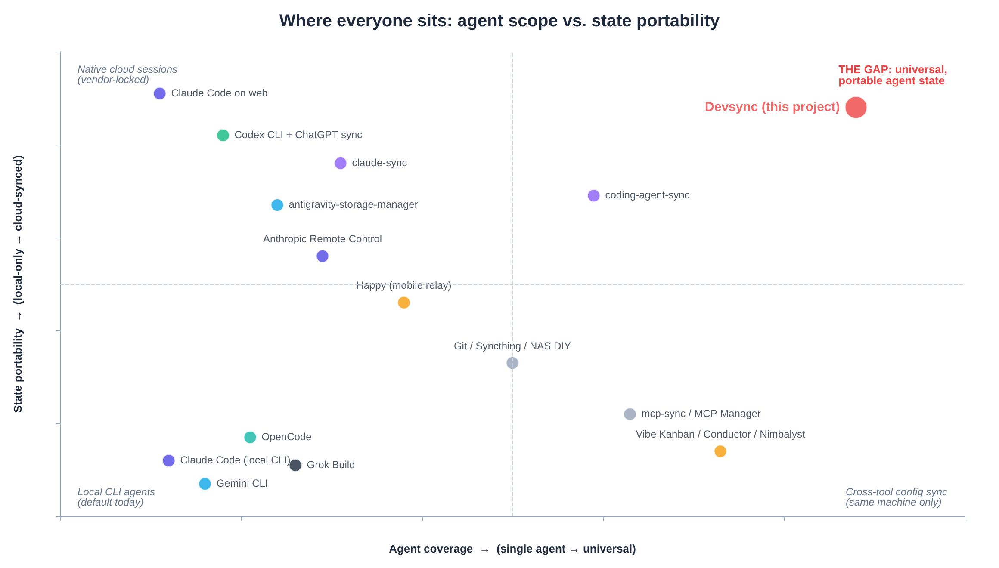

# Executive Summary

## One-line verdict

**Yes — build it.** Build the **adult version**: a vendor-neutral, local-first control plane for **verified cross-device (and eventually cross-agent) continuity**, not “S3 for session JSONL.”

---

## Agreement across all sources

| Claim | Agreement |
|-------|-----------|
| Multi-device session loss is a real, daily pain | **Unanimous** |
| “Just re-pull git and re-prompt” wastes tokens/time and loses decisions | **Unanimous** |
| Simple transcript-only cloud sync is weakly defensible | **Strong majority** |
| Vendors will (or already do) ship **same-agent** cloud/sync | **Unanimous** |
| **No vendor will sync competitors’ agents** → universality is the moat | **Strong majority** |
| Path remapping / OS differences are a hard product problem | **Unanimous among tech analyses** |
| Secrets, code, and MCP configs make security first-class | **Unanimous** |
| Expand the DevSync MCP idea into **Reinstate** (sessions + skills + configs) | **Near-unanimous** (DeepSeek prefers new agent instead) |
| Same-agent cross-device resume before cross-agent replay | **Strong majority** |
| Cross-agent full replay is brittle / should be experimental or handoff-only | **Strong majority** |

---

## Decision table (synthesized)

| Question | Recommendation | Confidence |
|----------|-----------------|------------|
| Is the problem real? | **Yes** | Very high |
| Is simple transcript sync enough? | **No** | High |
| Is there a gap worth building? | **Yes** — universal × cross-device × offline-capable × encrypted × path-aware (+ config/skills) | High |
| Moat | Adapter coverage, path remapping, E2EE/BYO storage, capability-aware resume, portable handoffs — **not** blob storage | High |
| Relationship to DevSync | **Reinstate expands** the earlier DevSync MCP-config idea; MCP/skills remain the capability plane | High |
| Product name | **Reinstate** (decided; `reinstate.dev` acquired) — not DevSync, not Rethra/Carryover | Decided |
| Build a whole new coding agent? | **Minority view (DeepSeek)**; majority: wrap/sync existing agents | Medium |
| Center product on sessions vs durable artifacts? | **Tension:** most say sessions are the *hook*; MiniMax argues skills/rules/MCP should be *center of gravity* | See disagreements |

---

## The weak product vs the strong product

### Weak (do not primarily sell this)

> “Upload terminal agent transcripts to S3 so I can resume them elsewhere.”

Already attacked by: Claude Remote Control / teleport / SessionStore, Codex account-level threads, Gemini local session maturity, OpenCode session APIs, SpecStory, claude-sync, Depot, Omnara, DIY Syncthing/OneDrive.

### Strong (build this)

> **Vendor-neutral, local-first control plane for agent continuity** that syncs not only history but the environment needed to continue safely: repository identity, commit/dirty state, MCP servers, skills, instructions, hooks, project config, and **device capability differences**.

Blunt positioning (ChatGPT deep research):

> **Yes, build it. But do not sell it as cloud chat sync. Sell it as verified cross-device, cross-agent continuity for AI development.**

The product question that matters (ChatGPT conversation):

> *“Can this agent, on this machine, in this repository, with these tools, safely continue the work that another agent stopped?”*

---

## Empty competitive quadrant

**Empty / under-owned:**

> **Universal × cross-device × works-when-the-other-machine-is-off × encrypted × path-aware**

Occupied categories (see [03-competitive-landscape.md](./03-competitive-landscape.md)):

1. Native vendor cloud (Claude web/teleport, Codex account sync)
2. Live remote-access relays (Happy, Remote Control) — **require origin machine awake**
3. Same-machine cross-tool config sync (mcp-sync, vsync, agentsync)
4. Partial cross-device state sync (claude-sync, coding-agent-sync — mostly single-vendor)

---

## Strategic tensions (do not paper over)

### A. Sync wrappers vs new agent (DeepSeek)

- **Approach A:** Session sync wrapper for existing CLIs — majority path; brittle formats, high maintenance.
- **Approach B (DeepSeek recommended):** Build your own cloud-native terminal agent with multi-provider backends and own session format.

**Master take:** Prototype personal wrappers for Claude + Codex; do **not** bet the company on re-implementing Claude Code. DeepSeek’s “own agent” path is a strategic alternative, not consensus.

### B. Sessions-first vs durable-artifacts-first (MiniMax)

- **Sessions-first (Kimi, Claude, ChatGPT, Perplexity, Grok, Meta):** Emotional killer feature; users file FRs for this.
- **Durable-first (MiniMax):** Skills, rules, agents, commands, MCP, hooks are stable markdown/JSON; sessions formats are unstable and vendors converge on cloud sessions. Sessions should be **opt-in**, not the product center.

**Master take:** Ship **both**, but sequence:

1. Capability/profile sync (DevSync heritage) + doctor
2. Same-agent session sync with path remapping (wedge / demo)
3. Portable checkpoints (Kontinuo-style)
4. Experimental native migration

Market with sessions; moat with profile + capability-aware resume + path remapping.

### C. Brand (decided)

**Product name is Reinstate.** Chosen over Carryover and other candidates in the ChatGPT naming thread. Domain: `reinstate.dev`. CLI verb: `reinstate resume`, `reinstate sync`, etc.

- **Meaning fit:** restore session + tools + config + workspace to a usable state on another device  
- **Not** “DevSync” as the public product name (DevSync/Devsynq remains the prior MCP-config lineage / collision caution)  
- **Caveat:** unrelated Shopify product at `reinstate.app` → trademark clearance still needed  

Full history: [10-naming.md](./10-naming.md).

---

## Consensus product hierarchy

1. **Synchronize capabilities** — MCP, skills, instructions, hooks, plugins, profiles  
2. **Capture continuity** — sessions, checkpoints, decisions, tasks, artifacts  
3. **Validate reality** — repo, commit, working tree, environment, missing capabilities  
4. **Resume safely** — native same-agent → portable handoff → experimental migration  
5. **Protect everything** — local-first, E2EE, secret references, device control  

---

## Business reality check

| Model | Score (synthesized) | Notes |
|-------|---------------------|--------|
| Personal OSS tool | **10/10** | Scratch the itch; guaranteed utility |
| Indie / open-core | **7–8/10** | Free CLI + BYO storage; paid managed E2EE storage / teams |
| Venture on transcript sync alone | **2–3/10** | Vendors absorb single-agent sync |
| Open control plane for portable agent environments | **~7/10** | Needs adapter moat + trust + standards (ACP) |

Early realistic scale (Kimi): thousands–tens of thousands OSS users; hundreds of paid seats — not automatically venture-scale.

---

## Immediate decision

| Do | Don’t |
|----|-------|
| Build Claude Code + Codex same-agent cross-OS resume with path remapping + E2EE | Promise perfect cross-agent mid-session replay at launch |
| Fold MCP/skills/config into one profile | Sync auth tokens / `auth.json` / raw secrets |
| Local-first + BYO object storage | Depend on Remote Control / teleport as core (origin-online, gated) |
| Atomic writes, backups, dry-run first pull | Overwrite local history without safety net |
| Honest three-mode resume model | Call it “just sessions in a bucket” |

**Bottom line from the strongest research (Kimi / ChatGPT / Claude):**  
Build **Reinstate** as the universal tool, not a better claude-sync. Worst case you solve your own Windows↔MacBook workflow. Best case Reinstate becomes neutral infrastructure for the agent-CLI wars.

**Canonical pitch:** *Reinstate restores your coding-agent workspace on any device.*
