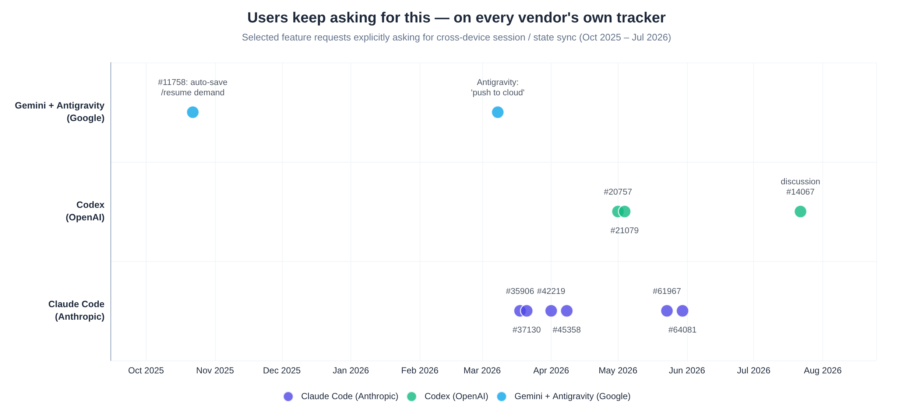

# Market Demand Evidence

**Product:** Reinstate answers demand for portable, cross-device agent continuity that vendors leave open for multi-agent / offline / path-aware cases.

## Why this evidence is strong

Users filed **feature requests on the vendors’ own trackers** — pain that survived process friction. Patterns recur **across Anthropic, OpenAI, and Google** in similar language within the same months → ecosystem-agnostic need, not one tool’s UX quirk.

---

## Vendor issue trackers (compiled)

### Anthropic / Claude Code (multiple open / long-lived FRs)

Themes (issue numbers vary by source; treat as cluster, not exhaustive):

| Theme | Example IDs / notes (sources) |
|-------|--------------------------------|
| Session portability across machines | #35906, #37130, #42219 (Kimi); #47926 (Claude research) |
| Cross-device resume + portable path resolution | #42219, #45358 |
| Mac + Windows + Linux shared context | #45358, #51816 |
| CLI ↔ desktop history sync (explicitly “like OpenAI”) | #61967 / #66 in Kimi |
| Memory / settings sync | #64081 / #26045 / account-level settings #22648 + many duplicates |
| Opt-in cloud sync of transcripts/plan/memory | #52052 |
| Connect from any client | #60058 |
| Quiet vendor movement | #71794 history sync notes (Claude research) |

**User language (paraphrased from FRs):**

- `--continue` / `--resume` only work on the same machine  
- JSONL embeds absolute `cwd` paths; Syncthing/rsync is fragile  
- OneDrive junctions “took the better part of a session… non-technical user should not have to do this”  
- Even if paths differ, **conversational context and high-level task history** would still help  

### OpenAI / Codex

| Theme | Notes |
|-------|-------|
| Cross-device thread/context sync | Discussion #14067 — nearly the product pitch; “recreate context manually…” |
| Mobile companion for desktop/cloud threads | #20757 |
| Local CLI sessions first-class in desktop history | #21079 |
| VS Code account-linked sync | #12593 |
| CLI ↔ app-server session sync | #14722 |
| Import legacy local JSONL into cloud threads | Community thread (MiniMax) |
| Forking | #4514 |

**Pattern (Kimi):** Users ask for portable state → vendor ships **hosted surfaces** for its own agent. Third party still owns **portable local thread + multi-vendor**.

### Google / Gemini / Antigravity

| Theme | Notes |
|-------|-------|
| Gemini CLI session management landed Dec 2025 after community pressure | Kimi / Gemini research |
| Antigravity “push conversation to cloud” | Google AI forum #129502 |
| Resume machinery maturity vs cloud story | Local strong; cloud weak |

### Other

| Product | Signal |
|---------|--------|
| Copilot CLI | Cloud-synced sessions / cross-environment resume FRs (#1947, #1635 — Claude research) |
| Cursor | Forum threads for account-level chat/agent sync, especially Remote SSH |
| Reddit r/ClaudeAI, r/ClaudeCode | Recurring multi-PC setup threads |

---

## What users explicitly ask for (ready-made product spec)

From FR tabulation (Kimi + Claude research):

1. **Cloud-based session storage** tied to account, **opt-in**  
2. Explicit **`export` / `import`** with portable path resolution  
3. Sessions stored server-side (or in user-owned cloud) rather than per client only  
4. A setting that redirects state into **any synced folder**  
5. Realistic about hard parts: path/environment differences OK if conversation continuity remains  

**Notably modest:** almost nobody asks for real-time collab multiplayer agents; they ask for **storage, export, a setting**. Plumbing, not magic.

---

## Grassroots / DIY demand (second-strongest signal)

When vendors lag, users invent:

| Approach | Examples | Pain accepted |
|----------|----------|---------------|
| Encrypted object-store sync | **claude-sync** (age + R2/S3/GCS/WebDAV) | Setup complexity |
| Gist-encrypted config + sessions | **coding-agent-sync** | Limited vendors |
| Google Drive + password | **antigravity-storage-manager** | Single ecosystem |
| File syncers | Syncthing, OneDrive, Dropbox, iCloud junctions | Path collisions, conflict files, secrets on share |
| NAS / SMB symlink farms | Practitioner writeups (~253k files across projects) | Maintenance hell |
| Dotfiles managers | chezmoi + age | Config yes; sessions poorly |

**Meta-observation:** Almost every DIY tool is **single-ecosystem**. Generalizing five adapters + path normalization is unpaid work → **moat-by-plumbing opportunity**.

Early traction of sync tools is small vs agent CLIs (e.g. claude-sync ~229★ / ~822 npm downloads/mo at research time) — category pre-consolidation, not “no demand.”

---

## Willingness to pay (signals)

| Signal | Interpretation |
|--------|----------------|
| Omnara IAP / Pro ~$20/mo, high early interactions (claimed) | Pay for control-plane UX |
| Syncode IAP | Companion cross-device |
| DevSynq commercial MCP marketplace | Config layer monetizable |
| OpenSync / managed storage products | Hosted convenience |
| ECC 100K★ skills ecosystem | Durable artifacts community scale |
| Happy ~20k+★ E2EE relay | Meta-layer tools can break out when demo is clear |

Cross-device resume is **highly demoable** (2-minute Loom: Windows session → `claude --resume` on Mac).

---

## Demand that is *not* the product

Do not mistake these for core ICP:

- Users happy entirely inside **one** vendor cloud (Claude Max web + teleport)  
- Single-machine power users (orchestrators serve them)  
- People who only need **config** once and never multi-device  

ICP is intersection: **agent CLI users × multi-machine × (often multi-agent) × tool-forward** — small % of all developers, high intensity, high word-of-mouth.

---

## Market sizing realism

- Agent CLI user bases are large and growing (point-in-time vendor claims — verify before fundraising).  
- Paying population is a **subset** of multi-machine multi-agent users willing to pay for plumbing.  
- Indie/open-core is the honest early business shape; venture requires control-plane ambition beyond sync.

See also: [09-product-positioning.md](./09-product-positioning.md).
