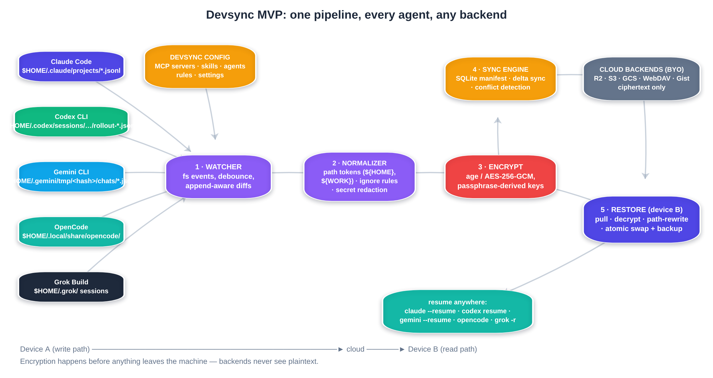

# Session Formats & Technical Hard Problems

## Artifact inventory (what you might sync)

| Category | Claude Code | Codex | Gemini | OpenCode | Grok | Stability |
|----------|-------------|-------|--------|----------|------|-----------|
| Sessions | `~/.claude/projects/<slug>/*.jsonl` | `~/.codex/sessions/.../rollout-*.jsonl` + SQLite | `~/.gemini/.../<hash>/...` | `~/.local/share/opencode/...` | `~/.grok/sessions/...` | **Fragile** |
| MCP config | `~/.claude.json` | `~/.codex/config.toml` | `.gemini/settings.json` | opencode config | varies | **Stable-ish** |
| Skills | `~/.claude/skills/` | `.codex/skills/` | `~/.gemini/skills/` | skills dirs | limited | **Markdown stable** |
| Agents / subagents | `~/.claude/agents/` | `.codex/agents/` | `~/.gemini/agents/` | varies | limited | **Stable** |
| Commands / prompts | `~/.claude/commands/` | `.codex/prompts/` | `~/.gemini/commands/` | varies | limited | **Stable** |
| Rules / instructions | CLAUDE.md / rules | AGENTS.md | GEMINI.md | AGENTS.md | AGENTS.md | **Stable** |
| Hooks | settings hooks | hooks.json beta | settings + OTel | varies | limited | Declarative |
| Memory | project memory dirs | `~/.codex/memories/` | GEMINI.md memory | varies | varies | Mixed |
| Auth | `auth.json` etc. | tokens / encrypted_content | tokens | tokens | tokens | **Never sync values** |

MiniMax strategic point: bottom half of table is **high-leverage durable pivot**; top half is attention hook but vendor-contested and format-unstable.

---

## Format landmines

### 1. Explicit instability (Claude)

Docs: entry format is **internal and changes between versions**; scripts that parse JSONL can break any release.

**Mitigations:**

- Prefer **hooks / SDK / sanctioned APIs** for capture  
- Defensive parsers (skip unknown types)  
- Golden fixtures per agent version in CI  
- Feature-detection over version sniffs  
- Byte-move + path rewrite mode that doesn’t require deep schema understanding for v1 resume  

### 2. Path-slug collisions (Claude)

Project dir = absolute path with non-alphanumerics → `-`.  
Dots and dashes collide. Two projects can share a slug.

**Mitigations:**

- Identity via **git remote URL + normalized relative paths**, not slug alone  
- Use in-transcript `cwd` field as disambiguator  
- Maintain device-local path map tables  

### 3. Absolute paths inside content

Transcripts embed:

- `cwd`  
- File read paths  
- Tool args  
- Git worktree paths  
- MCP command paths  

Copying bytes without rewrite → resume fails or points at missing files.

### 4. Path hashing (Cursor, Gemini project hash)

Different OS absolute paths → different hashes → isolated histories even for same git repo.

### 5. SQLite live databases

Cursor / some OpenCode paths: WAL, locks, primary keys.  
Sync while IDE open → corruption risk.

**Pattern:** `sqlite3 .backup`, stop-app guidance, atomic replace, never two writers.

### 6. Volume

Codex users report multi-GB histories. Full-file re-upload is a non-starter → **delta / append / CAS chunks**.

### 7. Grok default telemetry bucket

Third-party sync may inherit privacy liability if it re-mirrors vendor-uploaded traces carelessly.

---

## The five hard problems (Kimi framing)

| # | Problem | Proven solvable by | Product rule |
|---|---------|-------------------|--------------|
| 1 | **Path normalization** | claude-sync path maps; cursaves git-remote identity for Cursor | First-class feature, not afterthought |
| 2 | **Secrets in transcripts** | SpecStory redaction; age E2EE; Warp secret separation | Redact + encrypt + never sync auth files |
| 3 | **Conflicts** | Sequential use dominance; `.conflict` forks | Detect, never silent overwrite |
| 4 | **Format churn** | Defensive parse + fixtures | Adapter harness mandatory |
| 5 | **Capability drift** | Codex resume fails missing MCP | Capability-aware resume / doctor |

Plus Gemini’s dirty-state / workspace desync (see problem doc).

---

## What to explicitly *not* sync

Compiled denylist:

- `auth.json`, API keys, OAuth tokens, refresh tokens  
- Raw env secret values (sync **references** only)  
- OS keychain material  
- Vendor `encrypted_content` that is account-bound  
- Huge binary caches / model weights  
- IDE lock files / WAL live state without backup protocol  
- Anything user marks private / opt-out per repo  

---

## Six-state model (ChatGPT architecture correction)

Do **not** make “chat” the only object. Canonical continuity object should carry:

### 1. Intent state
Goal, decisions, rejected approaches, remaining work, next action.

### 2. Conversation state
Messages, tool I/O, summaries, subagents, compaction events.

### 3. Workspace state
Repo identity (remotes), branch, HEAD, worktree, dirty/untracked, patches, artifacts.

### 4. Capability state
MCP servers, skills, agents, hooks, plugins, permission policies present at capture.

### 5. Environment state
OS, shell, runtimes, package managers, containers, WSL, path maps, key binaries.

### 6. Provenance state
Source agent + version, adapter schema, import vs native, fork lineage.

---

## Three resume modes (do not promise one “universal resume”)

| Mode | Example | Reliability | When |
|------|---------|-------------|------|
| **1. Native resume** | Claude→Claude, Codex→Codex after path rewrite | Highest | Default MVP |
| **2. Portable handoff** | Checkpoint → any agent | High operational value | Cross-agent default |
| **3. Native migration** | Claude transcript → CASR IR → Codex thread | Variable / experimental | After golden tests |

### Portable checkpoint contents (Kontinuo-aligned)

- Original goal  
- Completed work  
- Important decisions  
- Blocked / deferred  
- Exact next action  
- Changed files  
- Git HEAD at capture  
- Dirty/clean flag  
- Validation evidence  
- Required capabilities + missing on target  

Compact handoff can beat giant replay on cost and reliability.

---

## Capability-aware resume (killer feature)

```text
reinstate resume <session>
→ Detect target agent + device profile
→ Diff required MCP/skills vs installed
→ Diff repo HEAD/dirty vs checkpoint
→ Report: READY | DEGRADED | BLOCKED
→ Offer: install missing caps | handoff summary | force native
```

This is where the original **DevSync** capability plane (MCP/skills) becomes **Reinstate**’s differentiation vs pure transcript movers.

---

## Config sync: overlays, not cloning

Desktop ≠ laptop on purpose sometimes (GPU tools, work VPN MCP, personal skills).

- Sync **canonical profile**  
- Apply **per-device overlays** (enable/disable servers, path substitutions)  
- Never force identical machines  

---

## Hooks-first vs files-first

| Approach | Pros | Cons |
|----------|------|------|
| **Files-first** (watch JSONL/SQLite) | Works without agent support; retroactive | Format churn; race conditions |
| **Hooks-first** | Stable event stream; less parse fragility | Requires hooks enabled; may miss history |
| **Hybrid (recommended)** | Hooks for live; files for backfill | More code |

Claude + Codex + Gemini all have meaningful hook surfaces now.

---

## Repo identity without local paths

Canonical keys should prefer:

```text
git remote get-url origin  (normalized)
+ optional monorepo package path
+ content hash of dirty patch if needed
```

Never:

```text
C:\Users\Harjot\Projects\dev-sync
```

as global identity.

---

## Sync mechanics recommendations

| Concern | Recommendation |
|---------|----------------|
| Event model | Append-only streams |
| Transport | Content-addressed chunks + manifest (SQLite) |
| Conflict | Last-writer-wins with **detection** + `.conflict` forks; no CRDT in v1 |
| Concurrency | Sequential multi-device is dominant; simultaneous = warn / worktrees |
| Writes | Temp + rename atomic; timestamped backups before overwrite |
| First pull | Default `--dry-run` + confirm |
| Offline | Local cache full fidelity; sync when online |


